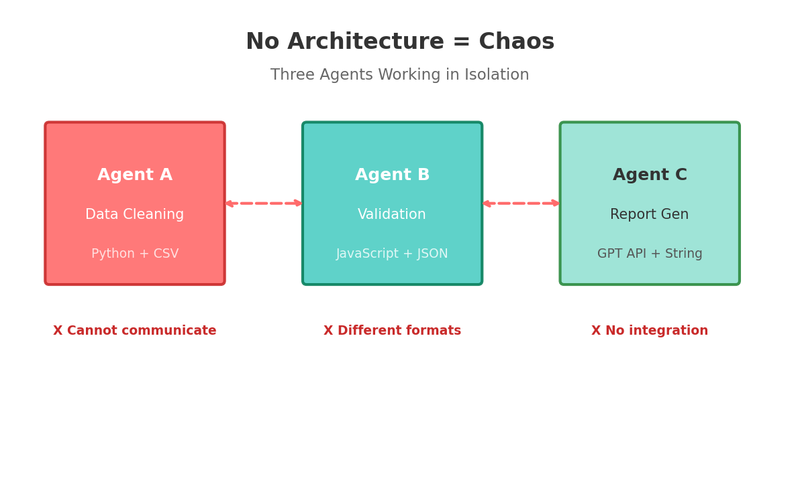
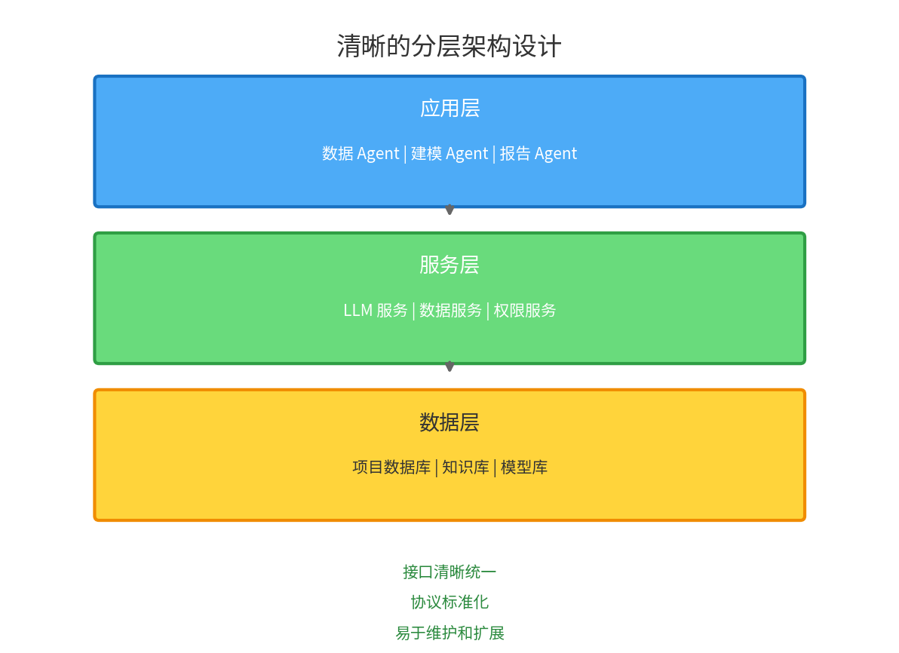
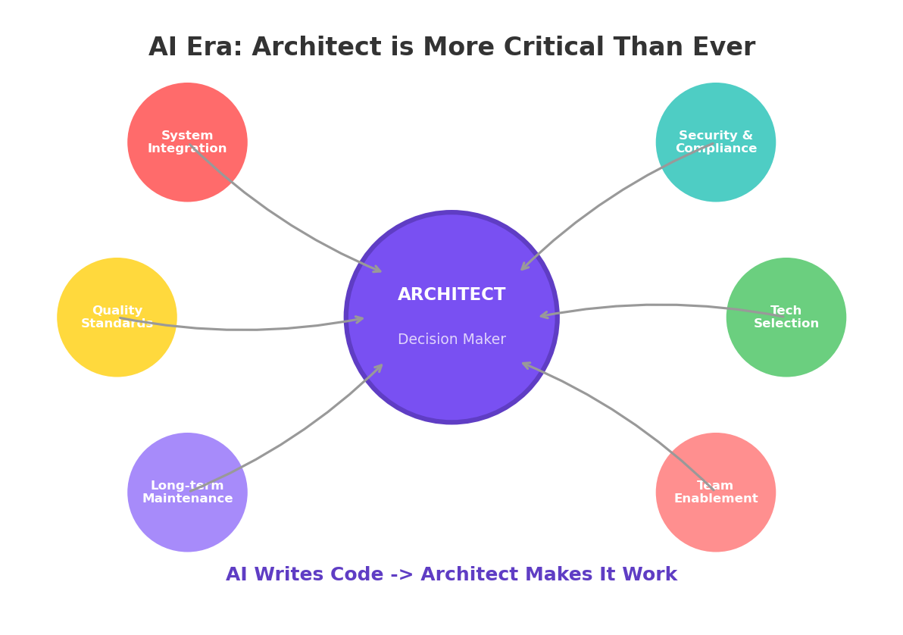
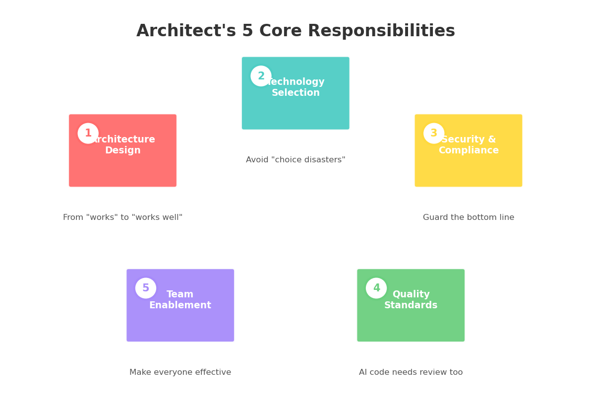
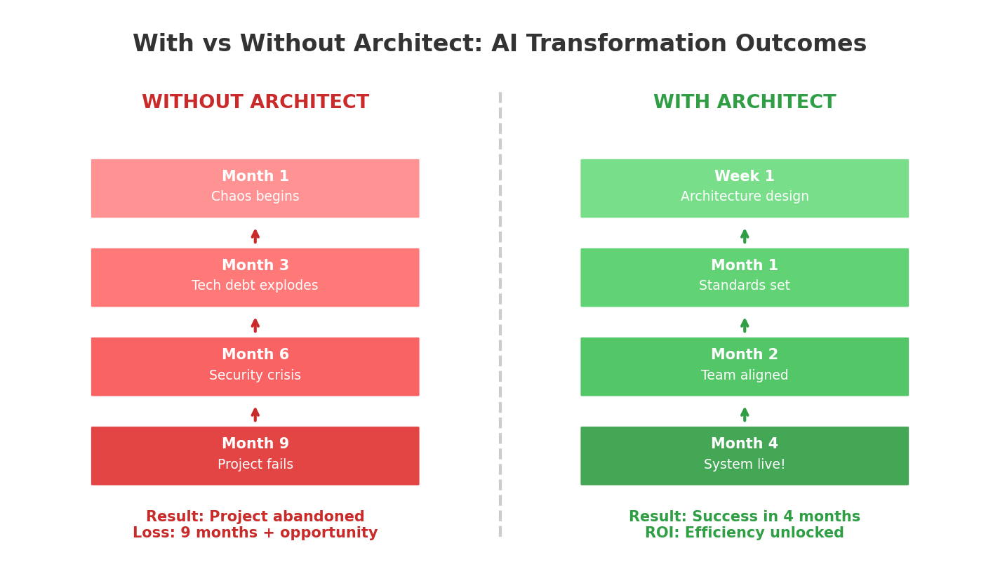

# OpenClaw时代，为什么水力模型架构师变得更值钱了？

## 引言：一个危险的误解

"ChatGPT都能写代码了，还要架构师干什么？"

这是我最近听到最多的一句话。

很多水务企业的管理者认为：AI工具这么强大，让工程师自己去用就行了，何必专门养一个架构师？

**但真相是：AI工具越强大，架构师越重要。**

今天这篇文章，我想用两个真实的案例，告诉你为什么OpenClaw时代，水力模型架构师不仅没有过时，反而成了团队里最值钱的人。

---

## 反面案例：没有架构师的AI转型踩坑实录

某市水务院，去年决定引入AI提升效率。

领导的想法很简单：买几个OpenClaw账号，让工程师们自学一下，不就能自动化写代码了吗？

于是，3名一线工程师（没有架构师参与）开始搭建智能化平台。

### 第1个月：各自为战


*图1：没有统一架构，三个Agent各自为战，数据格式混乱*

- 工程师A开发了一个数据清洗Agent，用Python写了一套数据处理流程
- 工程师B开发了数据验证Agent，用JavaScript写了一套校验规则
- 工程师C开发了报告生成Agent，直接调用ChatGPT API

**问题出现了**：三个Agent各自独立，数据格式不统一，无法协作。

工程师A说："我用的是CSV格式。"
工程师B说："我用的是JSON格式。"
工程师C说："我直接传字符串给GPT。"

**结果**：三个Agent就像三个说不同语言的人，根本没法配合。

### 第3个月：技术债务爆发

代码风格千差万别：

```python
# 工程师A的代码
def process_data_A(input_file):
    df = pd.read_csv(input_file)
    df_clean = df.dropna()
    return df_clean

# 工程师B的代码（完全不同的风格）
class DataValidator:
    def validate(self, data):
        return [d for d in data if d['valid']]

# 工程师C的代码（又是另一种风格）
import openai
def generate_report(data):
    response = openai.ChatCompletion.create(
        model="gpt-3.5-turbo",
        messages=[{"role": "user", "content": str(data)}]
    )
    return response
```

没有统一的接口规范、错误处理机制、日志标准。

Agent之间无法调用，调试困难，维护成本高得吓人。

### 第6个月：安全与合规危机

更糟的事情发生了：

- 工程师C直接把项目数据发送到OpenAI API，没有脱敏处理
- 工程师A把数据库密码硬编码在代码里上传到GitHub
- 没有权限控制，任何人都可以调用Agent访问敏感数据

**结果被信息安全部门叫停，项目延期3个月整改。**

### 第9个月：项目失败

代码无法维护，Bug越修越多。

团队内部互相指责，士气低落。

**最终决定放弃自研，采购商业化产品。**

**直接损失**：9个月人力成本 + 错失市场窗口期。

---

## 正面案例：有架构师的AI转型成功路径

另一家水务企业（B公司），同样引入OpenClaw，但让架构师主导设计。

**4个月后，系统成功上线。**

差别在哪？

### 架构师的关键决策

**决策1：统一的技术架构**

架构师在项目启动第一周，就制定了统一规范：

```yaml
architecture_principles:
  - 所有Agent必须遵循同一套接口标准
  - 数据流转必须使用统一的消息格式
  - 所有外部API调用必须经过网关审查
  - 敏感数据必须本地处理，禁止外传

coding_standards:
  - 使用Python作为唯一开发语言
  - 遵循PEP8规范
  - 所有工具函数必须有类型注解
  - 错误处理必须使用统一的异常体系
```

**决策2：分层架构设计**

架构师设计了清晰的分层架构：


*图2：清晰的三层架构，各层职责分明，接口标准化*

```
┌─────────────────────────────────────────────────────────┐
│  应用层 - 业务Agent（数据Agent、建模Agent、报告Agent）    │
├─────────────────────────────────────────────────────────┤
│  服务层 - 通用服务（LLM服务、数据服务、权限服务）        │
├─────────────────────────────────────────────────────────┤
│  数据层 - 数据存储（项目数据库、知识库、模型库）        │
└─────────────────────────────────────────────────────────┘
```

**决策3：安全与合规前置**

- 所有敏感数据本地处理，使用私有化部署的LLM
- 建立完整的权限控制体系
- 代码审查机制，防止密码等敏感信息泄露

**结果**：
- ✅ 4个月成功上线
- ✅ 代码可维护，文档齐全
- ✅ 通过安全合规审查
- ✅ 团队成员清晰知道自己的职责

---

## 为什么OpenClaw时代更需要架构师？

### 误区：AI会取代架构师？

很多人有一个误解：

- ❌ "ChatGPT能写代码，工程师自己就能开发Agent"
- ❌ "OpenClaw配置很简单，让初级工程师搞就行"
- ❌ "AI会自动找到最优方案，不需要人来做架构决策"

**这些认知的问题在于**：把AI当成"银弹"，忽视了技术架构的复杂性和系统性。

### 真相：AI放大了架构的重要性

AI工具的确让**写代码**变简单了。

但写代码只是软件工程的一小部分。


*图3：AI放大了架构设计的重要性，而非削弱*

在OpenClaw时代，以下问题变得更加重要：

| 问题 | 为什么更重要了 |
|------|---------------|
| **系统集成** | Agent之间如何协作？数据如何流转？ |
| **安全合规** | 哪些数据可以给AI？如何防止泄露？ |
| **质量标准** | AI生成的代码如何审查？如何确保正确？ |
| **技术选型** | 用哪个模型？私有化还是公有云？ |
| **长期维护** | 代码谁来维护？如何升级迭代？ |

**这些问题，ChatGPT回答不了，OpenClaw也自动解决不了。**

**需要架构师来决策。**

---

## 架构师在OpenClaw时代的5个核心职责


*图4：OpenClaw时代架构师的5个核心职责*

### 1. 架构设计：从"能用"到"好用"

没有架构师，系统可能"能用"，但一定不好用、不好维护。

架构师要设计：
- **分层架构**：数据层、服务层、应用层清晰分离
- **接口规范**：Agent之间如何通信
- **扩展性**：系统如何随着业务增长而扩展

### 2. 技术选型：避免"选型灾难"

OpenClaw生态里工具众多：
- 用GPT-4还是本地部署的Llama？
- 向量数据库用哪个？
- 工作流引擎怎么选？

**架构师的价值**：基于团队能力和业务需求，做出最合适的选择。

### 3. 安全合规：守住底线

水务数据涉及敏感信息，架构师必须：
- 设计数据分级策略
- 建立权限控制体系
- 确保合规性（等保、数据安全法）

### 4. 质量标准：AI代码也需要审查

AI生成的代码不一定对。

架构师要建立：
- 代码审查机制
- 测试验收标准
- 性能监控体系

### 5. 团队赋能：让每个人都能用好AI

架构师不是一个人在战斗，他要：
- 制定开发规范
- 培训团队成员
- 建立最佳实践

---

## 给水力模型团队的3个建议


*图5：有架构师 vs 无架构师的AI转型对比*

### 建议1：不要跳过架构设计直接上AI

很多团队犯的错误：

> "我们先让工程师用起来，架构慢慢补。"

**这是不可能的。**

没有好的架构，AI工具越多，技术债务越重，最后积重难返。

**正确做法**：
- 先请架构师做整体设计
- 制定规范和标准
- 然后再逐步落地

### 建议2：架构师要能听懂业务

水力模型行业的架构师，不能只懂技术。

他要理解：
- 水力模型的业务逻辑
- 工程师的工作流程
- 客户的真实需求

**好的架构师 = 技术专家 + 业务专家**

### 建议3：给架构师足够的权限

架构师不能只是"顾问"，要有决策权。

技术选型、规范制定、代码审查——这些都需要架构师说了算。

**如果架构师只有建议权没有决策权，那架构设计就是一纸空文。**

---

## 结语：OpenClaw时代，架构师是稀缺资源

AI让写代码变简单了。

但让复杂的AI系统**正确、安全、可维护**地运行，变得更难了。

这就是为什么，OpenClaw时代，水力模型架构师不仅没有过时，反而成了最稀缺的资源。

**如果你是一名架构师**：恭喜你，你的价值正在被重估。

**如果你是一名工程师**：学会和架构师配合，理解架构设计，会让你在AI时代更有竞争力。

**如果你是管理者**：别省了架构师这笔钱，否则可能像案例A那样，付出9个月的代价。

---

## 思考题

1. 你们团队有专门的架构师吗？还是工程师兼任？

2. 在引入AI工具时，有没有遇到过"各自为战"的问题？

3. 你觉得AI时代，架构师最重要的能力是什么？

欢迎在评论区留言讨论。

---

**延伸阅读**：

- 《HEBook：水力模型专业团队建设与AI赋能》第4章详细介绍了水力模型架构师的角色定位和能力要求
- 《HEBook》第6章深入讲解了OpenClaw平台的使用和架构设计

---

*本文作者：HEBook项目组*  
*文章素材来源于《HEBook：水力模型专业团队建设与AI赋能》*  
*转载请注明出处*
