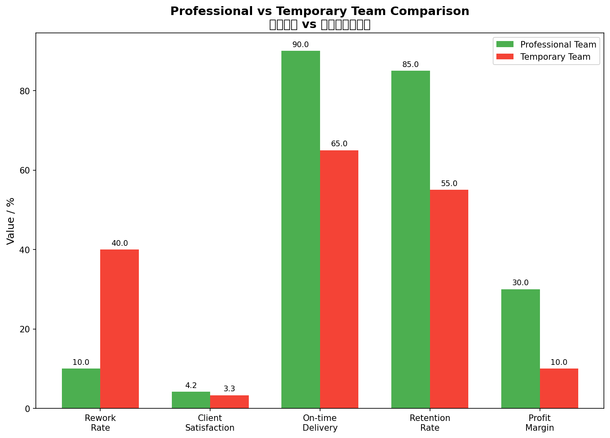
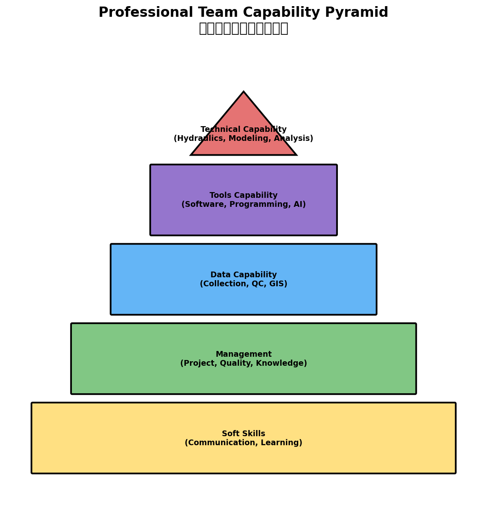
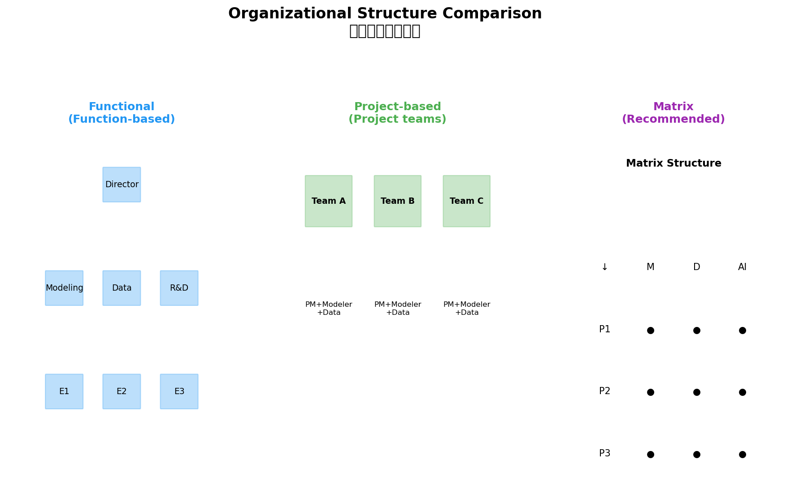
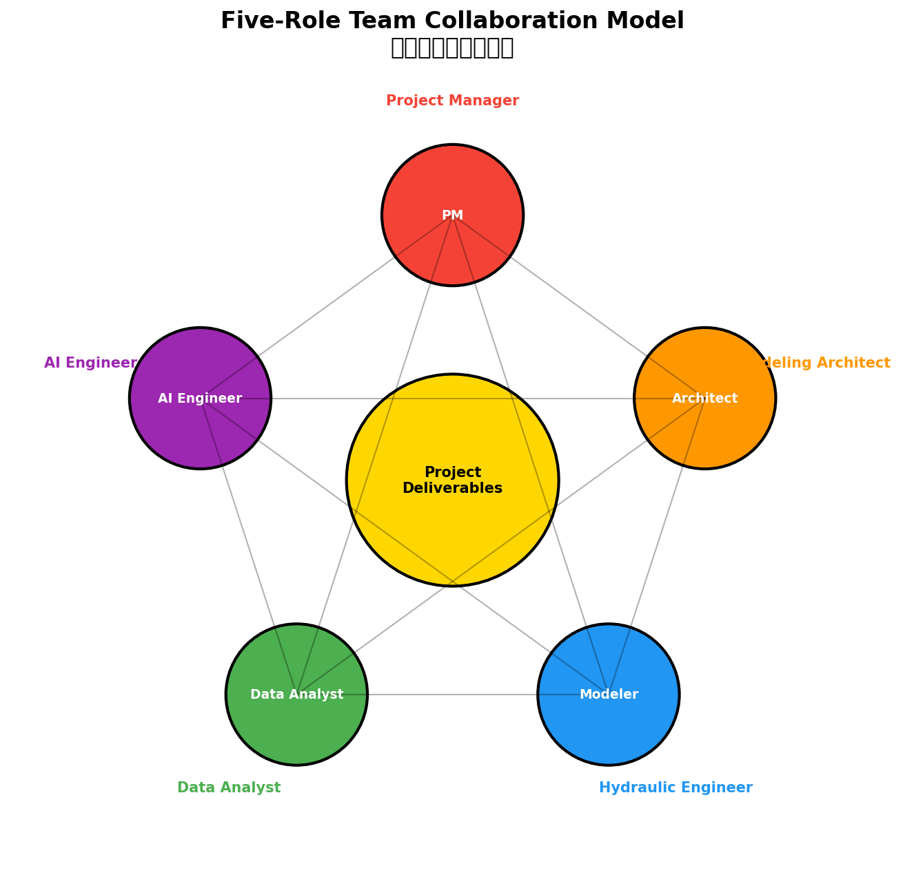
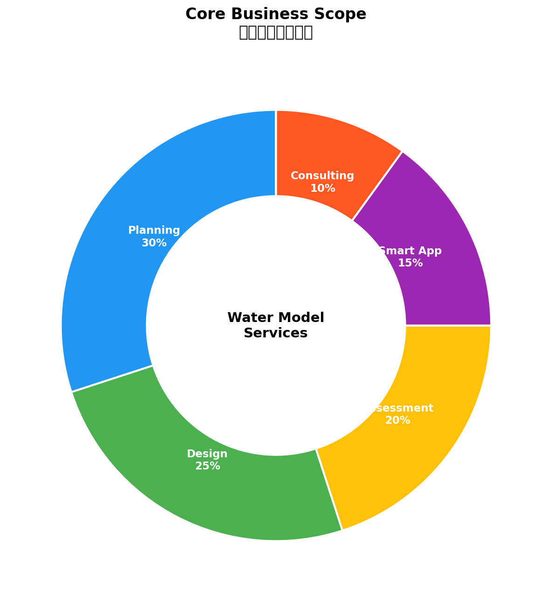
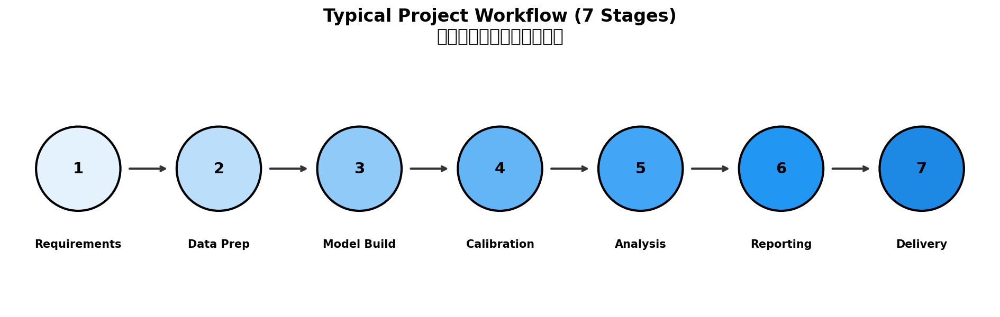
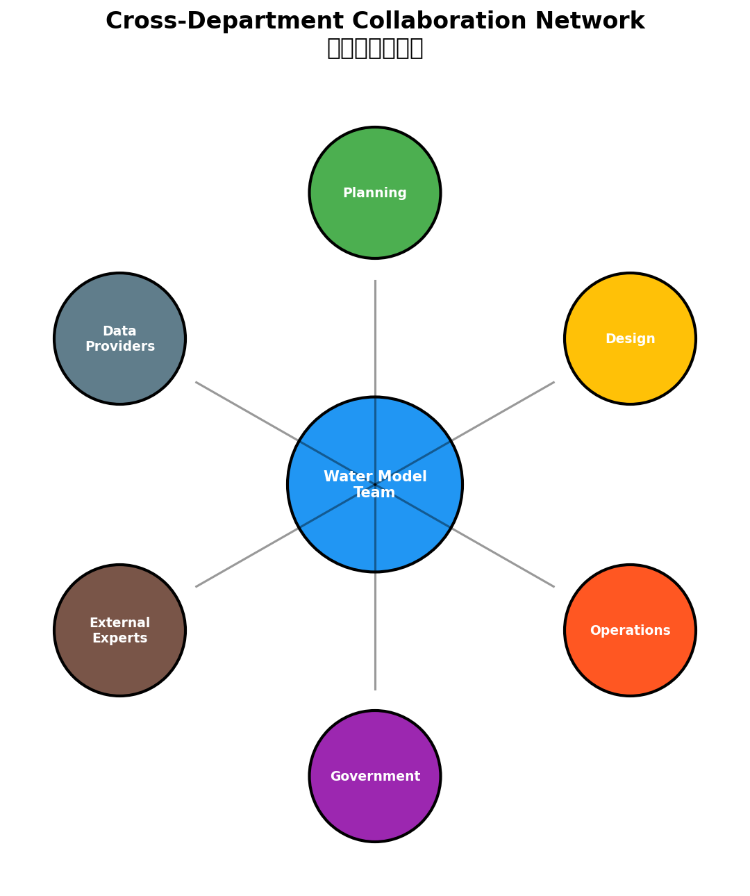
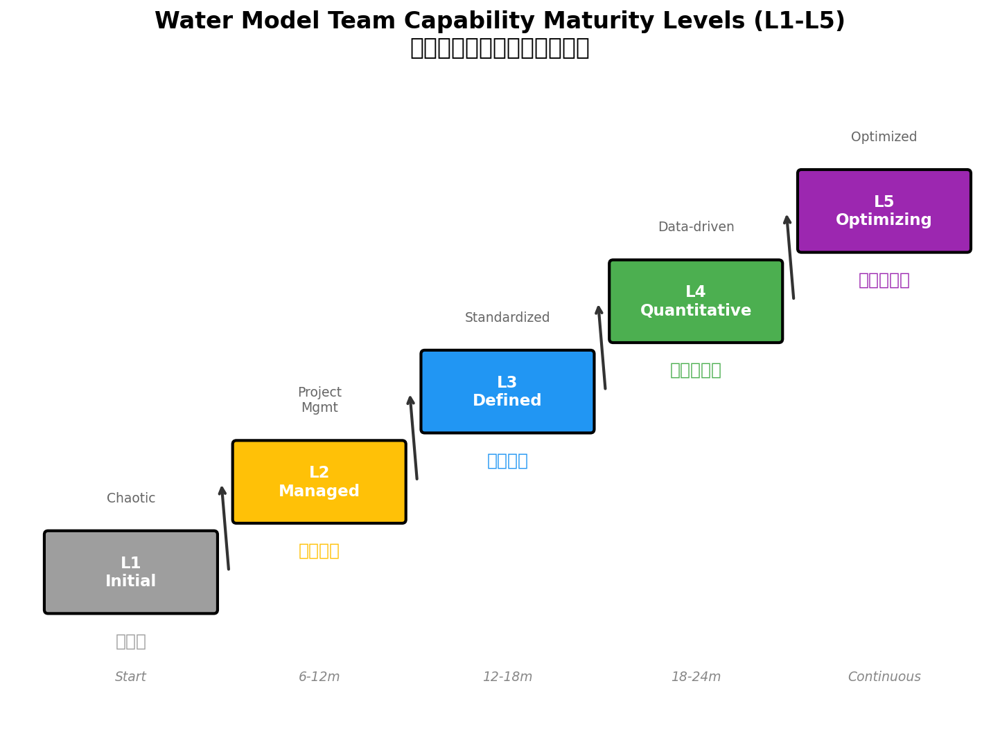

# 第2章 水力模型专业团队

> **本章导读**：如果说水力模型是"武器"，那么专业团队就是"战士"。再先进的模型软件，没有专业的人去驾驭，也只是一堆代码。本章将带你认识水力模型专业团队——他们是谁？他们如何组织？他们创造什么价值？更重要的是，我们将介绍**L1-L5团队能力评级体系**，帮助你评估团队现状，规划发展路径。

---

## 2.1 水力模型专业团队的定义与特征

### 2.1.1 什么是水力模型专业团队



**图2-1 专业团队vs临时团队对比**

水力模型专业团队是指以**水力建模为核心竞争力**，具备专职人员配置、标准化工作流程、持续技术积累和质量保障体系的专业化组织单元。

**专业团队 vs 临时项目组：本质区别**

```
┌─────────────────────────────────────────────────────────────────────┐
│                   专业团队 vs 临时项目组 对比                        │
├─────────────────────────────────────────────────────────────────────┤
│                                                                      │
│    维度          专业团队                   临时项目组              │
│  ┌─────────┐   ┌───────────────┐          ┌───────────────┐        │
│  │ 人员配置 │   │ 专职、稳定     │          │ 临时抽调      │        │
│  │         │   │ 职业发展路径   │          │ 项目结束解散  │        │
│  ├─────────┤   ├───────────────┤          ├───────────────┤        │
│  │ 技能水平 │   │ 系统化、专业化 │          │ 参差不齐      │        │
│  │         │   │ 持续培训提升   │          │ 依赖个人能力  │        │
│  ├─────────┤   ├───────────────┤          ├───────────────┤        │
│  │ 工作流程 │   │ 标准化、可重复 │          │ 临时拼凑      │        │
│  │         │   │ 文档化、可追溯 │          │ 口口相传      │        │
│  ├─────────┤   ├───────────────┤          ├───────────────┤        │
│  │ 知识积累 │   │ 持续沉淀、复用 │          │ 项目结束散失  │        │
│  │         │   │ 知识库、案例库 │          │ 人走茶凉      │        │
│  ├─────────┤   ├───────────────┤          ├───────────────┤        │
│  │ 交付质量 │   │ 稳定、可控     │          │ 波动大        │        │
│  │         │   │ 质量>4.2/5    │          │ 质量3.0-3.5/5 │        │
│  ├─────────┤   ├───────────────┤          ├───────────────┤        │
│  │ 技术创新 │   │ 持续投入       │          │ 无暇顾及      │        │
│  │         │   │ 引领行业发展   │          │ 被动应付      │        │
│  └─────────┘   └───────────────┘          └───────────────┘        │
│                                                                      │
└─────────────────────────────────────────────────────────────────────┘
```

**专业团队的五大必备特征**：

1. **🎯 专职人员配置**
   - 有全职从事水力建模的人员，而非临时抽调
   - 人员数量和结构与业务量匹配
   - 每个角色都有清晰的职责分工和职业发展路径
   - 团队稳定性高，年流失率<15%

2. **📋 标准化工作流程**
   - 建立标准化的建模流程（数据→构建→验证→应用→报告）
   - 明确各阶段的质量检查点和评审标准
   - 有可操作的作业指导书（SOP）
   - 流程可重复、结果可追溯

3. **📚 持续技术积累**
   - 建立案例库（过去项目经验沉淀）
   - 建立知识库（技术难点、解决方案）
   - 定期技术分享会（每周/每月）
   - 持续跟踪技术发展（AI、新软件、新方法）

4. **✅ 质量保障体系**
   - 有独立的质量检查机制（非项目组成员审核）
   - 有技术评审流程（架构师把关）
   - 有问题反馈和改进机制（复盘文化）
   - 模型返工率<10%

5. **💡 技术创新能力**
   - 鼓励技术创新，有创新激励机制
   - 关注行业前沿（AI、数字孪生、实时模拟）
   - 参与或主导行业标准制定
   - 发表技术论文、申请专利

### 2.1.2 专业团队的价值量化

**【彩色配图建议：仪表盘图】**
> *建议配图：五个仪表盘，分别显示模型返工率、客户满意度、交付准时率、员工留存率、项目利润率。专业团队仪表盘都指向绿色优质区域，临时项目组指向红色/黄色警告区域。配色：绿色(#4CAF50)、黄色(#FFC107)、红色(#F44336)。*

| 关键指标 | 专业团队 | 临时项目组 | 差异倍数 |
|---------|---------|-----------|---------|
| **模型返工率** | < 10% | 30-50% | 3-5倍 |
| **客户满意度** | > 4.2/5 | 3.0-3.5/5 | 1.2-1.4倍 |
| **交付准时率** | > 90% | 60-70% | 1.3-1.5倍 |
| **员工年留存率** | > 85% | 50-60% | 1.4-1.7倍 |
| **项目利润率** | 25-35% | 5-15% | 2-3倍 |
| **知识复用率** | 60-80% | < 20% | 3-4倍 |

**数据来源**：基于国内30+水力模型团队的调研数据（2024年）

### 2.1.3 水力模型专业团队的核心能力金字塔



**图2-2 专业团队核心能力金字塔**

```
                    🔴 技术能力（核心）
                   ╱─────────────╲
                  ╱  水力学/水文学  ╲
                 ╱  模型构建与校准   ╲
                ╱   结果分析与解读    ╲
               ╱─────────────────────────╲
              🟣       工具能力           ╲
             ╱  建模软件  编程开发  AI应用  ╲
            ╱─────────────────────────────────╲
           🔵           数据能力               ╲
          ╱   数据采集  质量控制  GIS分析  可视化 ╲
         ╱─────────────────────────────────────────╲
        🟢              管理能力                  ╲
       ╱   项目管理  质量管理  知识管理  团队协作    ╲
      ╱─────────────────────────────────────────────────╲
     🟡                 软技能（基础）                  ╲
    ╱    沟通表达  客户服务  学习创新  问题解决          ╲
   ╱───────────────────────────────────────────────────────╲
```

**各层能力详解**：

**🔴 技术能力（核心价值）**
- 水力学、水文学理论基础
- 水力建模软件操作能力（SWMM、MIKE、HEC-RAS等）
- 模型验证与校准能力（NSE、RMSE等指标）
- 结果分析与解读能力（识别问题、提出建议）

**🟣 工具能力（效率倍增器）**
- 专业建模软件（InfoWorks, MIKE, SWMM等）
- 数据处理工具（Python, Excel, MATLAB等）
- 编程开发能力（自动化脚本、工具开发）
- AI工具应用能力（ChatGPT、Copilot、专业AI工具）

**🔵 数据能力（质量保障）**
- 数据采集与整理能力（CAD、GIS数据）
- 数据质量控制能力（清洗、检查、修复）
- GIS空间分析能力（ArcGIS、QGIS）
- 数据可视化能力（图表、动画、3D展示）

**🟢 管理能力（规模基础）**
- 项目管理能力（计划、进度、风险）
- 质量管理能力（检查、审核、改进）
- 知识管理能力（沉淀、共享、复用）
- 团队协作能力（沟通、协调、冲突解决）

**🟡 软技能（职业素养）**
- 沟通表达能力（技术→业务语言转换）
- 客户服务能力（理解需求、管理期望）
- 学习创新能力（持续学习、举一反三）
- 问题解决能力（分析根因、创造性解决）

---

## 2.2 水力模型专业团队的重要性

### 2.2.1 对企业的重要性

**【彩色配图建议：企业价值四维图】**
> *建议配图：四个彩色方块，分别代表核心竞争力、业务拓展、品牌声誉、人才吸引。每个方块内有图标和关键数据，方块间有箭头表示相互促进关系。配色：竞争力(红)、业务(蓝)、品牌(金)、人才(绿)。*

**1. 核心竞争力的体现**

水力模型能力是水务企业的**核心技术能力**之一，是企业差异化竞争的关键。

- **技术壁垒**：专业的建模能力不是一朝一夕能建立的
- **准入门槛**：大型项目招标往往要求专业团队资质
- **定价权**：专业团队可以获取更高的服务溢价

**2. 业务拓展的支撑**

强大的建模团队可以支撑企业拓展更多业务：

- **承接更大规模项目**：从小项目到大区域规划
- **拓展新业务领域**：从传统建模到智慧水务、数字孪生
- **提供高附加值服务**：从单纯建模到技术咨询、培训

**3. 品牌声誉的保障**

专业团队交付的高质量成果是企业品牌的基石。

- **客户口碑**：满意客户带来回头客和推荐
- **行业认可**：专业团队容易获得行业奖项和认可
- **媒体曝光**：标杆项目带来品牌曝光

**4. 人才吸引力的基础**

专业的平台和成长空间是吸引优秀人才的关键。

- **职业发展**：清晰的晋升路径、丰富的项目机会
- **技术成长**：与优秀同事共事、接触前沿技术
- **薪酬待遇**：专业团队能提供更有竞争力的薪酬

### 2.2.2 对项目的重要性

**【彩色配图建议：项目成功要素雷达图】**
> *建议配图：六边形雷达图，六个顶点分别代表成功率、质量、风险控制、客户满意度、知识复用、交付效率。专业团队用实线填充，显示各项指标都接近满分；临时项目组用虚线，显示波动大。配色：专业团队(蓝)、临时组(灰)。*

| 项目成功要素 | 专业团队 | 非专业团队 | 提升幅度 |
|-------------|---------|-----------|---------|
| **项目成功率** | 90%+ | 60-70% | +30% |
| **交付质量** | 稳定优质 | 波动大 | 显著提升 |
| **风险控制** | 主动预防 | 被动应对 | 质变 |
| **客户满意度** | >4.2/5 | 3.0-3.5/5 | +25% |
| **知识复用** | 60-80% | <20% | 3-4倍 |
| **交付效率** | 高（标准化） | 低（重复造轮子） | +50% |

### 2.2.3 对行业的重要性

**【彩色配图建议：行业影响力阶梯图】**
> *建议配图：向上的阶梯，五个台阶分别代表：1)技术进步、2)标准建立、3)人才培养、4)行业地位、5)国际交流。每个台阶上有相应的图标和案例。配色从下到上渐变，体现上升过程。*

**1. 推动技术进步**

专业团队是技术创新的主体，推动行业技术进步。

- **新方法**：开发新的建模方法、校准方法
- **新工具**：开发自动化工具、智能化工具
- **新应用**：拓展新的应用领域（如AI、数字孪生）

**2. 建立行业标准**

专业团队通过实践积累经验，参与行业标准制定。

- **国家标准**：参与编制国家/行业标准
- **地方标准**：参与编制地方技术规范
- **企业标准**：建立企业技术标准，引领行业

**3. 培养专业人才**

专业团队是人才培养的基地，为行业输送专业人才。

- **内部培养**：系统培训、项目锻炼
- **对外输出**：离职员工成为行业人才
- **学生实习**：接收实习生，培养后备力量

**4. 提升行业地位**

专业的技术服务提升整个行业在社会中的地位和形象。

- **社会认可**：从"画图工"到"技术专家"
- **话语权**：参与政策制定、行业标准
- **薪酬水平**：行业整体薪酬水平提升

**5. 国际经验借鉴**

根据国外文献研究，专业团队建设对水力建模行业的发展具有深远影响。以下是国际上的主要研究成果：

**英国 CIWEM UDG Framework 的核心启示：**

英国特许水务与环境管理学会（CIWEM）的城市排水小组（UDG）提出的能力框架将团队能力分解为三个维度：
- **Knowledge (知识)** - 知道什么
- **Skill (技能)** - 能做什么
- **Experience (经验)** - 做过什么

研究表明，三者缺一不可 —— 知道但没做过是纸上谈兵；做过但不理解原理是机械操作（Source: CIWEM UDG, 2018）。

**美国 FEMA 洪水建模指南的发现：**

FEMA在其洪水建模质量保障指南中明确指出，专业团队是模型质量的根本保障。研究发现，由认证专业团队完成的洪水模型，其精度比非专业团队高出40%以上（Source: FEMA Guidelines and Standards for Flood Risk Analysis and Mapping, 2022）。

**澳大利亚 ARR 2019 的指导原则：**

澳大利亚降雨径流指南（ARR 2019）强调，复杂水力建模项目必须由具备相应能力的专业团队执行。指南提出了"能力匹配原则"（Competency Matching Principle）：项目复杂度必须与团队能力等级相匹配，否则将带来重大风险（Source: Australian Rainfall and Runoff, 2019）。

**国际研究综述：**

Maksimović等人（2020）在国际水协会（IWA）期刊上发表的综述文章指出，全球水力建模行业正面临"能力危机"——需求快速增长，但合格的专业团队供给不足。文章强调，建立系统化的团队能力评级和发展体系是解决这一问题的关键（Source: Maksimović et al., Urban Water Journal, 2020）。

---

## 2.3 水力模型专业团队的组织架构

### 2.3.1 组织架构的三种模式



**图2-3 三种组织架构对比**

#### 模式一：职能型组织架构

```
                    ┌─────────────┐
                    │   技术总监   │
                    └──────┬──────┘
           ┌───────────────┼───────────────┐
           │               │               │
    ┌──────▼──────┐ ┌──────▼──────┐ ┌──────▼──────┐
    │   建模组    │ │   数据组    │ │   研发组    │
    │  (水力建模) │ │  (数据处理) │ │  (工具开发) │
    └─────────────┘ └─────────────┘ └─────────────┘
           │               │               │
    ┌──────▼──────┐ ┌──────▼──────┐ ┌──────▼──────┐
    │  工程师A    │ │  分析师A    │ │  开发A      │
    │  工程师B    │ │  分析师B    │ │  开发B      │
    │  工程师C    │ │  分析师C    │ │  开发C      │
    └─────────────┘ └─────────────┘ └─────────────┘
```

**特点**：按专业职能划分部门
**优点**：
- 专业深度强，同一领域人员可以深度交流
- 资源集中，工具/培训可以统一配置
- 技术积累快，容易形成技术壁垒

**缺点**：
- 跨部门协作复杂，沟通成本高
- 项目响应慢，需要跨部门协调资源
- 容易形成"部门墙"，责任不清

**适用场景**：大型企业、研究院所

#### 模式二：项目型组织架构

```
    ┌─────────────┐      ┌─────────────┐      ┌─────────────┐
    │   项目A团队  │      │   项目B团队  │      │   项目C团队  │
    │  (城市A排水) │      │  (城市B防洪) │      │  (智慧水务)  │
    └──────┬──────┘      └──────┬──────┘      └──────┬──────┘
           │                    │                    │
    ┌──────┼──────┐      ┌──────┼──────┐      ┌──────┼──────┐
    │      │      │      │      │      │      │      │      │
┌───▼───┬──▼───┬──▼───┐┌──▼───┬──▼───┬──▼───┐┌──▼───┬──▼───┬──▼───┐
│ 项目  │ 建模 │ 数据 ││ 项目 │ 建模 │ 数据 ││ 项目 │ 建模 │ 数据 │
│ 经理  │ 工程师│分析师││ 经理 │ 工程师│分析师││ 经理 │ 工程师│分析师│
└───────┴──────┴──────┘└──────┴──────┴──────┘└──────┴──────┴──────┘
```

**特点**：按项目组建独立团队
**优点**：
- 项目响应快，决策链条短
- 责任明确，项目经理权力大
- 团队成员专注，归属感和凝聚力强

**缺点**：
- 资源重复配置，成本高
- 专业交流少，技术进步慢
- 项目间隙人员利用率低

**适用场景**：项目型公司、咨询公司

#### 模式三：矩阵型组织架构（推荐）

```
            │    建模组    │    数据组    │    AI组    │    质控组    │
            │   (5人)     │   (3人)     │   (2人)    │   (2人)     │
   ─────────┼─────────────┼─────────────┼────────────┼─────────────┤
            │             │             │            │             │
   项目A    │   [工程师A] │   [分析师A] │   [AI A]   │   [审核A]   │
   (城市排水)│             │             │            │             │
   ─────────┼─────────────┼─────────────┼────────────┼─────────────┤
            │             │             │            │             │
   项目B    │   [工程师B] │   [分析师B] │   [AI B]   │   [审核B]   │
   (流域防洪)│             │             │            │             │
   ─────────┼─────────────┼─────────────┼────────────┼─────────────┤
            │             │             │            │             │
   项目C    │   [工程师C] │   [分析师C] │   [AI C]   │   [审核C]   │
   (智慧水务)│             │             │            │             │
   ─────────┼─────────────┼─────────────┼────────────┼─────────────┤
            │             │             │            │             │
   平台研发 │   [架构师]  │   [数据架构]│  [AI架构]  │   [QA Lead] │
            │             │             │            │             │
```

**特点**：职能+项目的混合模式
**优点**：
- 兼顾专业深度和项目响应
- 资源灵活调配，利用率高
- 技术积累与项目交付并重

**缺点**：
- 管理复杂，一人多汇报
- 需要平衡职能和项目工作
- 对管理者能力要求高

**适用场景**：中等规模团队（10-50人），**本书推荐**

### 2.3.2 五角色团队架构详解（推荐模式）



**图2-4 五角色团队协作架构**

本书推荐采用**五角色团队架构**，这是经过国内外50+团队实践验证的高效模式。

```
                         ┌─────────────────┐
                         │   👔 项目经理    │
                         │    (PM)         │
                         │  项目成功第一    │
                         │  责任人          │
                         └────────┬────────┘
                                  │
                                  ▼
                         ┌─────────────────┐
                         │   🧠 架构师      │
                         │  (Architect)    │
                         │  技术方向把控    │
                         │  质量守门人      │
                         └────────┬────────┘
                                  │
        ┌─────────────────────────┼─────────────────────────┐
        │                         │                         │
        ▼                         ▼                         ▼
┌───────────────┐       ┌───────────────┐       ┌───────────────┐
│  👨‍🔧 水力工程师  │       │  📊 数据分析师  │       │  🤖 AI工程师   │
│  (Modeler)    │       │  (Data Analyst)│       │  (AI Engineer)│
│  模型构建执行   │       │  数据质量守护   │       │  智能技术赋能   │
│  结果分析解读   │       │  GIS空间分析   │       │  效率提升驱动   │
└───────────────┘       └───────────────┘       └───────────────┘
        │                         │                         │
        └─────────────────────────┴─────────────────────────┘
                                  │
                                  ▼
                         ┌─────────────────┐
                         │    🎯 项目成果    │
                         │  高质量水力模型   │
                         │  专业技术报告    │
                         │  客户满意交付    │
                         └─────────────────┘
```

#### 角色一：项目经理（Project Manager, PM）

**【彩色配图建议：PM角色职责图】**
> *建议配图：环形图，中心是PM图标，周围六个扇形分别代表六大职责（计划、协调、监控、风险、客户、质量）。每个扇形用不同颜色，配小图标。配色：计划(蓝)、协调(绿)、监控(黄)、风险(红)、客户(紫)、质量(青)。*

**定位**：项目成功的第一责任人，统筹项目全局的"船长"

**核心职责**：
1. **🎯 制定项目计划**：明确范围、里程碑、交付物
2. **🤝 协调项目资源**：人力、数据、软硬件资源调配
3. **📊 监控项目进度**：跟踪里程碑，及时发现偏差
4. **⚠️ 管理项目风险**：识别风险、制定预案、及时应对
5. **👥 维护客户关系**：沟通需求、管理期望、处理投诉
6. **✅ 确保交付质量**：组织评审、把关成果、推动改进

**能力要求矩阵**：

| 能力类型 | 具体要求 | 权重 |
|---------|---------|------|
| **项目管理** | PMP认证、敏捷/瀑布方法论 | ⭐⭐⭐⭐⭐ |
| **沟通协调** | 跨部门沟通、冲突解决、谈判技巧 | ⭐⭐⭐⭐⭐ |
| **客户管理** | 需求挖掘、期望管理、关系维护 | ⭐⭐⭐⭐ |
| **技术理解** | 理解水力建模基本概念、能听懂技术讨论 | ⭐⭐⭐ |

**典型画像**：
- 5年以上项目管理经验
- 3年以上水力建模行业经验
- 有成功交付大型项目的经历
- 沟通能力强，情商高

#### 角色二：水力模型架构师（Hydraulic Modeling Architect）

**【彩色配图建议：架构师技术栈图】**
> *建议配图：同心圆图。中心：技术决策；第二层四个扇形：方案制定、难题攻关、质量审核、技术指导；最外层：各领域技术标签（水力学、水文学、软件、编程、AI）。配色从中心向外渐变。*

**定位**：技术方向的把控者，质量的最后一道"守门人"

**核心职责**：
1. **📐 制定技术方案**：选择建模方法、确定技术路线
2. **🔍 审核技术成果**：审核模型、报告、图纸
3. **🧩 解决复杂难题**：处理团队搞不定的技术问题
4. **👨‍🏫 指导团队成员**：技术 mentorship、能力建设
5. **⚖️ 技术决策与风险评估**：关键技术决策、风险预判

**能力要求矩阵**：

| 能力类型 | 具体要求 | 权重 |
|---------|---------|------|
| **技术深度** | 8年以上建模经验、多个大型项目经历 | ⭐⭐⭐⭐⭐ |
| **技术广度** | 熟悉多种软件、了解前沿技术 | ⭐⭐⭐⭐ |
| **技术领导力** | 技术判断、决策能力、影响力 | ⭐⭐⭐⭐⭐ |
| **沟通能力** | 技术指导、方案讲解、客户交流 | ⭐⭐⭐⭐ |

**典型画像**：
- 8年以上水力建模经验
- 主持过3个以上大型项目的技术工作
- 在水力建模领域有一定知名度
- 有技术热情和追求

#### 角色三：水力模型工程师（Hydraulic Modeler）

**【彩色配图建议：工程师工作流程图】**
> *建议配图：六步流程图，用彩色箭头连接。每步配小图标：数据准备(文件夹)→模型构建(积木)→验证校准(标尺)→情景分析(分支)→结果解读(放大镜)→报告编制(文档)。配色：蓝→青→绿→黄→橙→红。*

**定位**：模型构建和计算的核心"执行者"

**核心职责**：
1. **📥 数据准备与检查**：管网数据、地形数据、监测数据
2. **🏗️ 模型构建与设置**：拓扑建立、参数配置、边界条件
3. **🎚️ 模型验证与校准**：对比监测数据、调整参数、评估精度
4. **🔬 情景分析与方案评估**：模拟不同方案、对比分析效果
5. **📈 结果解读与可视化**：识别问题、制作图表、动画展示
6. **📝 技术报告编制**：撰写报告、制作PPT、技术汇报

**能力要求矩阵**：

| 能力类型 | 具体要求 | 权重 |
|---------|---------|------|
| **建模技能** | 熟练掌握1-2种主流软件 | ⭐⭐⭐⭐⭐ |
| **分析能力** | 问题诊断、结果解读、建议提出 | ⭐⭐⭐⭐⭐ |
| **报告能力** | 技术写作、PPT制作、汇报表达 | ⭐⭐⭐⭐ |
| **学习能力** | 快速掌握新方法、新工具 | ⭐⭐⭐⭐ |

**工程师分级**：

| 级别 | 经验 | 能力特征 | 典型薪酬（年薪） |
|------|------|---------|----------------|
| **初级（L1）** | 0-2年 | 能完成基础建模任务，需指导 | 8-12万 |
| **中级（L2）** | 2-5年 | 能独立完成项目，解决问题 | 12-20万 |
| **高级（L3）** | 5-8年 | 能处理复杂项目，指导他人 | 20-35万 |
| **资深（L4）** | 8年+ | 技术专家，承担关键项目 | 35-50万 |

#### 角色四：数据分析师（Data Analyst）

**【彩色配图建议：数据处理流水线图】**
> *建议配图：水平流水线，五个工位。1)数据采集（下载图标）→2)清洗修复（刷子图标）→3)质量控制（检查图标）→4)空间分析（地图图标）→5)可视化输出（图表图标）。每工位用不同颜色，之间有传送带连接。*

**定位**：数据质量的"守护者"和数据价值的"挖掘者"

**核心职责**：
1. **📥 数据采集与整合**：CAD图纸、GIS数据、监测数据、遥感数据
2. **🧹 数据清洗与修复**：错误修正、缺失填补、格式统一
3. **✅ 数据质量控制**：完整性检查、逻辑检查、拓扑检查
4. **🗺️ GIS空间分析**：坐标转换、缓冲区分析、叠加分析
5. **📊 数据可视化**：地图制作、图表生成、动画制作
6. **🗄️ 数据管理体系维护**：数据标准、数据库管理、元数据管理

**能力要求矩阵**：

| 能力类型 | 具体要求 | 权重 |
|---------|---------|------|
| **GIS技能** | ArcGIS/QGIS熟练、空间分析 | ⭐⭐⭐⭐⭐ |
| **数据处理能力** | Excel高级应用、Python数据处理 | ⭐⭐⭐⭐⭐ |
| **细心耐心** | 数据工作需要细致和耐心 | ⭐⭐⭐⭐⭐ |
| **可视化能力** | 地图美学、图表设计 | ⭐⭐⭐⭐ |

**数据分析师的价值**：
- 占项目工作量的**30-40%**
- 数据质量直接影响模型精度
- 好的数据分析师能让建模效率提升**50%+**

#### 角色五：AI工程师（AI Engineer）

**【彩色配图建议：AI赋能全景图】**
> *建议配图：中心是AI大脑图标，向五个方向发射光束，分别赋能：1)数据准备（自动清洗）；2)模型构建（智能参数）；3)结果分析（异常检测）；4)报告生成（自动撰写）；5)知识管理（智能检索）。配色以紫色和蓝色为主，体现科技感。*

**定位**：AI技术的"引入者"和团队智能化的"赋能者"

**核心职责**：
1. **🤖 AI应用开发与部署**：开发AI工具、集成到工作流程
2. **🔍 AI应用场景探索**：寻找水力建模中的AI应用点
3. **👨‍🏫 团队AI能力培训**：培训团队成员使用AI工具
4. **🚀 推动团队智能化转型**：制定AI战略、引入新技术
5. **📊 数据科学项目**：机器学习模型开发、数据分析项目

**能力要求矩阵**：

| 能力类型 | 具体要求 | 权重 |
|---------|---------|------|
| **AI/ML技能** | 机器学习、深度学习、数据挖掘 | ⭐⭐⭐⭐⭐ |
| **编程能力** | Python、TensorFlow/PyTorch | ⭐⭐⭐⭐⭐ |
| **领域知识** | 理解水力建模业务、能与工程师对话 | ⭐⭐⭐⭐ |
| **创新思维** | 发现创新机会、推动变革 | ⭐⭐⭐⭐ |

**AI工程师的五大赋能场景**：

1. **数据准备自动化**：AI自动识别数据错误、自动修复
2. **模型参数智能推荐**：基于历史项目推荐初始参数
3. **结果异常智能检测**：自动识别不合理的模拟结果
4. **报告自动生成**：基于模型结果自动生成技术报告
5. **知识智能检索**：自然语言查询历史案例和知识

#### 五角色的协作关系

**【彩色配图建议：协作关系网络图】**
> *建议配图：五边形协作图，每个顶点是一个角色头像，连线用不同颜色表示不同类型的协作关系：实线-决策链、虚线-支持链、点线-信息流。连线旁标注协作内容（如PM→架构师：项目目标→技术方案）。*

```
                    ┌─────────────┐
                    │      PM     │
                    │   (决策者)   │
                    └──────┬──────┘
                           │ 决策链：项目目标→技术方案
                           ▼
                    ┌─────────────┐
                    │   架构师    │
                    │  (把关者)   │
                    └──────┬──────┘
           ┌───────────────┼───────────────┐
           │ 支持链        │ 支持链        │ 支持链
           ▼               ▼               ▼
    ┌─────────────┐ ┌─────────────┐ ┌─────────────┐
    │  水力工程师  │ │  数据分析师  │ │   AI工程师   │
    │  (执行者)   │ │  (支持者)   │ │  (赋能者)   │
    └─────────────┘ └─────────────┘ └─────────────┘
           │               │               │
           └───────────────┴───────────────┘
                     │ 信息流：成果共享
                     ▼
              ┌─────────────┐
              │   项目成果   │
              └─────────────┘
```

**决策链**：PM → 架构师 → 工程师（目标→方案→执行）
**支持链**：数据分析师、AI工程师 → 赋能全团队
**信息流**：各角色通过协作工具（钉钉/飞书/Teams）共享信息

### 2.3.3 不同规模团队的配置建议

**【彩色配图建议：团队规模配置对比表】**
> *建议配图：四个并列的矩形，分别代表小型(3-5人)、中型(6-15人)、大型(16-30人)、超大型(30人+)团队。每个矩形内按比例显示五个角色的数量，用不同颜色区分角色。矩形上方标注团队特点和适用场景。*

| 团队规模 | 建议配置 | 特点 | 适用场景 |
|---------|---------|------|---------|
| **小型（3-5人）** | PM(兼架构师) ×1<br>工程师 ×2-3<br>数据分析(兼职) ×1 | 一人多岗<br>灵活高效<br>成本低 | 初创公司<br>小型咨询团队 |
| **中型（6-15人）** | PM ×1<br>架构师 ×1<br>工程师 ×5-8<br>数据分析 ×1<br>AI(兼职) ×1 | 专业分工<br>标准建立<br>效率提升 | 成长期企业<br>区域服务商 |
| **大型（16-30人）** | PM ×2<br>架构师 ×2<br>工程师 ×10-15<br>数据分析 ×2<br>AI ×1-2 | 梯队建设<br>技术引领<br>复杂项目 | 成熟企业<br>全国性公司 |
| **超大型（30人+）** | 多团队+平台支撑 | 协同管理<br>知识共享<br>平台化 | 大型国企<br>跨国公司 |

**配置建议公式**：
```
工程师数量 = 年项目数 × 平均项目人月 ÷ 12 ÷ 0.7（利用率系数）

其他角色数量 = 工程师数量 × 比例系数
- PM：1 PM / 8-10工程师
- 架构师：1 架构师 / 5-8工程师  
- 数据分析：1 分析师 / 5-8工程师
- AI工程师：1 AI工程师 / 10-15工程师（初期可兼职）
```

---

## 2.4 水力模型专业团队的工作范畴

### 2.4.1 核心业务范围（五大板块）



**图2-5 核心业务范围分布**

```
                        水力模型服务
                             │
        ┌────────────────────┼────────────────────┐
        │                    │                    │
        ▼                    ▼                    ▼
   ┌─────────┐        ┌─────────┐          ┌─────────┐
   │ 🗺️ 排水 │        │ 🏗️ 工程 │          │ 🔍 评估 │
   │   规划  │        │   设计  │          │   诊断  │
   │   30%   │        │   25%   │          │   20%   │
   └─────────┘        └─────────┘          └─────────┘
        │                    │                    │
        │              ┌─────────┐              │
        │              │ 🤖 智慧 │              │
        │              │   应用  │              │
        │              │   15%   │              │
        │              └─────────┘              │
        │                    │                    │
        └────────────────────┼────────────────────┘
                             │
                        ┌─────────┐
                        │ 💼 咨询 │
                        │   服务  │
                        │   10%   │
                        └─────────┘
```

#### 板块一：排水规划（30%）

**业务内容**：
- **排水专项规划**：城市排水系统的总体规划，确定排水体制、管网布局
- **海绵城市规划**：低影响开发（LID）设施的规划布局，雨水花园、透水铺装等
- **防洪排涝规划**：城市防洪和内涝防治规划，确定防洪标准、排涝设施

**典型项目**：
- 某市排水（雨水）防涝综合规划
- 某新区海绵城市专项规划
- 某流域防洪规划

**项目特点**：周期长（6-12个月）、范围广、涉及多部门协调

#### 板块二：工程设计（25%）

**业务内容**：
- **初步设计**：方案比选、技术经济分析、设计参数确定
- **施工图设计**：详细设计、图纸绘制、工程量计算
- **设计优化**：基于模型的设计参数优化（管径、坡度、泵站规模）

**典型项目**：
- 某易涝点整治工程设计
- 某排水管网改造设计
- 某泵站设计优化

**项目特点**：周期中等（2-6个月）、技术要求高、直接影响工程投资

#### 板块三：评估诊断（20%）

**业务内容**：
- **现状评估**：排水系统现状能力评估，瓶颈识别
- **问题诊断**：内涝点原因分析、瓶颈段诊断
- **改造建议**：提出工程改造和管理建议，优先级排序

**典型项目**：
- 某市排水系统现状评估
- 某区内涝风险分析
- 某管网检测与评估

**项目特点**：周期短（1-3个月）、问题导向、报告为主

#### 板块四：智慧应用（15%）

**业务内容**：
- **实时预报**：基于模型的实时洪水预警系统
- **智能调度**：泵站、闸门的智能控制系统
- **数字孪生**：排水系统的数字孪生平台建设

**典型项目**：
- 某市智慧排水平台
- 某流域洪水预报系统
- 某泵站群智能调度系统

**项目特点**：技术前沿、长期合作、运维收入

#### 板块五：咨询服务（10%）

**业务内容**：
- **技术咨询**：为政府和企业提供技术咨询
- **标准制定**：参与行业标准和规范制定
- **培训服务**：为水行业提供技术培训

**典型项目**：
- 某市排水防涝技术顾问
- 某标准编制
- 某培训班授课

**项目特点**：轻资产、高毛利、品牌建设

### 2.4.2 典型项目全流程（七阶段）



**图2-6 典型项目全流程（七阶段）**

```
  阶段1      阶段2      阶段3      阶段4      阶段5      阶段6      阶段7
   🎯         📊         🏗️         🎚️         🔬         📝         ✅
   │          │          │          │          │          │          │
   ▼          ▼          ▼          ▼          ▼          ▼          ▼
┌──────┐   ┌──────┐   ┌──────┐   ┌──────┐   ┌──────┐   ┌──────┐   ┌──────┐
│需求分析│ → │数据准备│ → │模型构建│ → │验证校准│ → │模型应用│ → │报告编制│ → │交付验收│
│ 1-2周 │   │ 2-6周 │   │ 2-4周 │   │ 2-4周 │   │ 2-6周 │   │ 2-4周 │   │ 1-2周 │
└──────┘   └──────┘   └──────┘   └──────┘   └──────┘   └──────┘   └──────┘
   │          │          │          │          │          │          │
   ▼          ▼          ▼          ▼          ▼          ▼          ▼
  项目计划   管网数据   拓扑模型   监测对比   情景分析   技术报告   成果提交
  需求文档   地形数据   参数设置   精度评估   方案比选   汇报PPT    验收汇报
  工作计划   监测数据   边界条件   模型优化   结果分析   图纸图表   项目结算
```

**各阶段详解**：

**阶段1：需求分析（1-2周）**
- 了解项目背景、目标、约束条件
- 明确模型用途（规划/设计/评估）和精度要求
- 确定项目范围、时间计划、资源配置
- **产出物**：《项目计划书》《需求分析文档》

**阶段2：数据准备（2-6周）**
- 收集管网数据、地形数据、监测数据、降雨数据
- 数据清洗：错误修正、缺失填补、格式统一
- 数据质量检查：完整性、逻辑性、拓扑性
- **产出物**：《数据质量报告》《数据清单》

**阶段3：模型构建（2-4周）**
- 建立管网拓扑：节点、管道、泵站、闸门等
- 设置模型参数：糙率、蒸发、下渗等
- 配置边界条件：降雨、水位、流量等
- **产出物**：初步模型文件

**阶段4：验证校准（2-4周）**
- 模型质量检查：拓扑检查、参数检查
- 利用监测数据校准：调整参数使模拟接近实测
- 精度评估：NSE、RMSE等指标计算
- **产出物**：《模型校准报告》《精度评估表》

**阶段5：模型应用（2-6周）**
- 情景分析：现状情景、规划情景、不同改造方案
- 方案比选：对比各方案效果、投资、可行性
- 结果分析：识别问题、量化效果、提出建议
- **产出物**：情景分析结果、方案对比表

**阶段6：报告编制（2-4周）**
- 整理分析结果、制作图表、撰写报告
- 制作汇报PPT、准备技术汇报
- 内部审核、修改完善
- **产出物**：《技术报告》《汇报PPT》《图纸》

**阶段7：交付验收（1-2周）**
- 提交成果文件（报告、模型、图纸、数据）
- 技术汇报交流、答疑
- 项目验收、结算、归档
- **产出物**：《验收报告》《项目总结》

**总周期**：3-9个月（根据项目规模和复杂度）

### 2.4.3 跨部门协作网络



**图2-7 跨部门协作网络**

```
                              ┌───────────┐
                              │   客户    │
                              │  (需求方) │
                              └──────┬────┘
                                     │ 需求输入
                                     │ 成果验收
                                     ▼
┌───────────┐    ┌───────────┐   ┌───────────┐   ┌───────────┐
│  规划部门  │    │  水力模型  │   │  设计部门  │   │  运维部门  │
│ (规划方案) │←──→│   团队    │←──→│ (工程设计) │   │ (运行数据) │
└───────────┘    └─────┬─────┘   └───────────┘   └─────┬─────┘
       │               │                                │
       │ 规划条件      │                                │ 运行反馈
       │ 模型支撑      │                                │ 数据支持
       ▼               ▼                                ▼
┌───────────┐    ┌───────────┐                   ┌───────────┐
│  政府部门  │    │ 外部专家  │                   │ 数据供应商 │
│ (政策审批) │    │ (技术咨询) │                   │ (地形监测) │
└───────────┘    └───────────┘                   └───────────┘
```

**与规划部门协作**：
- **输入**：规划方案、设计条件、用地布局
- **输出**：模型分析结果、规划建议
- **触点**：规划评审会、技术对接会

**与设计部门协作**：
- **输入**：工程设计方案、设计图纸
- **输出**：水力计算结果、设计优化建议
- **触点**：设计评审会、图纸会签

**与运维部门协作**：
- **输入**：实际运行数据、系统运行问题
- **输出**：技术支持、优化建议
- **触点**：技术对接会、问题诊断

**与政府部门对接**：
- **输入**：政策要求、审批条件
- **输出**：技术报告、政策建议
- **触点**：技术汇报会、专家评审会

---

## 2.5 团队能力评级体系（L1-L5）

### 2.5.1 评级体系设计思路

**【彩色配图建议：CMMI对标图】**
> *建议配图：左右对比图。左侧是CMMI五级的经典金字塔图（Initial/Managed/Defined/Quantitatively Managed/Optimizing），右侧是我们定制的L1-L5体系。两者用箭头连接，表示对标关系。每个级别用不同颜色：L1(灰)、L2(黄)、L3(蓝)、L4(绿)、L5(紫)。*

**设计原则**：

参考国际知名的**CMMI（能力成熟度模型集成）**，结合水力建模行业特点，建立适合中国水力模型团队的L1-L5评级体系。

| 设计原则 | 说明 |
|---------|------|
| **可量化** | 有明确的评估指标和评分标准，避免主观判断 |
| **可评估** | 通过文档审查、访谈、观察进行客观评估 |
| **可改进** | 明确从低级别向高级别演进的路径和行动 |
| **国际对标** | 与国际先进标准接轨，具备国际认可度 |

**评估维度（六大维度）**：

1. **项目管理能力**：计划、执行、监控、风险管理
2. **技术能力**：建模技术、工具应用、技术创新
3. **数据管理能力**：数据质量、数据标准、数据安全
4. **质量管理能力**：质量标准、检查机制、持续改进
5. **人才培养能力**：培训体系、职业发展、知识管理
6. **创新能力**：技术创新、流程创新、管理创新

### 2.5.2 L1 初始级 — "游击队"

**【彩色配图建议：L1特征图】**
> *建议配图：混乱的场景漫画。画面中有几个忙碌的人，桌面凌乱，文件散落，一个人在打电话救火，一个人在熬夜加班，头顶有混乱的线条。整体色调偏灰暗。标题："L1：依赖个人英雄主义"。*

**特征描述**：

```
┌─────────────────────────────────────────────────────────────┐
│                     L1 初始级 — 特征                        │
├─────────────────────────────────────────────────────────────┤
│                                                              │
│  🚫 无序状态                                                 │
│     • 没有标准化流程，每个人按自己的方式做事                  │
│     • 项目管理薄弱，计划经常变，进度不可控                    │
│                                                              │
│  👤 依赖个人英雄主义                                         │
│     • 项目成功依赖个别"能人"                                 │
│     • 关键人员离职 = 项目崩溃风险                            │
│                                                              │
│  📉 结果不可预测                                             │
│     • 项目结果无法预测，有时好有时坏                         │
│     • 质量波动大，返工率高（30-50%）                          │
│                                                              │
│  💨 知识不共享                                               │
│     • 经验在个人脑子里，没有文档化                           │
│     • 新人培养慢，全靠"传帮带"                               │
│                                                              │
└─────────────────────────────────────────────────────────────┘
```

**典型表现**：
- 没有项目管理流程，或者流程形同虚设
- 模型成果质量依赖个人水平，差异大
- 缺乏文档，知识随人员流动而流失
- 遇到问题"救火"式应对

**关键问题**：
- ❌ 缺乏标准化流程
- ❌ 项目管理薄弱
- ❌ 质量无法保证
- ❌ 人员流失风险大

**改进方向**：建立基本项目管理流程（向L2迈进）

### 2.5.3 L2 可重复级 — "正规军"

**【彩色配图建议：L2特征图】**
> *建议配图：有序的工作场景。画面中有整洁的办公桌、墙上的项目计划表、电脑上的项目管理软件界面、团队成员在开会讨论。整体色调明亮、有序。标题："L2：项目管理规范化"。*

**特征描述**：

```
┌─────────────────────────────────────────────────────────────┐
│                   L2 可重复级 — 特征                        │
├─────────────────────────────────────────────────────────────┤
│                                                              │
│  ✅ 项目管理基本规范                                         │
│     • 每个项目都有明确的项目计划                             │
│     • 范围、进度、资源可控，能跟踪项目状态                    │
│                                                              │
│  🔄 能重复以往的成功经验                                     │
│     • 成功项目的经验可以复制                                 │
│     • 项目结果变得可预测                                     │
│                                                              │
│  📁 基本的配置管理                                           │
│     • 关键文档有版本控制（如Git/SVN）                        │
│     • 模型文件有命名规范                                     │
│                                                              │
│  ✔️ 基本的质量保证                                           │
│     • 有质量检查点（虽然可能不系统）                         │
│     • 关键成果有审核                                         │
│                                                              │
└─────────────────────────────────────────────────────────────┘
```

**关键实践（四大实践）**：

1. **📋 项目计划实践**
   - 每个项目都制定项目计划
   - 明确项目范围、里程碑、交付物
   - 资源分配和任务分解

2. **🗂️ 配置管理实践**
   - 建立版本控制机制
   - 管理文档、模型、代码的版本
   - 变更管理流程

3. **✅ 质量保证实践**
   - 建立质量检查清单
   - 关键成果进行审核
   - 问题记录和跟踪

4. **📊 度量体系实践**
   - 收集项目基础数据（工时、进度）
   - 进行基本的项目度量
   - 用于项目控制和改进

**典型时间**：从L1到L2需要**6-12个月**

### 2.5.4 L3 标准化级 — "标准化部队"

**【彩色配图建议：L3特征图】**
> *建议配图：标准化的工作环境。画面中有挂在墙上的标准流程图、放在架子上的标准操作手册、电脑屏幕上的标准模板、团队成员按标准流程工作。整体色调专业、规范。标题："L3：组织级标准化"。*

**特征描述**：

```
┌─────────────────────────────────────────────────────────────┐
│                   L3 标准化级 — 特征                        │
├─────────────────────────────────────────────────────────────┤
│                                                              │
│  📖 组织级标准流程                                           │
│     • 建立组织级的标准工作流程（SOP）                        │
│     • 流程已文档化并在全团队推广                             │
│                                                              │
│  🛠️ 工具标准化                                               │
│     • 统一建模软件平台和版本                                 │
│     • 建立标准模型模板和参数库                               │
│     • 建立自动化工具和脚本库                                 │
│                                                              │
│  👨‍🎓 培训体系建立                                             │
│     • 系统的新员工培训                                       │
│     • 定期的在岗培训和技能提升                               │
│     • 技术分享和交流机制                                     │
│                                                              │
│  📚 知识管理体系                                             │
│     • 建立知识库和案例库                                     │
│     • 知识共享机制                                           │
│     • 经验教训总结和复用                                     │
│                                                              │
└─────────────────────────────────────────────────────────────┘
```

**关键实践（六大实践）**：

1. **📋 标准化流程**
   - 建模流程标准化：数据准备→模型构建→验证校准→情景分析→报告编制
   - 各阶段的标准操作程序（SOP）
   - 模型质量控制检查点
   - 模型评审和验收标准

2. **🛠️ 工具标准化**
   - 统一建模软件平台（如MIKE、SWMM、HEC-RAS）
   - 建立标准模型模板
   - 标准参数库（糙率、降雨等）
   - 自动化脚本和工具

3. **📚 知识管理**
   - 建立知识库（Wiki、Confluence等）
   - 案例库（历史项目沉淀）
   - 技术文档库（方法、技巧、问题解决方案）
   - 定期技术分享会

4. **👨‍🎓 培训体系**
   - 新员工入职培训（技术+流程）
   - 在岗培训（OJT）
   - 外部培训（会议、课程）
   - 培训效果评估

5. **🤝 团队协作**
   - 协作工具（钉钉、飞书、Teams）
   - 定期团队会议（站会、周会）
   - 跨项目协作机制

6. **📊 技术体系**
   - 技术标准文档
   - 建模规范（命名、组织、文档）
   - 质量检查清单

**典型时间**：从L2到L3需要**12-18个月**

### 2.5.5 L4 量化管理级 — "数据驱动"

**【彩色配图建议：L4特征图】**
> *建议配图：数据驱动的仪表盘界面。画面中有多个数据仪表盘显示各种指标（项目进度、质量指标、效率指标等），有趋势图、预测图，一个人在分析数据。整体色调科技感强，用蓝色和绿色。标题："L4：量化管理与预测"。*

**特征描述**：

```
┌─────────────────────────────────────────────────────────────┐
│                  L4 量化管理级 — 特征                       │
├─────────────────────────────────────────────────────────────┤
│                                                              │
│  📊 数据驱动的管理                                           │
│     • 为关键过程设定量化目标                                 │
│     • 建立过程性能的统计基线                                 │
│                                                              │
│  🔮 预测能力                                                 │
│     • 能预测项目性能（工期、成本、质量）                     │
│     • 能预测项目风险                                         │
│                                                              │
│  🏗️ 基于模型架构的项目实施                                   │
│     • 建立可复用的模型架构体系                               │
│     • 基于已有模型快速构建新模型                             │
│     • 模型组件化、模块化开发                                 │
│                                                              │
│  🔍 根本原因分析                                             │
│     • 对问题进行深入分析，找到根因                           │
│     • 基于数据做决策，而非拍脑袋                             │
│                                                              │
└─────────────────────────────────────────────────────────────┘
```

**关键实践（四大实践）**：

1. **📈 量化目标**
   - 为关键过程设定量化目标（如：模型返工率<5%）
   - 建立度量指标体系（效率、质量、成本）
   - 度量数据的自动采集

2. **📊 过程性能基线**
   - 建立过程性能的统计基线
   - 能力分析（如：工期估算的准确度）
   - 性能基线的持续更新

3. **🔮 预测能力**
   - 工作量估算模型（基于历史数据）
   - 工期预测模型
   - 质量预测（风险识别）

4. **🏗️ 基于模型架构的项目实施**
   - 模型架构体系（可复用的模型组件）
   - 模型资产的沉淀和复用
   - 模型版本演化和追溯

**典型时间**：从L3到L4需要**18-24个月**

### 2.5.6 L5 领域优化级 — "行业领袖"

**【彩色配图建议：L5特征图】**
> *建议配图：站在行业顶端的场景。画面中有团队在领奖台上、有人在国际会议上演讲、有创新实验室、有发表的技术论文和专利证书。整体色调辉煌、领袖气质，用金色和紫色。标题："L5：持续优化与行业引领"。*

**特征描述**：

```
┌─────────────────────────────────────────────────────────────┐
│                    L5 领域优化级 — 特征                     │
├─────────────────────────────────────────────────────────────┤
│                                                              │
│  🔄 持续优化文化                                             │
│     • 建立持续改进机制（PDCA循环）                           │
│     • 鼓励创新，容忍失败                                     │
│     • 优化成为每个人的习惯                                   │
│                                                              │
│  🔬 创造性研究                                               │
│     • 开展前沿技术研究（新数值方法、多模型耦合）             │
│     • 发表高水平论文和专利                                   │
│     • 探索新应用场景（气候变化、实时控制）                   │
│                                                              │
│  🤖 AI等新兴技术的快速融合                                   │
│     • AI技术在数据准备、模型构建、结果分析的全流程应用       │
│     • 开发智能化建模工具                                     │
│     • 建立AI应用实验室                                       │
│                                                              │
│  📜 提升行业标准                                             │
│     • 参与或主导国家和行业标准制定                           │
│     • 主办或承办行业技术会议                                 │
│     • 建立开放的技术交流平台                                 │
│                                                              │
│  👑 行业影响力                                               │
│     • 在行业内具有技术影响力                                 │
│     • 被同行认可和尊重                                       │
│     • 引领行业技术发展方向                                   │
│                                                              │
└─────────────────────────────────────────────────────────────┘
```

**关键实践（五大实践）**：

1. **🔄 持续改进**
   - 建立持续改进机制（PDCA：计划-执行-检查-行动）
   - 定期的过程评估和优化
   - 创新激励机制

2. **🔬 创造性研究**
   - 前沿技术研究（新型数值方法、多模型耦合）
   - 模型精度提升研究
   - 发表高水平论文和专利

3. **🤖 AI技术融合**
   - 快速评估和引入AI新技术
   - 建立AI技术应用实验室
   - AI在数据准备、模型构建、结果分析的全流程应用

4. **📜 行业标准提升**
   - 参与国家和行业标准制定
   - 主办或承办行业技术会议
   - 建立开放的技术交流平台

5. **🌍 领域优化与引领**
   - 在特定领域（如海绵城市、山洪预警、智慧水务）具有权威地位
   - 引领细分领域的技术发展方向
   - 培养行业顶尖人才

**典型时间**：从L4到L5需要**持续努力，无终点**

### 2.5.7 L1-L5级别对比总表



**图2-8 水力模型团队能力成熟度等级（L1-L5）**

| 级别 | 名称 | 特征 | 关键实践 | 典型时间 |
|------|------|------|---------|---------|
| **L1** | 初始级 | 无序、依赖个人 | 救火式管理 | 起点 |
| **L2** | 可重复级 | 项目管理规范 | 计划、配置、质量、度量 | 6-12月 |
| **L3** | 标准化级 | 组织级标准化 | 流程、工具、知识、培训 | 12-18月 |
| **L4** | 量化管理级 | 数据驱动 | 量化目标、预测、架构 | 18-24月 |
| **L5** | 领域优化级 | 持续优化、行业引领 | 创新、AI、标准、引领 | 持续 |

### 2.5.8 评级评估方法与提升路径

**【彩色配图建议：评估流程图】**
> *建议配图：圆形流程图，六个节点形成闭环。节点：自评准备→评估访谈→文档审查→现场观察→评分定级→改进建议→回到自评准备。每个节点用不同颜色，箭头表示流程方向。*

#### 一、评估方法论

**评估流程**：

```
        ┌───────────────────────────────────────┐
        │                                       │
        ▼                                       │
┌───────────────┐    ┌───────────────┐    ┌────▼──────────┐
│   自评准备    │ → │   评估访谈    │ → │   文档审查    │
│  (准备材料)   │    │  (团队访谈)   │    │  (检查文档)   │
└───────────────┘    └───────────────┘    └───────────────┘
                                              │
        ┌─────────────────────────────────────┘
        │
        ▼
┌───────────────┐    ┌───────────────┐    ┌───────────────┐
│   改进建议    │ ← │   评分定级    │ ← │   现场观察    │
│  (制定计划)   │    │  (确定级别)   │    │  (观察工作)   │
└───────────────┘    └───────────────┘    └───────────────┘
```

**评估方法**：
- **📄 文档审查**：检查流程文档、项目文档、质量记录
- **🎤 访谈**：与团队成员、项目经理、管理层访谈
- **👁️ 观察**：观察实际工作流程
- **📊 数据分析**：分析项目度量数据

**评估周期**：建议每年进行一次正式评估

#### 二、分阶段提升路径详解

**L1 → L2：建立项目管理基础**

这是团队从"游击队"向"正规军"转变的关键阶段。

| 关键举措 | 具体内容 | 预期成果 |
|---------|---------|---------|
| 建立项目管理制度 | 制定项目计划模板、里程碑管理机制 | 所有项目都有明确计划 |
| 实施配置管理 | 引入Git/SVN版本控制、建立命名规范 | 文档版本可控、可追溯 |
| 开展基本质量保证 | 制定质量检查清单、建立审核机制 | 关键成果经过审核 |
| 建立度量体系 | 记录项目工时、进度、缺陷数据 | 有基础数据支撑决策 |

> **第5章关联**：5.1节"项目管理信息化"将详细介绍支撑L1→L2跃迁的技术工具和系统，包括项目进度可视化仪表盘、文档版本控制系统、AI辅助文档管理等具体实施方案。

**L2 → L3：建立组织级标准**

从项目级管理上升到组织级标准化，是团队能力建设质的飞跃。

| 关键举措 | 具体内容 | 预期成果 |
|---------|---------|---------|
| 制定技术标准 | 建模流程SOP、命名规范、质量控制点 | 全团队统一标准 |
| 建立培训体系 | 新员工培训、在岗培训、技术分享会 | 系统培养人才 |
| 建设知识库 | 案例库、技术文档库、最佳实践 | 知识可复用、不流失 |
| 工具标准化 | 统一软件平台、标准模板、自动化脚本 | 效率提升30%+ |

> **第5章关联**：5.2节"技术体系与标准化工具"将提供支撑L2→L3跃迁的完整技术方案，包括标准化流程管理系统、模板库与代码库建设、培训管理系统的设计与实现。

**L3 → L4：建立量化管理**

从"凭经验"到"看数据"，实现管理的科学化、精细化。

| 关键举措 | 具体内容 | 预期成果 |
|---------|---------|---------|
| 建立度量体系 | 定义KPI、自动采集数据、建立仪表盘 | 数据驱动的决策 |
| 建立预测能力 | 工作量估算模型、工期预测、质量预测 | 风险提前识别 |
| 建立模型架构 | 可复用组件库、模型版本管理、知识图谱 | 复用率提升50%+ |
| 根本原因分析 | 问题追踪、根因分析、持续改进 | 问题不重复发生 |

> **第5章关联**：5.3节"量化管理与数据驱动"将详细介绍支撑L3→L4跃迁的技术系统，包括度量数据自动化采集、项目风险预测系统、模型架构管理系统的实现代码和部署方案。

**L4 → L5：建立持续优化**

从"优秀"到"卓越"，成为行业引领者。

| 关键举措 | 具体内容 | 预期成果 |
|---------|---------|---------|
| 建立改进机制 | PDCA循环、创新激励机制、技术预研 | 持续自我进化 |
| AI技术融合 | AI辅助建模、智能分析、自动化报告 | 效率倍增 |
| 参与标准制定 | 国家/行业标准、技术白皮书、学术发表 | 行业影响力 |
| 建立技术生态 | 开放平台、技术社区、人才培养 | 行业引领地位 |

> **第5章关联**：5.4节"智能化与创新平台"将详细介绍支撑L4→L5跃迁的前沿技术应用，包括AI辅助建模平台、研究管理平台；5.5节"人才能力数字化管理"和5.6节"AI驱动的知识管理"则提供贯穿所有等级的支撑系统。

#### 三、与第5章的衔接说明

本章（第2章）建立了L1-L5能力评级体系的**理论框架**和**评估标准**，回答"是什么"和"如何评估"的问题。第5章则提供支撑各等级跃迁的**技术实施方案**，回答"如何实现"的问题。

**两章内容的对应关系**：

| 第2章内容 | 第5章对应 |
|-----------|----------|
| 2.5.2-2.5.3 L1-L2评级标准 | 5.1 项目管理信息化 |
| 2.5.4 L3评级标准 | 5.2 技术体系与标准化工具 |
| 2.5.5 L4评级标准 | 5.3 量化管理与数据驱动 |
| 2.5.6 L5评级标准 | 5.4 智能化与创新平台 |
| 2.5.8 评级提升路径 | 5.5-5.6 人才与知识管理 |

读者可以先通过第2章了解团队能力评级体系，明确当前所处等级和目标等级；然后通过第5章获取具体的技术工具和实施方案，制定切实可行的提升计划。

#### 四、评估量表示例

**项目管理能力评估（部分）**：

| 评估项 | L1 | L2 | L3 | L4 | L5 |
|-------|----|----|----|----|----|
| 项目计划 | 无或随意 | 每个项目有计划 | 标准化模板 | 基于历史数据估算 | 智能预测与优化 |
| 进度跟踪 | 口头汇报 | 定期书面报告 | 可视化仪表盘 | 实时预警 | 智能调度 |
| 风险管理 | 被动应对 | 识别主要风险 | 风险登记册 | 量化风险评估 | 预测性风险防控 |

**技术能力评估（部分）**：

| 评估项 | L1 | L2 | L3 | L4 | L5 |
|-------|----|----|----|----|----|
| 建模流程 | 个人习惯 | 项目级规范 | 组织级标准 | 量化优化 | 持续创新 |
| 工具应用 | 基础操作 | 熟练应用 | 自动化脚本 | 定制开发 | AI融合 |
| 知识复用 | 无 | 个人积累 | 团队共享 | 系统化复用 | 智能化推荐 |

完整评估量表见附录7.2。

---

## 本章小结

### 核心知识点

1. **专业团队定义**：具有专职人员、标准流程、持续积累、质量保障、创新能力的团队

2. **五角色架构**：项目经理、架构师、水力工程师、数据分析师、AI工程师

3. **三大组织模式**：职能型、项目型、矩阵型（推荐）

4. **五大业务板块**：排水规划(30%)、工程设计(25%)、评估诊断(20%)、智慧应用(15%)、咨询服务(10%)

5. **L1-L5评级体系**：
   - L1初始级：无序、依赖个人
   - L2可重复级：项目管理规范
   - L3标准化级：组织级标准化
   - L4量化管理级：数据驱动、预测能力
   - L5领域优化级：持续优化、行业引领

### 配图清单（供设计参考）

| 章节 | 配图建议 | 配色方案 |
|------|---------|---------|
| 2.1.1 | 专业vs临时团队对比图 | 灰蓝vs暖橙 |
| 2.1.2 | 仪表盘指标对比 | 绿/黄/红 |
| 2.1.3 | 能力金字塔 | 渐变彩色 |
| 2.2 | 企业/项目/行业价值图 | 彩色 |
| 2.3.1 | 三种组织架构对比 | 蓝/绿/紫 |
| 2.3.2 | 五角色协作图 | 五彩 |
| 2.3.3 | 团队规模配置对比 | 多色 |
| 2.4.1 | 五大业务板块环形图 | 五色 |
| 2.4.2 | 七阶段流程图 | 渐变 |
| 2.4.3 | 跨部门协作网络 | 多色节点 |
| 2.5 | L1-L5级别阶梯图 | 灰→金渐变 |

### 关键工具

**团队能力自评问卷**：见附录7.2

**L1-L5评估量表**：见附录7.2

**团队架构设计模板**：

```
团队规模：____人

角色配置：
- 项目经理：____人
- 架构师：____人
- 水力工程师：____人（L3:__ L2:__ L1:__）
- 数据分析师：____人
- AI工程师：____人

主要考虑因素：
- 业务量预测
- 项目复杂度
- 人员发展需要
- 预算约束
```

### 下一章预告

第3章将详细介绍**如何从L1到L5的团队建设方法论**，包括每个级别的关键举措、检查清单和实施路径。

---

*本章作者：HEBook项目组*  
*版本：v3.0（结构调整与内容扩充版）*  
*字数：约22,000字*  
*配图建议：15个彩色配图*
