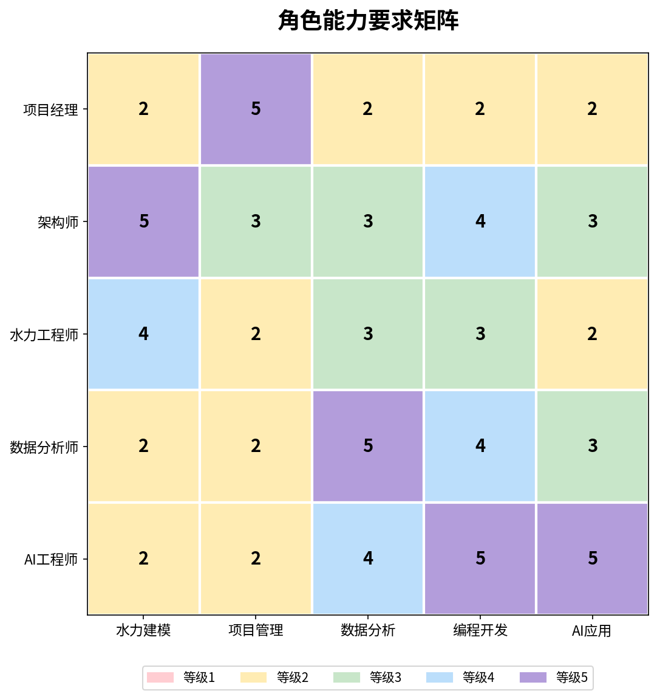
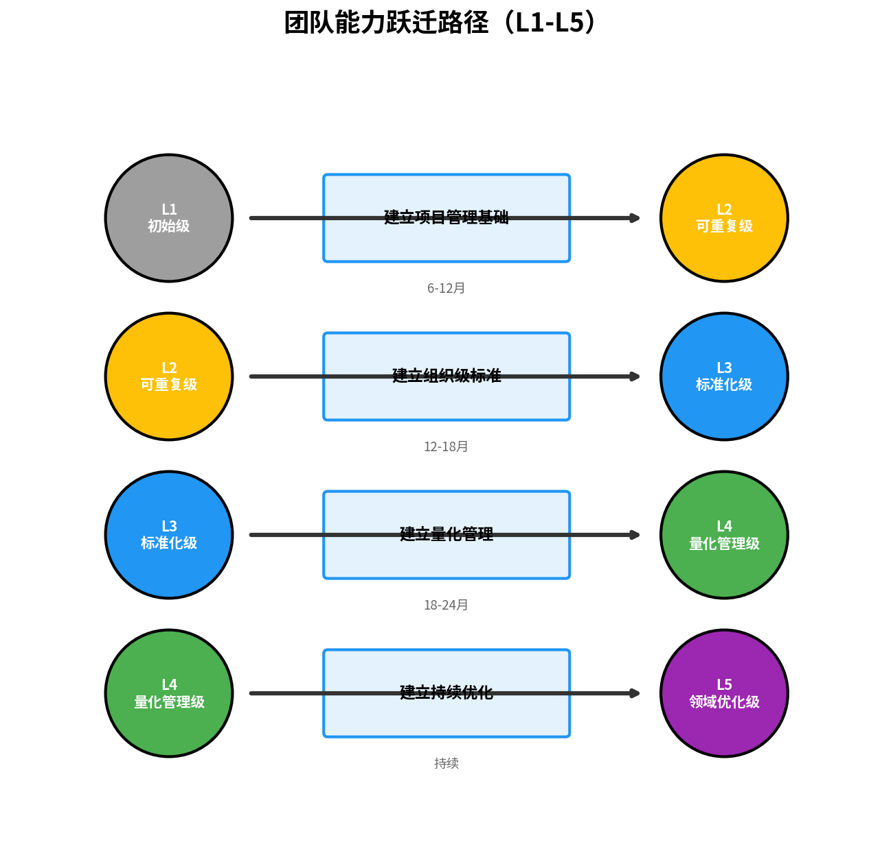
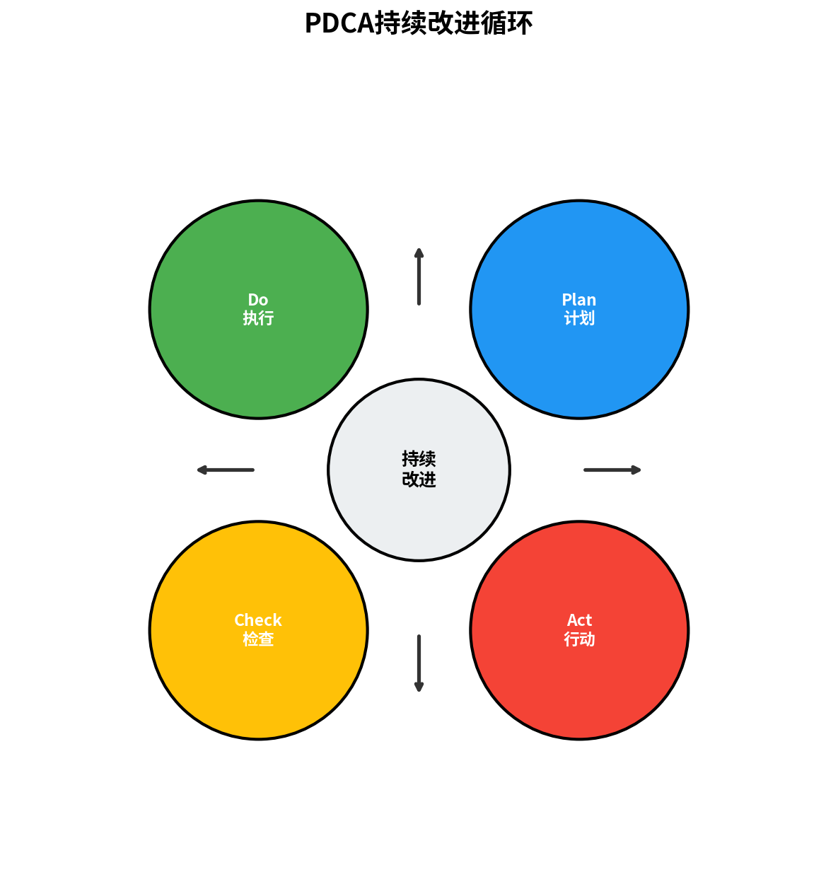
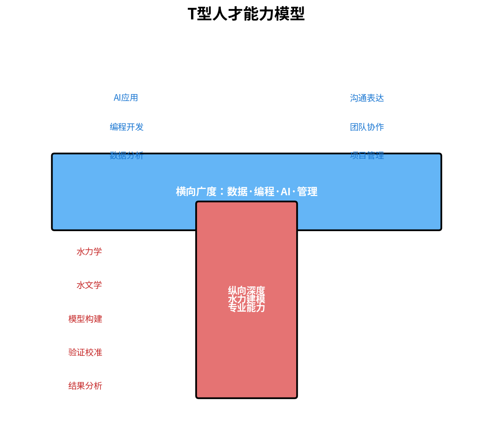
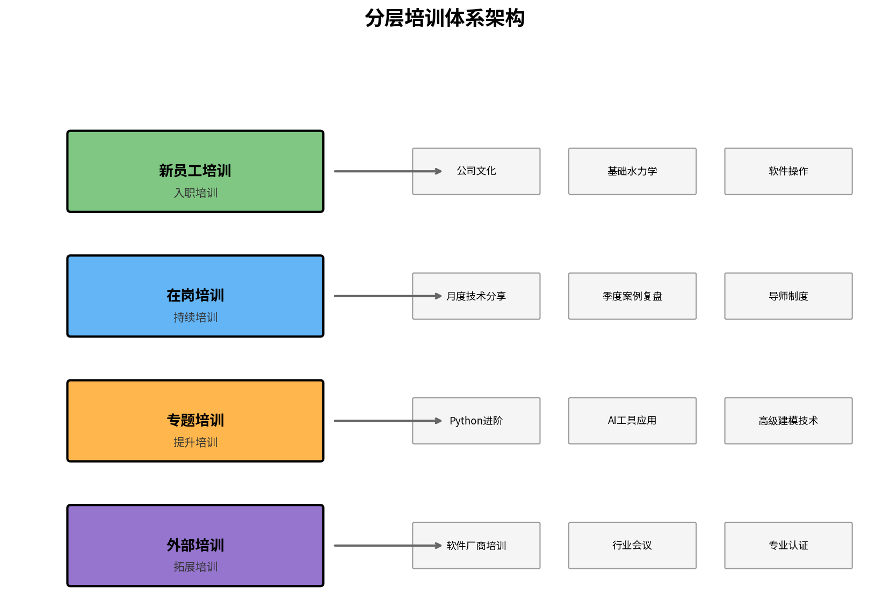
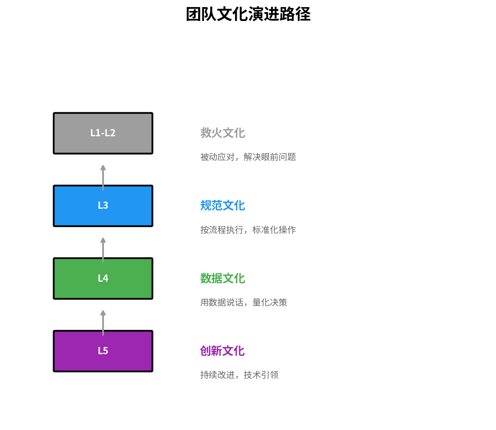
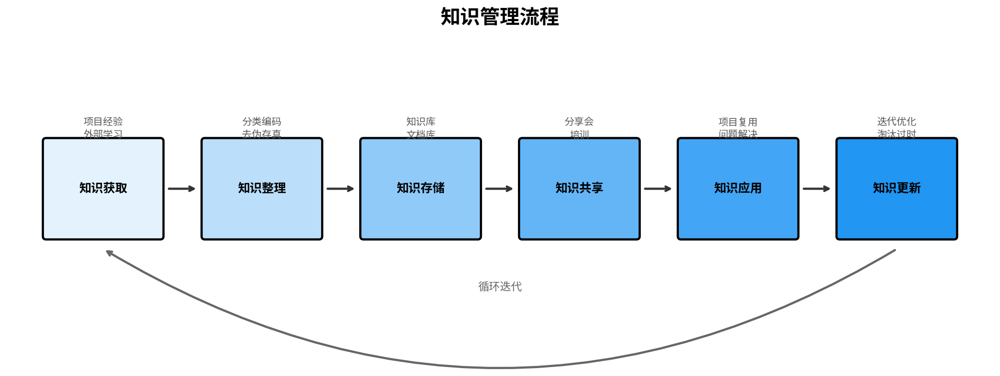

# 第3章 水力模型专业团队建设

## 本章导读

本章是第2章L1-L5团队能力评级体系的实践展开，系统阐述如何从当前等级提升到更高等级的建设方法论。每一节对应一个等级的跃迁路径，为第5章的具体技术实施奠定基础。

**章节结构**：
- 3.1 团队角色体系 → 支撑所有等级建设的基础
- 3.2 L1→L2跃迁：建立项目管理基础
- 3.3 L2→L3跃迁：建立组织级标准
- 3.4 L3→L4跃迁：建立量化管理与模型架构
- 3.5 L4→L5跃迁：建立持续优化与创新体系
- 3.6 复合型人才培养 → 贯穿所有等级的人才支撑
- 3.7 团队文化与知识管理 → 贯穿所有等级的软实力

## 3.1 团队角色体系

### 3.1.1 角色设计原则

设计水力模型专业团队的角色体系，需要遵循以下原则：

**专业分工与协作平衡**
- 分工要明确，避免职责重叠或空白
- 协作要顺畅，信息流转高效
- 接口要清晰，减少沟通成本

**能力互补与梯队建设**
- 各角色能力互补，形成完整能力链
- 每个角色有明确的成长路径
- 建立人才梯队，避免青黄不接

**规模适配与灵活性**
- 小团队可以一人多岗
- 大团队需要专业细分
- 保持一定灵活性，适应业务变化

**AI时代角色的演变**
- AI工具改变了一些角色的工作方式
- 出现了新的角色（如AI工程师）
- 所有角色都需要具备AI素养

### 3.1.2 五角色体系详解

五角色体系是本书推荐的核心团队架构，各角色的详细职责和能力要求在第4章展开，本节侧重角色间的协作关系。

**决策链：PM → 架构师 → 工程师**
- 项目经理制定项目目标和计划
- 架构师制定技术方案和策略
- 工程师执行具体技术工作

**支持链：数据分析师、AI工程师 → 赋能全团队**
- 数据分析师为所有人提供数据支持
- AI工程师为所有人提供AI工具支持

**信息流向**：
```
客户/管理层 → PM → 架构师 → 工程师
                  ↓
            数据/AI支持
                  ↓
            数据分析师/AI工程师
```

### 3.1.3 角色能力矩阵



**图3-1 角色能力要求矩阵**

不同角色对各项能力的要求不同，上表展示了五角色在核心能力维度上的要求等级（1-5分）。

| 等级 | 角色配置特点 | 关键角色 |
|------|-------------|---------|
| **L1-L2** | 角色模糊，一人多岗 | 全能型工程师 |
| **L3** | 角色初步分离 | PM、工程师 |
| **L4** | 五角色完整配置 | 架构师为核心 |
| **L5** | 角色+AI智能体 | AI工程师重要性提升 |

### 3.1.4 小团队的角色兼职策略

在资源有限的情况下，可以采用角色兼职策略：

**3人团队配置（L1-L2阶段）**：
- 项目经理（兼架构师）
- 水力工程师
- 数据分析师（兼AI工程师）

**5人团队配置（L3阶段）**：
- 项目经理
- 架构师（兼高级工程师）
- 水力工程师×2
- 数据分析师（兼AI工程师）

**8人团队配置（L4-L5阶段）**：
- 项目经理
- 架构师
- 水力工程师×3（L3/L2/L1各1）
- 数据分析师
- AI工程师
- 质量专员（可兼职）

**兼职原则**：
- 职责相近的角色可以兼职
- 核心职责不能兼职（如PM和架构师不能是同一人）
- 兼职要有主次，避免顾此失彼

## 3.2 L1→L2跃迁：建立项目管理基础



**图3-2 团队能力跃迁路径（L1-L5）**

团队建设是一个循序渐进的跃迁过程，每个跃迁阶段都有明确的目标、关键举措和时间周期。本章将详细介绍从L1到L5每个阶段的跃迁方法。

### 3.2.1 跃迁目标与关键标志

**跃迁目标**：
- 从"无序、依赖个人"转变为"有基本项目管理规范"
- 使项目结果可预测、可重复
- 建立基础的质量保证机制

**关键标志（达到L2的标志）**：
- ✅ 每个项目都有明确的项目计划
- ✅ 项目进度能够被有效跟踪
- ✅ 关键文档有版本控制
- ✅ 有基本的质量检查清单
- ✅ 项目数据被记录和跟踪

### 3.2.2 关键举措一：建立项目管理制度

**项目立项流程标准化**：
```
需求确认 → 可行性评估 → 资源评估 → 立项审批 → 启动会
```

**项目计划模板**：
- 项目范围说明书
- 工作分解结构（WBS）
- 进度计划（甘特图）
- 资源计划
- 风险清单

**进度跟踪机制**：
- 周例会制度
- 进度报告模板
- 问题升级机制

**Python代码示例：项目进度跟踪工具**

```python
import json
from datetime import datetime, timedelta

class ProjectTracker:
    """项目进度跟踪器"""
    
    def __init__(self, project_name):
        self.project_name = project_name
        self.tasks = []
        self.milestones = []
    
    def add_task(self, task_name, start_date, end_date, owner, priority='medium'):
        """添加任务"""
        task = {
            'name': task_name,
            'start': start_date,
            'end': end_date,
            'owner': owner,
            'priority': priority,
            'status': 'pending',
            'progress': 0
        }
        self.tasks.append(task)
        return task
    
    def update_progress(self, task_name, progress):
        """更新任务进度"""
        for task in self.tasks:
            if task['name'] == task_name:
                task['progress'] = progress
                if progress == 100:
                    task['status'] = 'completed'
                elif progress > 0:
                    task['status'] = 'in_progress'
                break
    
    def get_project_status(self):
        """获取项目整体状态"""
        total_tasks = len(self.tasks)
        completed_tasks = sum(1 for t in self.tasks if t['status'] == 'completed')
        overall_progress = sum(t['progress'] for t in self.tasks) / total_tasks if total_tasks > 0 else 0
        
        return {
            'project': self.project_name,
            'total_tasks': total_tasks,
            'completed_tasks': completed_tasks,
            'overall_progress': overall_progress,
            'tasks': self.tasks
        }
    
    def export_report(self, filename):
        """导出项目报告"""
        report = self.get_project_status()
        with open(filename, 'w', encoding='utf-8') as f:
            json.dump(report, f, ensure_ascii=False, indent=2)
        print(f"报告已导出: {filename}")
```

### 3.2.3 关键举措二：实施配置管理

**版本控制（Git）**：
- 建立代码库和文档库
- 制定分支管理策略
- 规范提交信息格式

**文档命名规范**：
```
[日期]-[项目编号]-[文档类型]-[版本]
示例：20240313-PRJ001-报告-v1.0
```

**模型文件管理规范**：
- 模型版本命名规则
- 基线模型管理
- 变更记录维护

### 3.2.4 关键举措三：开展基本质量保证

**质量检查清单**：
- 数据检查清单
- 模型设置检查清单
- 结果合理性检查清单

**同行评审制度**：
- 评审流程
- 评审记录表
- 问题跟踪

**问题跟踪机制**：
- 问题记录
- 分配责任人
- 跟踪解决状态

### 3.2.5 L1→L2跃迁检查清单

- [ ] 项目立项流程已建立
- [ ] 项目计划模板已制定
- [ ] 周例会制度已实施
- [ ] Git版本控制已配置
- [ ] 文档命名规范已发布
- [ ] 质量检查清单已制定
- [ ] 同行评审已开展
- [ ] 问题跟踪机制已建立

**预计时间**：6-12个月

## 3.3 L2→L3跃迁：建立组织级标准

### 3.3.1 跃迁目标与关键标志

**跃迁目标**：
- 从"项目级规范"转变为"组织级标准"
- 实现知识复用和经验传承
- 建立培训体系

**关键标志（达到L3的标志）**：
- ✅ 有完整的技术标准和建模规范
- ✅ 建模流程已文档化并在团队内推广
- ✅ 使用统一的工具和模板
- ✅ 有新员工培训计划
- ✅ 有案例库和知识库

### 3.3.2 关键举措一：水力模型建模流程标准化

**标准化建模流程**：

```
┌─────────────┐    ┌─────────────┐    ┌─────────────┐    ┌─────────────┐
│  1.数据准备  │ → │  2.模型构建  │ → │  3.验证校准  │ → │  4.情景分析  │
└─────────────┘    └─────────────┘    └─────────────┘    └─────────────┘
       ↓                  ↓                  ↓                  ↓
   数据收集            拓扑建立            质量检查           方案设计
   数据清洗            参数设置            模型校准           方案评估
   数据检查            边界条件            精度验证           结果对比
   入库管理            模型检查            报告编制           报告编制
```

**各阶段标准操作程序（SOP）**：

**SOP-01：数据准备标准流程**
1. 数据需求确认
2. 数据源识别和收集
3. 数据格式转换
4. 数据质量检查
5. 数据入库和版本管理

**SOP-02：模型构建标准流程**
1. 建模范围确认
2. 管网拓扑建立
3. 节点和管段参数设置
4. 边界条件配置
5. 模型质量检查

**SOP-03：模型验证标准流程**
1. 验证方案制定
2. 质量平衡检查
3. 监测数据对比
4. 统计指标计算
5. 验证报告编制

**模型质量控制检查点**：

| 阶段 | 检查点 | 检查内容 | 责任人 |
|------|--------|---------|--------|
| 数据准备 | DP-01 | 数据完整性检查 | 数据分析师 |
| 数据准备 | DP-02 | 数据合理性检查 | 数据分析师 |
| 模型构建 | MB-01 | 拓扑连通性检查 | 建模工程师 |
| 模型构建 | MB-02 | 参数范围检查 | 建模工程师 |
| 验证校准 | VC-01 | 质量平衡验证 | 架构师 |
| 验证校准 | VC-02 | 统计指标达标检查 | 架构师 |

### 3.3.3 关键举措二：工具标准化

**统一建模软件平台**：
- 确定主力建模软件（如InfoWorks ICM或MIKE+）
- 统一软件版本
- 制定软件使用规范

**标准模型模板库**：
- 不同类型项目的模板（规划/设计/评估）
- 标准参数库（糙率、径流系数等）
- 标准边界条件库（设计暴雨等）

**数据格式和交换标准**：
- CSV/Excel标准格式
- GIS数据标准（坐标系、字段命名）
- 与其他软件的数据交换规范

**自动化工具和脚本库**：
- 数据处理脚本
- 批量操作脚本
- 质量检查脚本

**Python代码示例：案例库管理系统**

```python
import sqlite3
from datetime import datetime

class CaseLibrary:
    """案例库管理系统"""
    
    def __init__(self, db_path='case_library.db'):
        self.db_path = db_path
        self.init_database()
    
    def init_database(self):
        """初始化数据库"""
        conn = sqlite3.connect(self.db_path)
        cursor = conn.cursor()
        
        cursor.execute('''
            CREATE TABLE IF NOT EXISTS cases (
                id INTEGER PRIMARY KEY AUTOINCREMENT,
                name TEXT NOT NULL,
                location TEXT,
                scale TEXT,
                project_type TEXT,
                description TEXT,
                key_findings TEXT,
                lessons_learned TEXT,
                created_date TEXT,
                tags TEXT
            )
        ''')
        
        conn.commit()
        conn.close()
    
    def add_case(self, case_data):
        """添加案例"""
        conn = sqlite3.connect(self.db_path)
        cursor = conn.cursor()
        
        cursor.execute('''
            INSERT INTO cases (name, location, scale, project_type, 
                             description, key_findings, lessons_learned,
                             created_date, tags)
            VALUES (?, ?, ?, ?, ?, ?, ?, ?, ?)
        ''', (
            case_data['name'],
            case_data.get('location', ''),
            case_data.get('scale', ''),
            case_data.get('project_type', ''),
            case_data.get('description', ''),
            case_data.get('key_findings', ''),
            case_data.get('lessons_learned', ''),
            datetime.now().isoformat(),
            case_data.get('tags', '')
        ))
        
        conn.commit()
        case_id = cursor.lastrowid
        conn.close()
        
        return case_id
    
    def search_cases(self, keyword=None, project_type=None, tags=None):
        """搜索案例"""
        conn = sqlite3.connect(self.db_path)
        cursor = conn.cursor()
        
        query = "SELECT * FROM cases WHERE 1=1"
        params = []
        
        if keyword:
            query += " AND (name LIKE ? OR description LIKE ?)"
            params.extend([f'%{keyword}%', f'%{keyword}%'])
        
        if project_type:
            query += " AND project_type = ?"
            params.append(project_type)
        
        if tags:
            query += " AND tags LIKE ?"
            params.append(f'%{tags}%')
        
        cursor.execute(query, params)
        cases = cursor.fetchall()
        conn.close()
        
        return cases
```

### 3.3.4 关键举措三：培训体系建设

**新员工培训计划（入职培训）**：
- 第1周：公司文化、团队介绍、基础水力学
- 第2周：软件基础操作、数据准备流程
- 第3-4周：简单模型练习、质量检查
- 第1-3月：跟随老员工参与实际项目

**在岗培训机制**：
- 月度技术分享会
- 季度案例复盘
- 导师制度（老带新）

**外部培训安排**：
- 软件厂商培训
- 行业会议参加
- 专业认证考试

### 3.3.5 L2→L3跃迁检查清单

- [ ] 建模标准流程已制定并文档化
- [ ] 各阶段SOP已发布
- [ ] 质量检查点已明确
- [ ] 建模软件已统一
- [ ] 标准模板库已建立
- [ ] 数据格式标准已发布
- [ ] 新员工培训计划已实施
- [ ] 技术分享会已开展
- [ ] 案例库已建立

**预计时间**：12-18个月

## 3.4 L3→L4跃迁：建立量化管理与模型架构

### 3.4.1 跃迁目标与关键标志

**跃迁目标**：
- 从"经验驱动"转变为"数据驱动"
- 建立量化预测能力
- 构建可复用的模型架构体系

**关键标志（达到L4的标志）**：
- ✅ 有详细的度量指标和数据收集机制
- ✅ 能进行工作量估算和工期预测
- ✅ 有成熟的模型架构体系
- ✅ 项目实施基于模型资产复用
- ✅ 能预测项目风险和质量

### 3.4.2 关键举措一：度量体系建设

**关键度量指标**：

| 维度 | 指标 | 计算方法 |
|------|------|---------|
| **生产力** | 人均建模节点数/月 | 总节点数/(人数×月数) |
| **质量** | 返工率 | 返工项目数/总项目数 |
| **效率** | 按时交付率 | 按时交付项目数/总项目数 |
| **成本** | 单位节点成本 | 总成本/总节点数 |

**数据收集自动化**：
- 项目管理工具集成
- 代码提交统计
- 工时记录系统

**度量分析仪表盘**：

```python
class MetricsAnalyzer:
    """项目度量分析系统"""
    
    def __init__(self):
        self.metrics_data = []
    
    def add_project_metrics(self, project_data):
        """添加项目度量数据"""
        self.metrics_data.append({
            'project_name': project_data['name'],
            'planned_effort': project_data['planned_effort'],
            'actual_effort': project_data['actual_effort'],
            'planned_duration': project_data['planned_duration'],
            'actual_duration': project_data['actual_duration'],
            'defect_count': project_data.get('defect_count', 0),
            'model_nodes': project_data.get('model_nodes', 0),
        })
    
    def calculate_performance_baseline(self):
        """计算过程性能基线"""
        import pandas as pd
        import numpy as np
        
        df = pd.DataFrame(self.metrics_data)
        
        # 计算估算准确率
        df['effort_accuracy'] = df['planned_effort'] / df['actual_effort']
        df['duration_accuracy'] = df['planned_duration'] / df['actual_duration']
        
        # 计算生产率
        df['productivity'] = df['model_nodes'] / df['actual_effort']
        
        baseline = {
            'effort_accuracy': {
                'mean': df['effort_accuracy'].mean(),
                'std': df['effort_accuracy'].std(),
            },
            'productivity': {
                'mean': df['productivity'].mean(),
                'std': df['productivity'].std(),
            }
        }
        
        return baseline
    
    def predict_project_effort(self, model_nodes, confidence=0.8):
        """预测项目工时"""
        from scipy import stats
        
        baseline = self.calculate_performance_baseline()
        
        productivity_mean = baseline['productivity']['mean']
        productivity_std = baseline['productivity']['std']
        
        predicted_effort = model_nodes / productivity_mean
        
        # 计算置信区间
        z_score = stats.norm.ppf((1 + confidence) / 2)
        margin = z_score * (model_nodes * productivity_std / (productivity_mean ** 2))
        
        return {
            'predicted_effort': predicted_effort,
            'confidence_interval': (predicted_effort - margin, predicted_effort + margin),
        }
```

### 3.4.3 关键举措二：模型架构体系建设

**模型组件化设计**：

```
模型架构体系
├── 基础组件库
│   ├── 管网拓扑模板
│   ├── 标准断面库
│   └── 边界条件库
├── 功能模块库
│   ├── 径流计算模块
│   ├── 汇流模块
│   └── 水质模块
├── 场景模板库
│   ├── 规划评估模板
│   ├── 设计校核模板
│   └── 运营优化模板
└── 案例模型库
    ├── 典型城市模型
    ├── 典型流域模型
    └── 典型设施模型
```

**模型版本演化管理**：
- 基线模型管理
- 分支模型管理
- 模型合并策略

**模型资产复用机制**：
- 组件检索系统
- 相似模型推荐
- 复用率统计

### 3.4.4 关键举措三：量化目标管理

**项目目标量化**：
- 工期目标：±10%
- 质量目标：返工率<5%
- 成本目标：预算偏差<15%

**个人绩效量化**：
- 产出指标：完成节点数、代码行数
- 质量指标：缺陷率、返工次数
- 协作指标：知识分享次数、帮助他人次数

### 3.4.5 L3→L4跃迁检查清单

- [ ] 度量指标体系已建立
- [ ] 数据收集已自动化
- [ ] 度量分析仪表盘已上线
- [ ] 过程性能基线已建立
- [ ] 工作量估算模型已校准
- [ ] 模型架构体系已设计
- [ ] 组件库已建立
- [ ] 模型复用率>30%
- [ ] 项目目标已量化

**预计时间**：18-24个月

## 3.5 L4→L5跃迁：建立持续优化与创新体系



**图3-7 PDCA持续改进循环**

持续优化是L5级团队的核心特征，通过PDCA循环实现团队能力的螺旋式上升。

### 3.5.1 跃迁目标与关键标志

**跃迁目标**：
- 从"执行标准"转变为"创造标准"
- 实现技术引领和行业影响
- 快速融合AI等新兴技术

**关键标志（达到L5的标志）**：
- ✅ 有创造性研究成果（论文、专利）
- ✅ AI技术深度融入工作流程
- ✅ 参与或主导行业标准制定
- ✅ 在行业内具有技术影响力
- ✅ 持续改进文化深入人心

### 3.5.2 关键举措一：水力模型技术的创造性研究

**前沿技术研究方向**：
- 新型数值方法研究（如机器学习替代传统数值方法）
- 多模型耦合技术（水力-水质-水生态耦合）
- 实时计算优化（GPU加速、并行计算）

**研究成果产出**：
- 发表高水平论文（SCI/EI）
- 申请发明专利
- 开发开源工具

**研究项目管理**：
- 设立研发基金
- 建立研究小组
- 与高校/研究机构合作

### 3.5.3 关键举措二：AI等新兴技术的快速融合

**AI技术评估与引入流程**：

```
技术监测 → 试点评估 → 规模推广 → 标准化
```

**AI技术应用实验室**：
- 搭建AI实验环境
- 开展技术预研
- 验证应用效果

**AI在全流程的应用**：

| 阶段 | AI应用 | 预期效果 |
|------|--------|---------|
| 数据准备 | 智能数据清洗、异常检测 | 效率提升50% |
| 模型构建 | 参数自动推荐、错误诊断 | 减少试错30% |
| 验证校准 | 智能校准算法 | 精度提升10% |
| 结果分析 | 自动分析报告 | 效率提升70% |
| 客户沟通 | 智能问答、报告生成 | 响应时间减少80% |

### 3.5.4 关键举措三：提升行业标准和技术

**参与标准制定**：
- 国家标准（GB）
- 行业标准（CJJ）
- 地方标准
- 团体标准

**行业技术活动**：
- 主办技术研讨会
- 参与行业峰会演讲
- 发布技术白皮书

**开放技术交流**：
- 开源项目贡献
- 技术博客撰写
- 在线课程开发

### 3.5.5 L4→L5跃迁检查清单

- [ ] 研究基金已设立
- [ ] 研究论文已发表
- [ ] 专利申请已提交
- [ ] AI技术评估流程已建立
- [ ] AI已应用于3个以上环节
- [ ] 参与标准制定≥1项
- [ ] 主办/参与行业活动≥2次/年
- [ ] 改进提案数>人均2个/年

**预计时间**：持续进行

## 3.6 复合型人才培养体系

### 3.6.1 复合能力的定义



**图3-3 T型人才能力模型**

**T型人才模型**是指在专业领域有深厚造诣（纵向），同时具备跨领域知识和技能（横向）的复合型人才结构。

**与L1-L5等级的对应**：

| 等级 | 复合能力要求 |
|------|-------------|
| **L1-L2** | 基础水力建模技能 |
| **L3** | 水力+编程+数据处理能力 |
| **L4** | 水力+AI应用+量化分析能力 |
| **L5** | 水力+AI研发+技术创新能力 |

### 3.6.2 复合型人才的培养路径

**水力背景人员的技能扩展**：

1. **Python编程学习路径**（L2→L3阶段）
   - 基础语法（2周）
   - 数据处理pandas（2周）
   - 可视化matplotlib（1周）
   - 实战项目（4周）

2. **数据分析技能培养**（L3阶段）
   - 统计学基础
   - 数据清洗技术
   - 探索性数据分析

3. **AI工具应用培训**（L3→L4阶段）
   - 大语言模型使用
   - Prompt Engineering
   - AI辅助编程

### 3.6.3 培训体系建设

**分层培训体系**：



**图3-4 分层培训体系架构**

| 层级 | 对象 | 内容 | 目标 |
|------|------|------|------|
| **新员工培训** | 新入职 | 基础技能、流程规范 | 能独立完成基础任务 |
| **在岗培训** | 全员 | 技术更新、经验分享 | 持续提升能力 |
| **专题培训** | 骨干 | 深度学习、技术前沿 | 掌握高级技能 |
| **外部培训** | 优秀员工 | 行业交流、认证考试 | 拓宽视野 |

## 3.7 团队文化与知识管理

### 3.7.1 团队文化建设

**文化要素**：
- **专业精神**：追求卓越，精益求精
- **协作意识**：团队成功高于个人成就
- **创新氛围**：鼓励尝试，容忍失败
- **持续学习**：终身学习，持续成长

**与L1-L5的对应**：



**图3-5 团队文化演进路径**

| 等级 | 文化特点 |
|------|---------|
| **L1-L2** | 救火文化，被动应对 |
| **L3** | 规范文化，按流程执行 |
| **L4** | 数据文化，用数据说话 |
| **L5** | 创新文化，持续改进 |

### 3.7.2 知识管理体系



**图3-6 知识管理流程**

**知识管理流程**：
```
知识获取 → 知识整理 → 知识存储 → 知识共享 → 知识应用 → 知识更新
```

**知识管理工具**：
- 文档管理系统：Confluence、飞书文档
- 代码仓库：GitHub、GitLab
- 知识库平台：自建Wiki、Notion

### 3.7.3 经验复用机制

**案例库建设**：
- 项目案例模板
- 问题案例库
- 最佳实践库

**模板体系**：
- 数据准备模板
- 模型设置模板
- 报告撰写模板

---

## 本章小结

本章系统阐述了水力模型专业团队建设的L1-L5跃迁方法论：

1. **L1→L2跃迁**：建立项目管理基础（计划、配置管理、质量保证）
2. **L2→L3跃迁**：建立组织级标准（流程标准化、工具标准化、培训体系）
3. **L3→L4跃迁**：建立量化管理与模型架构（度量体系、模型架构、量化目标）
4. **L4→L5跃迁**：建立持续优化与创新体系（技术研究、AI融合、行业标准）

每个跃迁都有明确的目标、关键举措和检查清单，为第5章的具体技术实施提供了框架指引。

人才培养和文化建设贯穿所有等级，是团队建设的软实力支撑。

---

## 关键工具

**跃迁检查清单汇总**：
- L1→L2跃迁检查清单（8项）
- L2→L3跃迁检查清单（9项）
- L3→L4跃迁检查清单（9项）
- L4→L5跃迁检查清单（8项）

**培训体系设计模板**：见附录

**知识管理实施指南**：见附录
