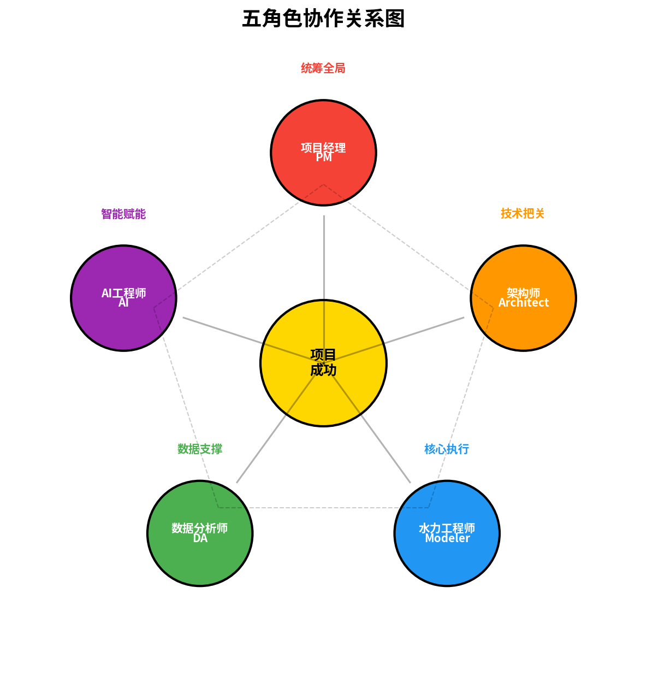
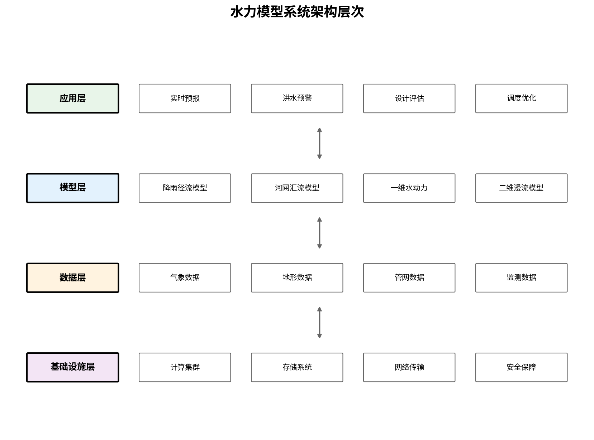
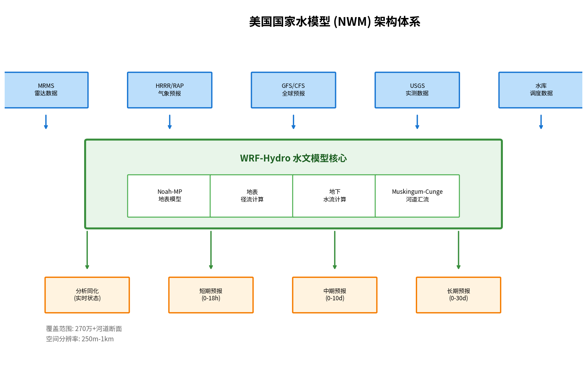
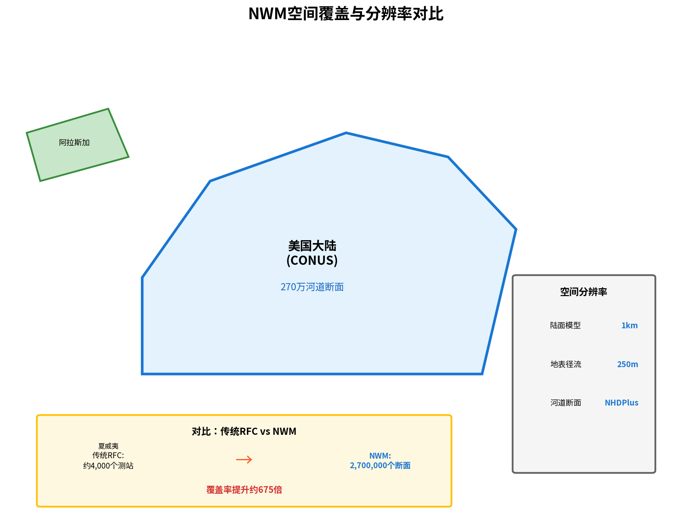
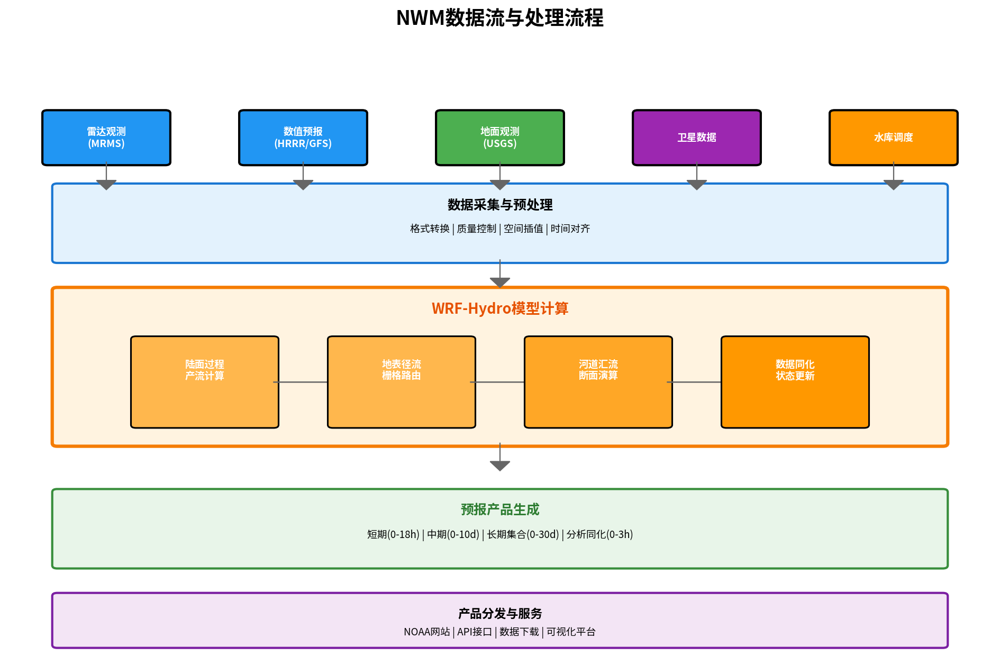
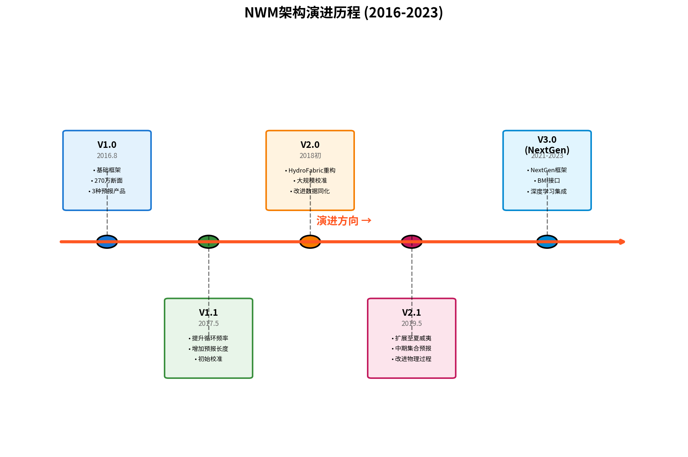
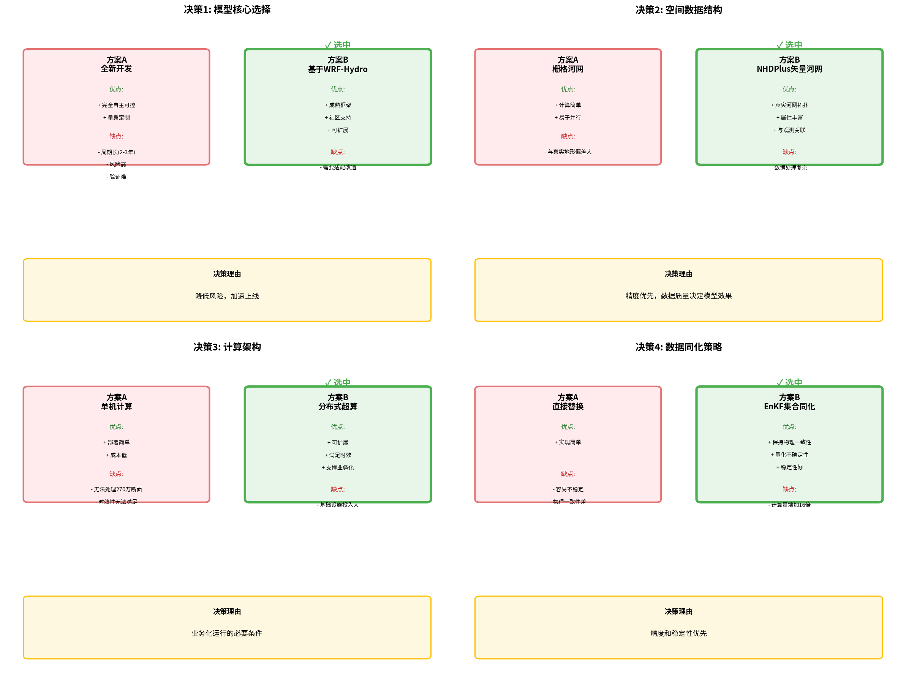
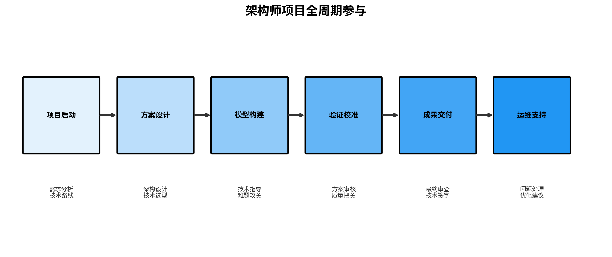

# 第4章 不同角色详解

## 本章导读

本章深入剖析水力模型专业团队的五个核心角色，特别关注架构师这一传统团队容易缺失的关键岗位，以及AI技术对各角色的赋能作用。

**本章结构**：
- 4.1 项目经理（PM）：统筹全局的管理者
- 4.2 水力模型架构师：技术方向的把控者（本章重点）
- 4.3 水力模型工程师：核心执行者
- 4.4 数据分析师：数据质量的守护者
- 4.5 AI工程师：智能技术的引入者
- 4.6 角色协作与AI赋能：五角色协作模式



**图4-1 五角色协作关系图**

五个角色围绕项目成功这一核心目标协同工作：项目经理统筹全局，架构师技术把关，水力工程师核心执行，数据分析师提供数据支撑，AI工程师提供智能赋能。

---

## 4.1 项目经理（PM）

### 4.1.1 角色定位与核心价值

项目经理是项目成功的第一责任人，是连接客户、团队和管理层的枢纽。

**核心价值**：
- **统筹全局**：协调项目所有资源和活动
- **把控进度**：确保项目按时交付
- **管理风险**：识别和化解项目风险
- **维护客户**：管理客户期望和关系

**PM与架构师的分工**：
- **PM管事**：进度、资源、客户、风险
- **架构师管技术**：方案、质量、技术决策
- **协作关系**：PM提出需求约束，架构师提供技术方案，共同决策

### 4.1.2 职责详解

**项目统筹**：
- 制定项目整体计划和里程碑
- 协调项目资源（人力、设备、数据）
- 监控项目进度，识别偏差
- 组织项目例会，跟踪任务

**客户管理**：
- 作为客户主要联系人
- 组织项目启动会、汇报会
- 理解和管理客户期望
- 处理客户投诉和争议

**质量控制**：
- 确保交付物符合质量标准
- 组织内部质量评审
- 监督技术方案执行
- 处理技术问题升级

### 4.1.3 能力要求

**硬技能**：
- 项目管理方法论（PMP/Prince2）
- 基础技术理解（能听懂技术讨论）
- 数据分析（能看懂项目数据）
- 办公软件（Excel、Project等）

**软技能**：
- 沟通协调（⭐⭐⭐⭐⭐）
- 谈判影响（⭐⭐⭐⭐⭐）
- 领导力（⭐⭐⭐⭐）
- 抗压能力（⭐⭐⭐⭐⭐）

### 4.1.4 AI赋能PM

**AI应用场景**：

1. **智能计划生成**
2. **风险预测**
3. **会议纪要自动生成**
4. **进度报告自动生成**

**Python代码示例：AI智能周报生成器**

```python
import openai
import json
from datetime import datetime, timedelta

class AIReportGenerator:
    """AI智能报告生成器"""
    
    def __init__(self, api_key):
        openai.api_key = api_key
    
    def generate_weekly_report(self, project_data):
        """生成项目周报"""
        
        prompt = f"""
        请根据以下项目数据生成一份专业的项目周报：
        
        项目名称：{project_data['name']}
        报告周期：{project_data['week_start']} 至 {project_data['week_end']}
        
        本周完成任务：
        {json.dumps(project_data['completed_tasks'], ensure_ascii=False, indent=2)}
        
        进行中任务：
        {json.dumps(project_data['ongoing_tasks'], ensure_ascii=False, indent=2)}
        
        遇到的问题：
        {json.dumps(project_data['issues'], ensure_ascii=False, indent=2)}
        
        下周计划：
        {json.dumps(project_data['next_week_plan'], ensure_ascii=False, indent=2)}
        
        请生成一份包含以下部分的周报：
        1. 项目概况（进度、状态）
        2. 本周工作总结
        3. 问题与风险
        4. 下周工作计划
        5. 需要协调的事项
        
        要求：
        - 使用专业、简洁的语言
        - 突出关键信息
        - 提出明确的行动建议
        """
        
        response = openai.ChatCompletion.create(
            model="gpt-4",
            messages=[
                {"role": "system", "content": "你是一位专业的项目管理专家，擅长撰写项目报告。"},
                {"role": "user", "content": prompt}
            ],
            temperature=0.7,
            max_tokens=2000
        )
        
        return response.choices[0].message.content
    
    def analyze_project_risks(self, project_metrics):
        """AI分析项目风险"""
        
        prompt = f"""
        请分析以下项目指标，识别潜在风险：
        
        {json.dumps(project_metrics, ensure_ascii=False, indent=2)}
        
        请分析：
        1. 进度风险（是否可能延期）
        2. 质量风险（返工率、缺陷率趋势）
        3. 资源风险（工作量饱和度）
        4. 客户风险（需求变更、满意度）
        
        对于每个风险，请给出：
        - 风险等级（高/中/低）
        - 风险描述
        - 建议的应对措施
        """
        
        response = openai.ChatCompletion.create(
            model="gpt-4",
            messages=[
                {"role": "system", "content": "你是一位资深的项目风险管理专家。"},
                {"role": "user", "content": prompt}
            ],
            temperature=0.5
        )
        
        return response.choices[0].message.content

# 使用示例
generator = AIReportGenerator(api_key="your-api-key")

project_data = {
    'name': '某市排水规划项目',
    'week_start': '2024-03-01',
    'week_end': '2024-03-07',
    'completed_tasks': [
        '完成中心区数据收集',
        '建立基础模型框架',
        '完成现状模拟'
    ],
    'ongoing_tasks': [
        {'name': '模型校准', 'progress': 60},
        {'name': '方案设计', 'progress': 30}
    ],
    'issues': [
        '部分监测数据缺失，需要协调补充',
        '模型在暴雨场景下出现不稳定'
    ],
    'next_week_plan': [
        '完成模型校准',
        '开始方案模拟',
        '提交中期报告'
    ]
}

report = generator.generate_weekly_report(project_data)
print(report)

### 4.1.5 【实操指南】PM技能提升路径

**【场景】技术骨干转型PM的困惑**

小王是团队的技术骨干，技术能力很强，最近被提拔为项目经理。但他发现：
- 以前只顾自己干活，现在要协调多人，不知道从何下手
- 客户总是改需求，项目进度一拖再拖
- 团队成员配合度不高，任务经常延期
- 写周报、开会很占用时间，感觉还不如自己干

**PM核心能力提升路径**：

**阶段1：任务管理（前3个月）**

**核心任务**：学会把大任务拆解、分配、跟踪

**实操方法**：
1. **任务拆解法（WBS）**
   ```
   项目目标：完成某市排水规划
   ├── 数据准备（2周）
   │   ├── 收集管网数据
   │   ├── 收集地形数据
   │   └── 数据质量检查
   ├── 模型构建（3周）
   │   ├── 主干管网建模
   │   ├── 支管网建模
   │   └── 边界条件设置
   ├── 模型校准（2周）
   │   ├── 选择校准事件
   │   ├── 参数调整
   │   └── 精度验证
   └── 报告编制（1周）
       ├── 技术报告
       └── 汇报PPT
   ```

2. **每日站会（15分钟）**
   - 昨天完成了什么？
   - 今天计划做什么？
   - 遇到什么阻碍？

3. **进度可视化**
   ```python
   # 用Excel或项目管理工具记录进度
   # 推荐工具：飞书项目、Teambition（免费版够用）
   
   # 简单的Python进度跟踪
   import pandas as pd
   from datetime import datetime
   
   tasks = [
       {'任务': '数据收集', '负责人': '小李', '计划完成': '2024-03-15', '状态': '进行中', '进度': 60},
       {'任务': '管网建模', '负责人': '小张', '计划完成': '2024-03-20', '状态': '未开始', '进度': 0},
       {'任务': '模型校准', '负责人': '小王', '计划完成': '2024-03-25', '状态': '未开始', '进度': 0},
   ]
   
   df = pd.DataFrame(tasks)
   df.to_excel('项目进度表.xlsx', index=False)
   print(f"项目整体进度：{df['进度'].mean():.1f}%")
   ```

**阶段2：风险管理（3-6个月）**

**核心任务**：提前识别风险，防患于未然

**风险识别清单**：
```markdown
## 项目风险检查表

### 数据风险
- [ ] 数据交付时间是否明确？
- [ ] 数据质量是否有保障？
- [ ] 是否有备用数据源？

### 技术风险
- [ ] 模型复杂度是否在团队能力范围内？
- [ ] 是否有技术难点需要预研？
- [ ] 软件和硬件资源是否充足？

### 进度风险
- [ ] 关键里程碑是否有缓冲时间？
- [ ] 并行任务是否考虑资源冲突？
- [ ] 外部依赖（如数据）是否可控？

### 客户风险
- [ ] 需求是否已明确并书面确认？
- [ ] 客户决策流程是否了解？
- [ ] 变更管理流程是否建立？
```

**风险应对策略**：
- **高概率+高影响**：提前准备Plan B，预留充足时间
- **高概率+低影响**：标准化处理，快速解决
- **低概率+高影响**：购买保险（如数据备份），做好应急预案
- **低概率+低影响**：接受风险，发生时再处理

**阶段3：客户管理（6个月以上）**

**核心任务**：管理客户期望，建立信任关系

**客户沟通技巧**：
1. **需求确认阶段**
   - ❌ "我明白了"（你以为的未必是客户要的）
   - ✅ "我总结一下您的需求，看对不对：..."（复述确认）

2. **进度汇报阶段**
   - ❌ "还在做，快了"（模糊，让客户焦虑）
   - ✅ "已完成60%，预计下周三完成，目前遇到XX问题，解决方案是..."（具体、透明）

3. **变更管理**
   - 建立变更流程：变更申请→影响评估→审批确认→执行→验收
   - 任何口头变更都要书面确认（邮件、会议纪要）

**【实战模板】项目周报模板**

```markdown
# 项目周报 - [项目名称]

**报告周期**：2024年3月1日 - 3月7日
**项目经理**：[姓名]

## 1. 项目概况
- **总体进度**：65%（计划60%，超前5%）
- **项目状态**：🟢 正常 / 🟡 有风险 / 🔴 延期

## 2. 本周完成工作
- ✅ 完成中心区管网数据收集（100%）
- ✅ 完成模型拓扑构建（100%）
- 🔄 模型初步校准（80%，预计下周完成）

## 3. 遇到的问题与风险
| 问题 | 影响 | 解决方案 | 状态 |
|-----|------|---------|------|
| 部分监测数据缺失 | 可能影响校准精度 | 已与水务局沟通，预计下周提供 | 跟进中 |

## 4. 下周计划
- [ ] 完成模型校准（负责人：小李）
- [ ] 开始方案模拟（负责人：小张）
- [ ] 准备中期汇报材料（负责人：小王）

## 5. 需要协调/支持的事项
- 请客户确认中期汇报时间
- 申请使用高性能计算服务器（大规模模拟需要）
```

**【效率工具】PM必备工具箱**

| 场景 | 推荐工具 | 替代方案 |
|-----|---------|---------|
| 任务管理 | 飞书项目 | Teambition、Notion |
| 文档协作 | 飞书文档 | 腾讯文档、石墨文档 |
| 进度可视化 | Excel甘特图 | Project（复杂项目） |
| 会议记录 | 飞书妙记（语音转文字） | 讯飞听见 |
| 思维导图 | XMind | ProcessOn（在线） |

## 4.2 水力模型架构师

### 4.2.0 水力模型架构概述

在深入讨论架构师角色之前，我们需要系统性地理解什么是水力模型的架构。水力模型架构是指水力建模系统的整体结构设计和组织方式，它决定了系统的功能、性能、可扩展性和可维护性。

#### 什么是水力模型架构

水力模型架构是指将水力建模相关的数据、模型、算法、工具和人员进行系统化组织的顶层设计。它回答了以下关键问题：

1. **数据如何流动**：从原始数据到模型输入，再到结果输出的完整数据流
2. **模型如何组织**：不同尺度、不同类型模型的组合方式
3. **计算如何分布**：单机计算、集群计算还是云计算
4. **系统如何集成**：与外部系统（气象、监测、调度）的接口
5. **功能如何划分**：数据采集、模型计算、结果展示的分工



**图4-2 水力模型系统架构层次**

#### 常见的水力模型架构模式

**1. 单体架构（Monolithic）**
- **特点**：所有功能集成在一个软件中
- **代表**：传统桌面软件（如SWMM、MIKE URBAN）
- **优点**：部署简单，一致性高
- **缺点**：扩展性差，难以并行计算
- **适用**：小型项目，单机计算

**2. 分层架构（Layered）**
- **特点**：按功能分层，每层职责清晰
- **典型层次**：
  - 数据层：数据存储和管理
  - 计算层：模型计算引擎
  - 服务层：API和业务逻辑
  - 应用层：用户界面
- **优点**：模块化，易于维护
- **适用**：中型系统，团队协作

**3. 分布式架构（Distributed）**
- **特点**：计算任务分布到多个节点
- **关键技术**：
  - 任务调度：将计算分解到多个计算节点
  - 数据分区：空间分区或时间分区
  - 结果合并：汇总各节点计算结果
- **优点**：高性能，可扩展
- **适用**：大型流域，实时预报

**4. 微服务架构（Microservices）**
- **特点**：将系统拆分为独立的小服务
- **典型服务**：
  - 数据服务：数据接入和预处理
  - 计算服务：模型计算
  - 预报服务：实时预报
  - 可视化服务：结果展示
- **优点**：灵活部署，独立扩展
- **适用**：业务复杂，需要快速迭代的系统

#### 美国国家水模型（NWM）架构案例分析

美国国家水模型（National Water Model, NWM）是全球最先进的水文预报系统之一，其架构设计值得我们深入学习。

**NWM概述**：
- **开发机构**：美国国家海洋和大气管理局（NOAA）
- **运行时间**：2016年8月投入业务运行
- **覆盖范围**：美国大陆（CONUS）、阿拉斯加、夏威夷、波多黎各
- **预报断面**：270万+河道断面（相比传统RFC的约4000个断面）
- **空间分辨率**：250m-1km



**图4-3 美国国家水模型（NWM）架构体系**

**NWM架构的核心组件**：

**1. 数据输入层**
- **气象强迫数据**：
  - MRMS（多雷达多传感器系统）：实时降雨观测
  - HRRR/RAP：高分辨率快速刷新数值预报
  - GFS/CFS：全球预报系统
- **观测数据同化**：
  - USGS（美国地质调查局）：5000+水文站流量数据
  - USACE（美国陆军工程兵团）：水库调度数据

**2. 模型核心层（WRF-Hydro）**
- **地表过程模型**：Noah-MP陆面模型
  - 模拟入渗、蒸发、产流过程
  - 1km分辨率栅格计算
- **地表径流模块**：
  - 扩散波方程
  - 250m分辨率栅格路由
- **地下水流模块**：
  - 饱和地下水流计算
- **河道汇流模块**：
  - Muskingum-Cunge方法
  - 基于NHDPlusV2河网数据

**3. 预报产品层**
- **分析同化**：实时水文状态估计（3小时回溯）
- **短期预报**：0-18小时，每小时更新
- **中期预报**：0-10天，每天4次
- **长期预报**：0-30天，集合预报（16个成员）
- **总水位预报**：结合海洋模型（STOFS）的沿海洪水预报

**NWM架构的优势**：

| 优势维度 | 具体表现 | 对中国团队的启示 |
|---------|---------|----------------|
| **全覆盖** | 270万断面，覆盖全国所有山丘区 | 从重点断面到全流域覆盖 |
| **高时空分辨率** | 250m-1km空间，小时级时间 | 精细化建模成为趋势 |
| **多时间尺度** | 从小时到月尺度的完整产品链 | 满足不同决策需求 |
| **数据同化** | 实时融合观测数据 | 提高预报精度 |
| **集合预报** | 16个成员的长期集合预报 | 量化预报不确定性 |
| **沿海耦合** | 与海洋模型耦合的TWL预报 | 综合水灾害风险 |
| **超算支撑** | NOAA超级计算中心 | 大规模计算是基础设施 |

**对中国水力模型团队架构设计的启示**：

1. **从项目制向平台制转变**
   - NWM是持续运行的业务系统，不是单个项目
   - 需要建立长期运维的平台思维

2. **数据是核心资产**
   - NWM整合了多源数据（雷达、卫星、地面站）
   - 数据同化技术显著提升预报精度

3. **分层解耦的架构**
   - 模型核心（WRF-Hydro）与数据输入、产品输出解耦
   - 便于升级维护和功能扩展

4. **高性能计算是基础**
   - 270万断面的实时计算需要超算支撑
   - 架构设计需考虑并行化和可扩展性

5. **产品多样化**
   - 同一模型核心输出多种产品（短期/中期/长期）
   - 满足不同用户群体的需求

**Python代码示例：简单的分层水力模型架构设计**

```python
"""
分层水力模型架构示例
参考NWM的分层思想，实现一个简单的可扩展架构
"""

from abc import ABC, abstractmethod
from typing import Dict, List, Any
import numpy as np
import pandas as pd

class DataLayer(ABC):
    """数据层：负责数据接入和预处理"""
    
    @abstractmethod
    def read_forcing_data(self, time_range: tuple) -> pd.DataFrame:
        """读取气象强迫数据（降雨等）"""
        pass
    
    @abstractmethod
    def read_observations(self, station_ids: List[str]) -> pd.DataFrame:
        """读取观测数据用于同化"""
        pass
    
    @abstractmethod
    def preprocess(self, raw_data: pd.DataFrame) -> pd.DataFrame:
        """数据预处理（格式转换、质量控制）"""
        pass

class CalculationLayer(ABC):
    """计算层：负责模型计算"""
    
    @abstractmethod
    def initialize(self, config: Dict[str, Any]):
        """初始化模型"""
        pass
    
    @abstractmethod
    def run_land_surface_model(self, forcing: pd.DataFrame) -> pd.DataFrame:
        """运行地表过程模型（产流计算）"""
        pass
    
    @abstractmethod
    def run_routing_model(self, runoff: pd.DataFrame) -> pd.DataFrame:
        """运行汇流模型"""
        pass
    
    @abstractmethod
    def data_assimilation(self, simulated: pd.DataFrame, 
                         observed: pd.DataFrame) -> pd.DataFrame:
        """数据同化：融合观测数据修正模拟结果"""
        pass

class ProductLayer(ABC):
    """产品层：负责生成预报产品"""
    
    @abstractmethod
    def generate_short_range_forecast(self, results: pd.DataFrame) -> Dict:
        """生成短期预报产品（0-18h）"""
        pass
    
    @abstractmethod
    def generate_medium_range_forecast(self, results: pd.DataFrame) -> Dict:
        """生成中期预报产品（0-10d）"""
        pass
    
    @abstractmethod
    def export_to_service(self, products: Dict, service_endpoint: str):
        """将产品输出到服务层"""
        pass

class HydraulicModelFramework:
    """
    水力模型框架
    整合数据层、计算层、产品层
    """
    
    def __init__(self, data_layer: DataLayer, 
                 calc_layer: CalculationLayer,
                 product_layer: ProductLayer):
        self.data_layer = data_layer
        self.calc_layer = calc_layer
        self.product_layer = product_layer
        
    def run_forecast(self, config: Dict[str, Any]) -> Dict:
        """
        运行预报流程
        
        Args:
            config: 配置参数，包含时间范围、区域等
        
        Returns:
            预报产品字典
        """
        # 1. 数据层：读取和预处理数据
        print("[数据层] 读取气象强迫数据...")
        forcing = self.data_layer.read_forcing_data(config['time_range'])
        forcing = self.data_layer.preprocess(forcing)
        
        # 2. 计算层：模型计算
        print("[计算层] 运行地表过程模型...")
        runoff = self.calc_layer.run_land_surface_model(forcing)
        
        print("[计算层] 运行汇流模型...")
        discharge = self.calc_layer.run_routing_model(runoff)
        
        # 数据同化（如果配置）
        if config.get('data_assimilation', False):
            print("[计算层] 数据同化...")
            observations = self.data_layer.read_observations(
                config['station_ids']
            )
            discharge = self.calc_layer.data_assimilation(discharge, observations)
        
        # 3. 产品层：生成产品
        print("[产品层] 生成预报产品...")
        short_range = self.product_layer.generate_short_range_forecast(discharge)
        medium_range = self.product_layer.generate_medium_range_forecast(discharge)
        
        return {
            'short_range': short_range,
            'medium_range': medium_range,
            'raw_results': discharge
        }


# 具体实现示例
class MRMSDataLayer(DataLayer):
    """MRMS雷达数据接入层"""
    
    def read_forcing_data(self, time_range: tuple) -> pd.DataFrame:
        # 实际实现：调用MRMS API或读取本地文件
        print(f"从MRMS读取{time_range[0]}到{time_range[1]}的降雨数据")
        # 返回模拟数据
        dates = pd.date_range(time_range[0], time_range[1], freq='H')
        return pd.DataFrame({
            'datetime': dates,
            'rainfall': np.random.exponential(5, len(dates))
        })
    
    def read_observations(self, station_ids: List[str]) -> pd.DataFrame:
        print(f"读取{len(station_ids)}个测站的观测数据")
        return pd.DataFrame({
            'station_id': station_ids,
            'discharge': np.random.normal(100, 20, len(station_ids))
        })
    
    def preprocess(self, raw_data: pd.DataFrame) -> pd.DataFrame:
        # 质量控制：剔除负值
        raw_data = raw_data[raw_data['rainfall'] >= 0]
        # 单位转换
        raw_data['rainfall_mm'] = raw_data['rainfall'] * 25.4  # inch to mm
        return raw_data

class WRFHydroLayer(CalculationLayer):
    """WRF-Hydro模型计算层（简化版）"""
    
    def initialize(self, config: Dict[str, Any]):
        print(f"初始化WRF-Hydro模型，分辨率：{config.get('resolution', '1km')}")
        self.config = config
    
    def run_land_surface_model(self, forcing: pd.DataFrame) -> pd.DataFrame:
        # 简化版：使用SCS-CN方法计算产流
        print("运行Noah-MP陆面模型（简化版）...")
        forcing['runoff'] = forcing['rainfall_mm'] * 0.3  # 简化的产流计算
        return forcing
    
    def run_routing_model(self, runoff: pd.DataFrame) -> pd.DataFrame:
        # 简化版：Muskingum方法
        print("运行Muskingum-Cunge河道汇流...")
        runoff['discharge'] = runoff['runoff'].rolling(window=3).mean()
        return runoff
    
    def data_assimilation(self, simulated: pd.DataFrame, 
                         observed: pd.DataFrame) -> pd.DataFrame:
        # 简化版：直接替换
        print("执行数据同化...")
        # 实际应用中这里会使用EnKF、粒子滤波等方法
        return simulated

class NOAAProductLayer(ProductLayer):
    """NOAA标准产品生成层"""
    
    def generate_short_range_forecast(self, results: pd.DataFrame) -> Dict:
        # 提取0-18h预报
        short_range = results.head(18)
        return {
            'type': 'short_range',
            'lead_time': '0-18h',
            'data': short_range,
            'update_frequency': 'hourly'
        }
    
    def generate_medium_range_forecast(self, results: pd.DataFrame) -> Dict:
        # 提取0-10天预报
        medium_range = results.head(240)  # 10天 * 24小时
        return {
            'type': 'medium_range',
            'lead_time': '0-10d',
            'data': medium_range,
            'update_frequency': '6-hourly'
        }
    
    def export_to_service(self, products: Dict, service_endpoint: str):
        print(f"将产品导出到{service_endpoint}")
        # 实际实现：HTTP POST到API或写入数据库


# 使用示例
if __name__ == "__main__":
    # 初始化各层
    data_layer = MRMSDataLayer()
    calc_layer = WRFHydroLayer()
    calc_layer.initialize({'resolution': '1km', 'domain': 'CONUS'})
    product_layer = NOAAProductLayer()
    
    # 创建框架实例
    nwm_like_system = HydraulicModelFramework(
        data_layer, calc_layer, product_layer
    )
    
    # 运行预报
    from datetime import datetime, timedelta
    now = datetime.now()
    config = {
        'time_range': (now, now + timedelta(days=3)),
        'data_assimilation': True,
        'station_ids': ['USGS_12345', 'USGS_67890']
    }
    
    products = nwm_like_system.run_forecast(config)
    print("\n预报产品生成完成！")
    print(f"短期预报：{products['short_range']['lead_time']}")
    print(f"中期预报：{products['medium_range']['lead_time']}")
```

---

### 4.2.1 架构制定与演进：以美国国家水模型为例

架构师最核心的能力之一是**根据项目需求制定合理的系统架构**，并在项目生命周期中不断演进优化。本节以美国国家水模型（NWM）为案例，详细分析架构从需求分析到制定再到演进的完整过程。

#### 4.2.1.1 需求分析阶段：从业务痛点到技术目标

**NWM诞生的背景与需求（2012-2015）**

在NWM出现之前，美国的水文预报面临以下核心痛点：

| 痛点 | 具体表现 | 对架构的需求 |
|------|---------|-------------|
| **覆盖盲区** | 传统RFC（河流预报中心）仅覆盖约4,000个测站，大量中小河流无预报 | 需要**全覆盖架构**，支持270万+河段的计算 |
| **时空分辨率低** | 预报更新频率低（通常每天1-2次），空间分辨率粗 | 需要**高分辨率网格计算**和**高频更新**能力 |
| **数据孤岛** | 气象、水文、地形数据分散，缺乏整合 | 需要**多源数据融合架构** |
| **响应速度慢** | 从降雨到预报的链条长，无法满足实时决策 | 需要**实时计算+数据同化**架构 |
| **不确定性量化缺失** | 仅提供单值预报，无法评估风险 | 需要**集合预报架构** |

**架构师的需求转化工作**

架构师需要将这些业务需求转化为可量化的技术指标：

```
业务需求 → 技术指标
─────────────────────────────────
覆盖全国所有河流    → 270万+河道断面
小时级预报更新      → 每小时循环计算
实时响应            → 18小时短期预报窗口
不确定性量化        → 16个成员的集合预报
多灾种综合          → 河道+沿海淹没耦合
```

**关键架构决策点1：计算规模评估**

架构师需要回答：270万断面 × 小时级更新 × 多时间尺度产品，需要什么样的计算能力？



**图4-X NWM空间覆盖与分辨率对比**

上图展示了NWM相比传统RFC的空间覆盖优势：从约4,000个测站扩展到270万个河道断面，覆盖率提升约675倍。同时展示了NWM的多尺度分辨率设计。

```
NWM v1.2 技术规格：
├── 每日输入数据：4.45 TB
├── 每日输出数据：3 TB  
├── 计算单元数量：~3.6亿个
├── 代码量：74,740行
└── 日常计算量：>100,000 CPU-hours/天

→ 结论：必须采用超算支撑，架构设计需考虑并行化和可扩展性
```

#### 4.2.1.2 架构制定阶段：技术路线选择与架构设计

**关键架构决策点2：模型核心选择**

架构师面临的核心技术选型：从头开发 vs. 基于成熟框架改造？

| 方案 | 优点 | 缺点 | NWM选择 |
|------|------|------|---------|
| 方案A：全新开发 | 完全自主可控 | 周期长、风险高、验证难 | ❌ |
| 方案B：基于WRF-Hydro | 成熟框架、社区支持、可扩展 | 需要适配和增强 | ✅ |

**决策依据**：
- WRF-Hydro是NCAR开发的开源框架，已在学术界验证多年
- 支持模块化扩展，便于后续演进
- 有活跃的开发者社区，可持续获得技术支持
- 与WRF气象模型同源，便于气象-水文耦合

**关键架构决策点3：分层架构设计**

架构师设计了NWM的三层架构：

```
┌─────────────────────────────────────────────────────────┐
│                    产品输出层                            │
│  ┌─────────┐ ┌─────────┐ ┌─────────┐ ┌─────────────┐   │
│  │分析同化  │ │短期预报 │ │中期预报 │ │ 长期集合预报 │   │
│  │(0-3h)   │ │(0-18h)  │ │(0-10d)  │ │ (0-30d)     │   │
│  │每小时   │ │每小时   │ │每6小时  │ │ 每6小时×16  │   │
│  └─────────┘ └─────────┘ └─────────┘ └─────────────┘   │
├─────────────────────────────────────────────────────────┤
│                    模型核心层                            │
│  ┌─────────────┐ ┌─────────────┐ ┌─────────────────┐   │
│  │ Noah-MP     │ │ 汇流模型    │ │ 数据同化模块    │   │
│  │ 陆面模型    │ │ (Muskingum- │ │ (EnKF/直接插入) │   │
│  │ (1km网格)   │ │  Cunge)     │ │                 │   │
│  └─────────────┘ └─────────────┘ └─────────────────┘   │
├─────────────────────────────────────────────────────────┤
│                    数据输入层                            │
│  ┌─────────┐ ┌─────────┐ ┌─────────┐ ┌─────────────┐   │
│  │ MRMS    │ │ HRRR    │ │ GFS/CFS │ │ USGS观测    │   │
│  │ 雷达降雨│ │ 快速预报│ │ 全球预报│ │ 水文站数据  │   │
│  └─────────┘ └─────────┘ └─────────┘ └─────────────┘   │
└─────────────────────────────────────────────────────────┘
```

**关键架构决策点4：空间数据结构选择**

| 选项 | 技术特点 | 适用场景 | NWM选择 |
|------|---------|---------|---------|
| 栅格河网 | 规则网格，计算简单 | 均匀地形 | ❌ |
| 矢量河网(NHDPlus) | 真实河网拓扑，属性丰富 | 复杂真实地形 | ✅ |

**NWM采用NHDPlusV2的理由**：
- 基于1:10万比例尺的真实河网
- 包含丰富的河道属性（坡度、糙率、断面形状）
- 与USGS测站点位关联，便于数据同化
- 支持汇入关系的精确表达



**图4-X NWM数据流与处理流程**

上图展示了NWM从多源数据输入到预报产品输出的完整数据流：多源观测和预报数据经过采集预处理后，进入WRF-Hydro模型核心进行陆面过程计算、地表径流路由、河道汇流演算和数据同化，最终生成多时间尺度的预报产品并对外分发。

**关键架构决策点5：计算并行化策略**

架构师设计的并行策略：

```python
"""
NWM并行计算架构示意
"""
class NWMDistributedComputing:
    """NWM分布式计算架构"""
    
    def __init__(self):
        self.n_river_reaches = 2_700_000  # 270万河道断面
        self.n_processors = 1000  # 典型配置
        self.domain_decomposition = "spatial"  # 空间分解
    
    def domain_decomposition_strategy(self):
        """
        空间域分解策略
        将流域划分为若干子流域，每个处理器负责一个子流域
        """
        # 1. 基于河网拓扑进行图划分
        # 2. 目标：最小化跨域流量交换
        # 3. 负载均衡：各子流域计算量相当
        
        partitions = self.graph_partitioning(
            river_network=self.nhdplus_network,
            n_partitions=self.n_processors,
            objective="min_cut_edges"
        )
        return partitions
    
    def parallel_workflow(self):
        """
        并行计算流程
        """
        # 1. 陆面过程并行（栅格计算， embarrassingly parallel）
        # 2. 河道汇流并行（需要上下游通信）
        # 3. 数据同化为串行（观测点相对较少）
        
        for timestep in forecast_window:
            # 并行：各子流域独立计算产流
            runoff = self.parallel_land_surface_model(timestep)
            
            # 并行+通信：河道汇流需要上下游边界交换
            discharge = self.parallel_routing_model(runoff, timestep)
            
            # 数据同化（可选）
            if self.data_assimilation_enabled:
                discharge = self.data_assimilation(discharge, observations)
```

#### 4.2.1.3 架构演进阶段：从v1.0到v3.0的持续优化

NWM架构并非一成不变，而是根据实际运行反馈和新技术发展持续演进：

**NWM架构演进时间线**：



**图4-X NWM架构演进历程（2016-2023）**

上图展示了NWM从2016年V1.0到2023年V3.0的完整演进历程。每个版本的升级都针对前一版本的核心问题：V1.1优化运营频率，V2.0重构底层数据(HydroFabric)，V2.1扩展空间覆盖，V3.0引入NextGen框架实现范式转变。

```
2016年8月    2017年5月      2018年初       2019年5月      2021-2023
   │           │             │              │              │
   ▼           ▼             ▼              ▼              ▼
┌──────┐   ┌──────┐     ┌──────┐      ┌──────┐      ┌──────┐
│V1.0  │ → │V1.1  │  → │V2.0  │   →  │V2.1  │  →   │V3.0  │
│基础版│   │增强版│     │重大升级│      │扩展版│       │下一代│
└──────┘   └──────┘     └──────┘      └──────┘      └──────┘
 
主要改进：
• 基础框架建立   • 提升循环频率    • 大规模校准     • 扩展至夏威夷    • NextGen框架
• 270万断面     • 增加预报长度    • 改进地形/河网  • 中期集合预报   • BMI接口
• 三种预报产品   • 初始校准       • 改进数据同化   • 改进物理过程   • 深度学习集成
```

**V1.0 → V1.1：运营优化**

架构师的改进决策：

| 问题反馈 | 架构改进 | 效果 |
|---------|---------|------|
| 预报长度不足 | 短期预报从12h延长至18h | 覆盖更多洪峰 |
| 更新频率低 | 循环频率提升 | 更及时的预报 |
| 初始场偏差大 | 引入初步校准 | 改善冷启动 |

**V1.1 → V2.0：大规模重构**

这是NWM生命周期中最重要的一次架构升级：

```markdown
## NWM V2.0 架构改进要点

### 1. HydroFabric重构（核心数据层改进）
- **问题**：V1.x使用的地形数据存在偏差，河网连接关系有误
- **改进**：
  - 重新处理全国30m DEM
  - 重建NHDPlusV2河网拓扑
  - 修正河道坡度计算
- **架构师决策**：投入大量计算资源重新构建底层数据，为后续改进奠定基础

### 2. 参数校准体系
- **问题**：V1.x使用默认参数，各地表现差异大
- **改进**：
  - 建立USGS测站与NWM河段的映射关系
  - 大规模参数自动校准（成千上万的小流域）
  - 分区域参数分区
- **架构师决策**：建立校准工作流和工具链，实现批量化校准

### 3. 数据同化增强
- **改进**：
  - 延长分析同化窗口（从1h到3h回溯）
  - 改进USGS流量数据同化算法
  - 增加对水库调度的处理
```

**V2.0 → V2.1：扩展与增强**

| 维度 | V2.0 | V2.1 | 架构演进逻辑 |
|------|------|------|-------------|
| 空间覆盖 | 美国大陆 | +阿拉斯加+夏威夷 | 模块化架构便于扩展 |
| 产品类型 | 3种 | 4种（新增中期集合） | 统一框架支持多产品 |
| 物理过程 | 基础版 | 增强土壤/积雪 | 模块化替换 |
| 代码结构 | 相对耦合 | 增强模块化 | 便于维护和升级 |

**V2.1 → V3.0（NextGen）：面向未来的架构革命**

V3.0代表了NWM架构的范式转变：

```
传统架构 (V1-V2)          NextGen架构 (V3+)
────────────────────────────────────────────────────────
单一模型核心       →      多模型可插拔框架
   │                        │
   ▼                        ▼
WRF-Hydro固定       →      任意符合BMI的模型
   │                        │
   ▼                        ▼
难以替换组件        →      模块化、标准化接口
   │                        │
   ▼                        ▼
技术债务累积        →      可持续演进
```

**NextGen架构的关键创新**：

1. **BMI（Basic Model Interface）标准**
   - 定义统一模型接口规范
   - 任何符合BMI的模型都可以接入
   - 支持物理模型+机器学习模型混合

2. **HydroFabric 2.0**
   - 更高分辨率（从1km到250m可选）
   - 更灵活的子流域划分
   - 支持全球扩展

3. **深度学习集成**
   - 引入LSTM作为后处理器
   - 物理模型+深度学习混合预报
   - 提升极端事件预报能力

#### 4.2.1.4 架构演进的经验启示

**对中国水力模型团队架构设计的启示**：

```markdown
## NWM架构演进的经验教训

### 1. 架构要有前瞻性，但也要务实
- ✅ NWM选择基于WRF-Hydro而非从头开发，降低了风险
- ✅ 但初期架构保留了足够的扩展性，支持后续演进

### 2. 数据架构是基础投资
- NWM V2.0花了大量精力重构HydroFabric
- 底层数据质量决定了上层模型效果
- 架构师要把数据架构放在优先位置

### 3. 模块化设计支持渐进式演进
- NWM的物理过程模块化使得改进可以分块进行
- 数据同化、汇流计算、陆面过程可以独立升级
- 避免牵一发而动全身

### 4. 建立反馈闭环驱动架构优化
- 实时验证系统（Rwrfhydro）提供性能数据
- 根据验证结果持续优化参数和算法
- 架构师要设计好监控和评估机制

### 5. 标准化接口是长期演进的保障
- V3.0引入BMI标准，为未来发展打开空间
- 架构师要关注行业标准和技术趋势

---



**图4-X NWM关键架构决策对比**

上图展示了NWM开发过程中的四个关键架构决策：选择WRF-Hydro框架而非全新开发、采用NHDPlus矢量河网而非栅格、使用分布式超算而非单机、采用EnKF集合同化而非直接替换。每个决策都体现了架构师在技术选型中的权衡思维。

---
```

**Python代码示例：架构演进决策框架**

```python
"""
架构演进决策支持工具
帮助架构师评估是否需要进行架构升级
"""

from dataclasses import dataclass
from typing import List, Dict
from enum import Enum

class EvolutionType(Enum):
    """架构演进类型"""
    OPTIMIZATION = "优化"  # 性能调优，不改动架构
    EXTENSION = "扩展"      # 新增功能，局部改动
    REFACTORING = "重构"    # 大规模重构，保持功能
    REVOLUTION = "革命"     # 范式转变，替换核心

@dataclass
class ArchitectureEvolutionDecision:
    """架构演进决策"""
    version: str
    evolution_type: EvolutionType
    drivers: List[str]        # 驱动因素
    risks: List[str]         # 风险
    investments: Dict        # 资源投入
    expected_benefits: List[str]

class ArchitectureEvolutionPlanner:
    """架构演进规划器"""
    
    def __init__(self):
        self.history = []
    
    def evaluate_evolution_need(self, current_metrics, target_requirements):
        """
        评估是否需要进行架构演进
        
        Args:
            current_metrics: 当前系统性能指标
            target_requirements: 目标需求
        
        Returns:
            演进建议
        """
        gaps = self._identify_gaps(current_metrics, target_requirements)
        
        if not gaps:
            return {
                'need_evolution': False,
                'message': '当前架构满足需求，建议继续优化'
            }
        
        # 根据差距类型推荐演进策略
        evolution_type = self._determine_evolution_type(gaps)
        
        return {
            'need_evolution': True,
            'gaps': gaps,
            'recommended_type': evolution_type,
            'priority': self._calculate_priority(gaps)
        }
    
    def _identify_gaps(self, current, target):
        """识别差距"""
        gaps = []
        
        for key, target_value in target.items():
            current_value = current.get(key)
            if current_value is None or current_value < target_value:
                gaps.append({
                    'dimension': key,
                    'current': current_value,
                    'target': target_value,
                    'gap': target_value - current_value if current_value else 'N/A'
                })
        
        return gaps
    
    def _determine_evolution_type(self, gaps):
        """确定演进类型"""
        # 简单规则：
        # - 性能差距 → 优化
        # - 功能缺失 → 扩展
        # - 技术债务 → 重构
        # - 范式不匹配 → 革命
        
        has_performance_gap = any(g['dimension'] in ['speed', 'accuracy'] for g in gaps)
        has_function_gap = any(g['dimension'] in ['coverage', 'resolution'] for g in gaps)
        has_tech_debt = any(g['dimension'] == 'maintainability' for g in gaps)
        
        if has_tech_debt and has_function_gap:
            return EvolutionType.REFACTORING
        elif has_function_gap:
            return EvolutionType.EXTENSION
        elif has_performance_gap:
            return EvolutionType.OPTIMIZATION
        else:
            return EvolutionType.OPTIMIZATION
    
    def plan_v2_upgrade(self):
        """
        模拟NWM V2.0升级决策
        """
        return ArchitectureEvolutionDecision(
            version="V2.0",
            evolution_type=EvolutionType.REFACTORING,
            drivers=[
                "地形数据存在系统性偏差",
                "默认参数导致各地表现差异大",
                "河网拓扑连接关系有误"
            ],
            risks=[
                "重构周期长，影响运营",
                "数据重新处理成本高",
                "可能引入新的问题"
            ],
            investments={
                "computing": "大规模DEM重处理",
                "personnel": "校准团队建设",
                "time": "6-12个月开发周期"
            },
            expected_benefits=[
                "全面提升预报精度",
                "为后续扩展奠定基础",
                "建立可持续的校准能力"
            ]
        )

# 使用示例
planner = ArchitectureEvolutionPlanner()

# 评估当前系统是否需要演进
current = {
    'coverage': 4000,      # 当前覆盖4000个测站
    'resolution': 1000,    # 当前1km分辨率
    'update_frequency': 24, # 当前24小时更新
    'maintainability': 0.6  # 可维护性评分
}

target = {
    'coverage': 2700000,   # 目标270万断面
    'resolution': 250,     # 目标250m
    'update_frequency': 1,  # 目标1小时更新
    'maintainability': 0.8
}

decision = planner.evaluate_evolution_need(current, target)
print(f"是否需要演进: {decision['need_evolution']}")
print(f"推荐演进类型: {decision['recommended_type']}")

# 查看V2.0升级决策
v2_plan = planner.plan_v2_upgrade()
print(f"\nV2.0演进类型: {v2_plan.evolution_type.value}")
print(f"主要驱动因素: {v2_plan.drivers}")
```

---

### 4.2.2 为什么需要架构师

理解了水力模型架构的复杂性，我们就能明白为什么需要专门的架构师角色。

**传统团队的痛点**：
- 技术决策无人把关，质量波动大
- 复杂项目搞不定，技术债务累积
- 新人成长慢，依赖老员工
- 技术创新无力

**架构师的价值**：
- **技术方向的把控者**：在NWM这样的复杂系统中，架构师决定数据流、计算流程、产品设计的整体方向
- **质量的最后守门人**：审核模型设置、验证方案、把关交付物质量
- **复杂问题的解决者**：处理技术难题，如数据同化、并行计算、模型耦合
- **团队技术的引领者**：推动技术创新，如引入AI、云计算、实时预报

### 4.2.3 架构师的核心职责



**图4-4 架构师项目全周期参与**

架构师在项目各阶段都发挥关键作用：

**项目启动 → 需求分析与技术路线**
- 评估项目技术可行性
- 确定建模范围和尺度
- 选择技术路线（如是否采用分布式架构）
- 制定数据策略（数据源、同化方案）

**方案设计 → 技术方案设计**
- 设计模型架构（参考NWM的分层思想）
- 确定模型耦合方案（如1D-2D耦合）
- 选择软件和工具
- 设计质量控制流程

**模型构建 → 技术指导与难题攻关**
- 指导关键技术实现
- 解决复杂技术问题
- 审核模型设置
- 优化计算效率

**验证校准 → 方案审核与质量把关**
- 审核验证方案的科学性
- 把关校准结果的合理性
- 确定精度达标标准

**成果交付 → 最终审查与技术签字**
- 最终技术质量审查
- 技术报告审核
- 技术签字负责

**运维支持 → 问题处理与优化建议**
- 处理重大技术问题
- 提供优化建议
- 指导系统升级

### 4.2.4 架构师的能力要求

**技术深度**：
- 精通各类水力建模技术（1D/2D/耦合）
- 深入理解数值方法（有限差分、有限体积）
- 掌握不确定性分析（GLUE、贝叶斯）
- 熟悉前沿技术发展（AI、实时计算、数字孪生）

**技术广度**：
- 系统架构设计（分层、分布式、微服务）
- 高性能计算（并行计算、GPU加速）
- 数据管理（数据库、数据同化）
- 软件开发（Python、API设计）

**工程经验**：
- 8年以上建模经验
- 主导过多个复杂项目
- 处理过各类技术难题
- 具备跨学科协作经验

**软技能**：
- 技术领导力
- 决策能力
- 沟通能力
- 培养他人的能力

### 4.2.5 AI赋能架构师

**AI辅助模型审查系统**：

```python
import pandas as pd
import numpy as np

class AIModelReviewer:
    """AI辅助模型审查系统"""
    
    def __init__(self):
        self.check_rules = self._load_check_rules()
    
    def _load_check_rules(self):
        """加载检查规则"""
        return {
            'geometry': [
                {'name': '管径合理性', 'check': self._check_diameter},
                {'name': '坡度合理性', 'check': self._check_slope},
                {'name': '连续性检查', 'check': self._check_continuity}
            ],
            'parameters': [
                {'name': '糙率范围', 'check': self._check_roughness},
                {'name': '参数一致性', 'check': self._check_consistency}
            ],
            'results': [
                {'name': '质量平衡', 'check': self._check_mass_balance},
                {'name': '结果合理性', 'check': self._check_result_plausibility}
            ]
        }
    
    def review_model(self, model_data):
        """审查模型"""
        issues = []
        warnings = []
        
        # 几何检查
        for rule in self.check_rules['geometry']:
            result = rule['check'](model_data)
            if result['severity'] == 'error':
                issues.append({
                    'category': '几何',
                    'rule': rule['name'],
                    'message': result['message'],
                    'suggestion': result.get('suggestion', '')
                })
            elif result['severity'] == 'warning':
                warnings.append({
                    'category': '几何',
                    'rule': rule['name'],
                    'message': result['message']
                })
        
        # 生成审查报告
        report = self._generate_review_report(issues, warnings)
        return report
    
    def _check_diameter(self, model_data):
        """检查管径合理性"""
        pipes = model_data.get('pipes', [])
        invalid_pipes = [p for p in pipes if p['diameter'] <= 0 or p['diameter'] > 5000]
        
        if invalid_pipes:
            return {
                'severity': 'error',
                'message': f'发现{len(invalid_pipes)}根管道的管径异常',
                'suggestion': '检查管径数据，确保单位为mm且在合理范围内'
            }
        return {'severity': 'ok', 'message': '管径检查通过'}
    
    def _check_slope(self, model_data):
        """检查坡度合理性"""
        pipes = model_data.get('pipes', [])
        steep_pipes = [p for p in pipes if abs(p['slope']) > 0.5]
        
        if steep_pipes:
            return {
                'severity': 'warning',
                'message': f'发现{len(steep_pipes)}根管道坡度超过50%',
                'suggestion': '核实这些管道的坡度数据是否正确'
            }
        return {'severity': 'ok', 'message': '坡度检查通过'}
    
    def _check_continuity(self, model_data):
        """检查连续性"""
        # 检查节点连接关系
        nodes = set()
        for pipe in model_data.get('pipes', []):
            nodes.add(pipe['from_node'])
            nodes.add(pipe['to_node'])
        
        # 检查是否有孤立节点
        all_nodes = set(n['id'] for n in model_data.get('nodes', []))
        isolated = all_nodes - nodes
        
        if isolated:
            return {
                'severity': 'error',
                'message': f'发现{len(isolated)}个孤立节点',
                'suggestion': '检查这些节点是否应该连接管道'
            }
        return {'severity': 'ok', 'message': '连续性检查通过'}
    
    def _check_roughness(self, model_data):
        """检查糙率范围"""
        pipes = model_data.get('pipes', [])
        invalid = [p for p in pipes if p['roughness'] < 0.009 or p['roughness'] > 0.03]
        
        if invalid:
            return {
                'severity': 'warning',
                'message': f'发现{len(invalid)}根管道的糙率超出典型范围',
                'suggestion': '核实糙率取值是否合理'
            }
        return {'severity': 'ok', 'message': '糙率检查通过'}
    
    def _check_mass_balance(self, model_data):
        """检查质量平衡"""
        # 简化示例，实际应基于模拟结果
        return {'severity': 'ok', 'message': '质量平衡检查通过'}
    
    def _check_result_plausibility(self, model_data):
        """检查结果合理性"""
        # 简化示例，实际应基于模拟结果
        return {'severity': 'ok', 'message': '结果合理性检查通过'}
    
    def _generate_review_report(self, issues, warnings):
        """生成审查报告"""
        report = {
            'summary': {
                'total_issues': len(issues),
                'total_warnings': len(warnings),
                'status': '通过' if not issues else '不通过'
            },
            'issues': issues,
            'warnings': warnings,
            'recommendations': self._generate_recommendations(issues, warnings)
        }
        return report
    
    def _generate_recommendations(self, issues, warnings):
        """生成改进建议"""
        recommendations = []
        
        if any(i['category'] == '几何' for i in issues):
            recommendations.append('建议进行详细的几何数据检查')
        
        if any(i['category'] == '参数' for i in issues):
            recommendations.append('建议复核模型参数设置')
        
        return recommendations

# 使用示例
reviewer = AIModelReviewer()

# 示例模型数据
model_data = {
    'nodes': [
        {'id': 'N1', 'elevation': 10.0},
        {'id': 'N2', 'elevation': 9.5},
        {'id': 'N3', 'elevation': 9.0}
    ],
    'pipes': [
        {'id': 'P1', 'from_node': 'N1', 'to_node': 'N2', 'diameter': 500, 'slope': 0.005, 'roughness': 0.013},
        {'id': 'P2', 'from_node': 'N2', 'to_node': 'N3', 'diameter': 600, 'slope': 0.008, 'roughness': 0.014}
    ]
}

report = reviewer.review_model(model_data)
print(f"审查结果: {report['summary']['status']}")
print(f"问题数: {report['summary']['total_issues']}")
print(f"警告数: {report['summary']['total_warnings']}")
```

### 4.2.6 【实操指南】架构师技能提升路径

**【场景】高级工程师如何成长为架构师**

小李是团队的高级工程师，技术能力很强，能解决各种复杂问题。但他发现：
- 每次项目都要从零开始，没有可复用的技术积累
- 团队成员水平参差不齐，同样的错误反复出现
- 复杂项目的技术方案总是临时拼凑，缺乏系统性
- 想提升团队整体水平，但不知道从哪入手

**架构师核心能力提升路径**：

**阶段1：技术方案设计能力（6-12个月）**

**核心任务**：从"执行方案"到"设计方案"

**实操方法**：
1. **建立方案设计思维**
   ```
   接到项目任务后，不要急着动手，先问自己：
   - 项目的核心目标是什么？（排水？防洪？水质？）
   - 关键约束条件有哪些？（时间、预算、数据、精度）
   - 有哪些可选的技术路线？各有什么优缺点？
   - 如何平衡精度、效率、成本？
   ```

2. **技术方案对比表（必用工具）**
   ```markdown
   ## 技术方案对比分析

   ### 方案A：1D管网模型
   - **适用场景**：城市排水规划、管网改造设计
   - **精度**：★★★☆☆（能满足一般要求）
   - **效率**：★★★★★（建模快，计算快）
   - **成本**：★★★★★（人力成本低）
   - **数据要求**：★★★☆☆（需要完整管网数据）
   - **风险评估**：低（团队熟悉，风险可控）

   ### 方案B：1D-2D耦合模型
   - **适用场景**：内涝风险评估、海绵城市评估
   - **精度**：★★★★★（能模拟地面漫流）
   - **效率**：★★☆☆☆（建模慢，计算慢）
   - **成本**：★★☆☆☆（人力成本高）
   - **数据要求**：★★★★★（需要高精度地形数据）
   - **风险评估**：中（需要2D建模经验）

   ### 推荐方案
   根据项目需求（XX）和约束条件（XX），推荐采用**方案A**，理由：
   1. ...
   2. ...
   ```

3. **设计模式积累**
   将常用场景的设计方案整理成"模式库"：
   ```
   模式库/
   ├── 城市排水规划模式.md
   ├── 防洪排涝评估模式.md
   ├── 海绵城市评估模式.md
   ├── 管网改造设计模式.md
   └── 水质模拟模式.md
   ```

**阶段2：代码架构设计能力（12-18个月）**

**核心任务**：学会设计可复用、可扩展的技术框架

**实操方法**：
1. **分层架构设计**
   - 数据层：负责数据接入和预处理
   - 模型层：负责模型计算
   - 产品层：负责生成各种产品

2. **模块化设计原则**
   - 单一职责：每个模块只做一件事
   - 接口清晰：模块之间通过明确的接口交互
   - 可替换：一个模块可以被另一个实现相同接口的模块替换

3. **实际案例：构建模型自动化框架**
   ```python
   # 架构师设计的框架（供团队使用）
   
   class ModelingFramework:
       """水力建模自动化框架"""
       
       def __init__(self, config):
           self.config = config
           self.data_layer = DataLayer(config['data'])
           self.model_layer = ModelLayer(config['model'])
           self.product_layer = ProductLayer(config['product'])
       
       def run_project(self, project_id):
           """运行完整项目流程"""
           # 1. 数据准备
           data = self.data_layer.prepare(project_id)
           
           # 2. 模型构建
           model = self.model_layer.build(data)
           
           # 3. 模型运行
           results = self.model_layer.run(model)
           
           # 4. 产品生成
           products = self.product_layer.generate(results)
           
           return products
   
   # 工程师使用框架（简单、高效）
   framework = ModelingFramework(config)
   products = framework.run_project('PRJ2024001')
   ```

**阶段3：技术领导力（18-24个月）**

**核心任务**：带领团队技术进步，建立技术文化

**实操方法**：
1. **技术分享机制**
   - 每周技术分享会（轮流主讲）
   - 每月代码审查（学习优秀代码）
   - 每季度技术复盘（总结改进）

2. **人才培养计划**
   - 为每个工程师制定发展计划
   - 定期进行技术指导和反馈
   - 创造机会让工程师承担更大责任

3. **技术决策流程**
   ```markdown
   ## 技术决策流程

   1. **问题识别**
      - 发现技术问题或改进机会
      - 明确问题的范围和影响

   2. **方案调研**
      - 收集可能的解决方案
      - 评估各方案的优缺点

   3. **方案选择**
      - 召开技术评审会（相关人员参与）
      - 基于事实和数据做出决策
      - 记录决策理由

   4. **实施验证**
      - 制定实施计划
      - 小规模试点验证
      - 根据反馈调整

   5. **推广落地**
      - 制定推广计划
      - 培训相关人员
      - 监控实施效果
   ```

**【效率工具】架构师必备工具箱**

| 场景 | 推荐工具 | 用途 |
|-----|---------|------|
| 架构设计 | draw.io / ProcessOn | 画架构图、流程图 |
| 代码管理 | Git + GitLab | 版本控制、代码审查 |
| 文档管理 | Markdown + GitBook | 技术文档管理 |
| 原型设计 | Python + Streamlit | 快速开发工具原型 |
| 知识管理 | Notion / 语雀 | 团队知识库建设 |

## 4.3 水力模型工程师

### 4.3.1 角色定位

水力模型工程师是模型构建和计算的核心执行者，是将设计转化为可计算模型的关键角色。

**核心价值**：
- 执行技术方案，构建水力模型
- 进行模型验证和校准
- 分析结果，识别问题，提出建议

### 4.3.2 职责详解

**模型构建**：
- 根据技术方案构建水力模型
- 准备和处理输入数据
- 设置模型参数和边界条件
- 运行模型并调试

**模型验证**：
- 执行质量检查
- 进行模型校准
- 分析验证结果
- 编写验证报告

**结果分析**：
- 分析模型计算结果
- 提取关键水力指标
- 制作结果图表
- 识别系统问题

### 4.3.3 分级能力要求

| 等级 | 核心能力 | 典型工作 |
|------|---------|---------|
| **L1** | 学习基础 | 辅助工作，在指导下完成简单任务 |
| **L2** | 独立完成 | 独立完成小型模型（<500节点） |
| **L3** | 解决复杂 | 独立完成中型模型+校准（500-2000节点） |
| **L4** | 指导审核 | 负责大型模型+审核他人（>2000节点） |

### 4.3.4 【实操指南】工程师技能提升路径

**【L1→L2提升路径】从辅助到独立**

**目标**：能独立完成小型项目（<500节点）

**必学技能清单**：
1. **软件操作熟练度**
   - 主流软件（SWMM/MIKE/InfoWorks）至少精通1个
   - 能独立完成：数据导入→模型构建→运行调试→结果输出全流程
   - 学习资源：软件官方教程 + 做3个完整案例

2. **数据处理能力**
   - Excel高级功能：透视表、VLOOKUP、条件格式
   - Python基础：pandas读取Excel、数据清洗、简单计算
   - 必会脚本：批量格式转换、数据质量检查

3. **质量检查习惯**
   - 建立个人Checklist（参考第3章模板）
   - 养成"三查"习惯：建模前查数据、建模中查设置、建模后查结果

**【实战案例】新手如何快速上手**

**场景**：刚入职的小张接到第一个项目——某小区排水评估（约200个节点）

**传统做法（容易踩坑）**：
- 直接打开软件开始建模
- 边做边摸索，遇到问题临时查资料
- 没有规范，做到哪算哪
- 结果：花了一周，模型还跑不通

**正确做法（有章可循）**：

**第1天：准备阶段**
1. 找领导或同事要一个类似项目的完整资料（参考模板）
2. 仔细阅读项目要求，列出关键问题清单
3. 按照Checklist检查数据完整性

**第2-3天：建模阶段**
1. 先用Excel整理好数据，确保格式正确
2. 分步骤建模：先建主干管，再建支管，最后节点
3. 每完成一个子系统就保存一个版本（用Git或手动备份）

**第4天：调试阶段**
1. 先跑稳态检查，确保模型不报错
2. 再跑设计暴雨，检查流量合理性
3. 如果报错，按错误提示逐个解决（记录到问题清单）

**第5天：输出阶段**
1. 按照报告模板填写内容
2. 自动生成关键图表（总平面图、关键断面、结果表）
3. 自查一遍，确认无误后提交

**结果**：5天完成，一次通过审核。

**【L2→L3提升路径】从独立到高效**

**目标**：能高效完成中型项目（500-2000节点），并掌握校准技能

**必学技能清单**：
1. **Python进阶**
   - 自动化脚本：批量数据处理、批量出图
   - 数据分析：统计分析、相关性分析、可视化
   - 代码管理：Git版本控制、代码文档化

2. **模型校准能力**
   - 理解校准原理：什么是NSE、RMSE、PBIAS
   - 掌握校准流程：先调敏感参数，再微调次要参数
   - 学会判断：校准到什么程度算"够好了"

3. **技术方案能力**
   - 能看懂技术方案，理解设计意图
   - 能提出合理的技术建议
   - 能识别潜在的技术风险

**【实战案例】如何高效完成中型项目**

**场景**：某城区排水规划项目（约1500节点），时间紧（3周）

**效率提升策略**：

**策略1：用Python自动化数据处理**
```python
# 原始做法：手工整理数据，容易出错，耗时2天
# 优化做法：用脚本自动处理，30分钟完成

import pandas as pd

def process_pipe_data(raw_file, output_file):
    """自动处理管网数据"""
    df = pd.read_excel(raw_file)
    
    # 自动检查和修正
    # 1. 检查管径合理性
    abnormal_diameter = df[(df['管径'] < 200) | (df['管径'] > 2000)]
    if len(abnormal_diameter) > 0:
        print(f"警告：发现{len(abnormal_diameter)}条异常管径")
    
    # 2. 自动计算坡度（如果没有）
    if '坡度' not in df.columns:
        df['坡度'] = (df['起点高程'] - df['终点高程']) / df['长度']
    
    # 3. 格式标准化
    df['管径'] = df['管径'].astype(int)
    df['长度'] = df['长度'].round(2)
    
    df.to_excel(output_file, index=False)
    print(f"数据处理完成，输出到：{output_file}")

# 使用
process_pipe_data("原始管网数据.xlsx", "处理后管网数据.xlsx")
```

**策略2：模块化建模**
- 把整个城区分成5-6个子区域
- 每个子区域单独建模、单独验证
- 最后再合并成整体模型
- 好处：出错容易定位，便于多人协作

**策略3：建立校准SOP**
```markdown
## 模型校准标准流程（SOP）

### 第一步：初步运行
- [ ] 运行模型，检查是否能正常完成
- [ ] 检查质量平衡（误差<5%）
- [ ] 初步检查流量量级是否合理

### 第二步：参数敏感性分析
- [ ] 识别敏感参数（通常是糙率、CN值）
- [ ] 对每个敏感参数进行±20%的扰动
- [ ] 记录每个参数变化对结果的影响

### 第三步：参数调整
- [ ] 优先调整最敏感的参数
- [ ] 每次只调一个参数，观察变化
- [ ] 调整幅度从小到大（5%→10%→20%）

### 第四步：精度评估
- [ ] 计算NSE、RMSE、PBIAS
- [ ] 判断是否满足精度要求（如NSE>0.7）
- [ ] 如不满足，返回第三步继续调整

### 第五步：验证
- [ ] 用另一场降雨事件验证模型
- [ ] 确保模型不过度拟合
```

**【L3→L4提升路径】从执行到把关**

**目标**：能负责大型复杂项目，能审核他人工作

**必学技能清单**：
1. **技术深度**
   - 深入理解模型原理：圣维南方程、曼宁公式、汇流计算
   - 掌握高级技术：1D-2D耦合、实时模拟、不确定性分析
   - 能解决复杂问题：模型不收敛、结果异常、边界条件复杂

2. **代码审查能力**
   - 能阅读他人的Python/MATLAB代码
   - 能发现代码中的问题和改进点
   - 能提出重构建议

3. **技术方案设计**
   - 能独立完成技术方案编写
   - 能进行多方案比选
   - 能评估技术风险和提出应对措施

**【实战案例】如何审核他人的模型**

**场景**：你是技术负责人，需要审核小李提交的模型

**审核清单**：
```markdown
## 模型技术审核清单

### 一、数据质量审核
- [ ] 数据来源是否可靠？
- [ ] 数据时间范围是否满足要求？
- [ ] 数据完整性如何？缺失值如何处理？
- [ ] 数据合理性检查是否通过？

### 二、模型设置审核
- [ ] 模型范围是否与任务书一致？
- [ ] 网格/节点划分是否合理？
- [ ] 边界条件设置是否正确？
- [ ] 参数取值是否有依据？

### 三、校准验证审核
- [ ] 校准事件选择是否合理？
- [ ] 校准精度指标是否满足要求？
- [ ] 验证事件是否独立？
- [ ] 参数调整是否在合理范围内？

### 四、结果分析审核
- [ ] 结果是否合理（流量量级、时间分布）？
- [ ] 是否进行了敏感性分析？
- [ ] 结论是否有数据支撑？
- [ ] 建议是否可行？

### 五、报告质量审核
- [ ] 报告结构是否完整？
- [ ] 图表是否清晰、规范？
- [ ] 文字描述是否准确？
- [ ] 是否存在低级错误（错别字、数据错误）？
```

**审核反馈技巧**：
- ✅ "建议在XX部分补充敏感性分析"（具体、可操作）
- ❌ "这里写得不太好"（模糊、无用）
- ✅ "管径取值偏大，建议复核设计图纸"（指出问题+给出方向）
- ❌ "再改改"（无效反馈）

### 4.3.5 AI赋能工程师

**AI辅助数据处理脚本生成**：

```python
import openai

class AICodeAssistant:
    """AI代码助手"""
    
    def __init__(self, api_key):
        openai.api_key = api_key
    
    def generate_data_processing_code(self, requirements, data_sample=None):
        """生成数据处理代码"""
        
        prompt = f"""
        请根据以下需求生成Python数据处理代码：
        
        需求描述：
        {requirements}
        """
        
        if data_sample:
            prompt += f"""
        数据样例：
        {data_sample}
        """
        
        prompt += """
        要求：
        1. 使用pandas进行数据处理
        2. 添加详细的中文注释
        3. 包含输入验证和异常处理
        4. 代码要健壮、高效
        5. 返回处理后的DataFrame
        
        请直接给出完整的Python代码。
        """
        
        response = openai.ChatCompletion.create(
            model="gpt-4",
            messages=[
                {"role": "system", "content": "你是一位专业的Python数据工程师。"},
                {"role": "user", "content": prompt}
            ],
            temperature=0.3
        )
        
        return response.choices[0].message.content
    
    def explain_code(self, code):
        """解释代码"""
        prompt = f"""
        请详细解释以下Python代码的功能和工作原理：
        
        ```python
        {code}
        ```
        
        请从以下几个方面解释：
        1. 代码的整体功能
        2. 每个函数的作用
        3. 关键步骤的说明
        4. 使用注意事项
        """
        
        response = openai.ChatCompletion.create(
            model="gpt-4",
            messages=[
                {"role": "system", "content": "你是一位资深的Python编程讲师。"},
                {"role": "user", "content": prompt}
            ]
        )
        
        return response.choices[0].message.content

# 使用示例
assistant = AICodeAssistant(api_key="your-api-key")

requirements = """
我需要处理一个排水管网数据文件，要求：
1. 读取CSV文件，包含管段ID、起点井号、终点井号、管径(mm)、管长(m)、坡度
2. 检查数据完整性，去除空值
3. 检查管径合理性（0-5000mm）
4. 计算每根管道的过流能力（使用曼宁公式，假设糙率n=0.013）
5. 保存处理后的数据到新的CSV文件
"""

code = assistant.generate_data_processing_code(requirements)
print(code)
```

## 4.4 数据分析师

### 4.4.1 角色定位

数据分析师是数据质量的守护者和数据价值的挖掘者，为水力建模提供数据支撑。

**核心价值**：
- 确保输入数据质量
- 提供数据分析支撑
- 建立数据管理体系

### 4.4.2 职责详解

**数据采集与处理**：
- 收集管网数据、地形数据、监测数据
- 数据清洗和格式转换
- 数据质量控制

**GIS分析**：
- 空间数据分析
- 专题地图制作
- 流域分析

**数据分析**：
- 统计分析
- 趋势分析
- 异常检测

### 4.4.3 能力要求

**技术技能**：
- GIS软件（ArcGIS/QGIS）
- Python数据处理（pandas/geopandas）
- 数据可视化（matplotlib/plotly）
- 数据库（SQL/PostGIS）

### 4.4.4 数据挖掘技术应用

**管网数据异常检测**：

```python
import pandas as pd
import numpy as np
from sklearn.ensemble import IsolationForest
from sklearn.preprocessing import StandardScaler

class PipeDataAnomalyDetector:
    """管网数据异常检测器"""
    
    def __init__(self):
        self.model = None
        self.scaler = StandardScaler()
    
    def prepare_features(self, pipe_data):
        """准备特征"""
        features = pd.DataFrame()
        features['diameter'] = pipe_data['diameter']
        features['length'] = pipe_data['length']
        features['slope'] = pipe_data['slope']
        features['area_ratio'] = pipe_data['diameter'] ** 2 / pipe_data['length']
        return features
    
    def fit(self, pipe_data):
        """训练异常检测模型"""
        features = self.prepare_features(pipe_data)
        
        # 标准化
        features_scaled = self.scaler.fit_transform(features)
        
        # 训练Isolation Forest
        self.model = IsolationForest(
            contamination=0.1,  # 假设10%的异常
            random_state=42,
            n_estimators=100
        )
        self.model.fit(features_scaled)
        
        return self
    
    def detect_anomalies(self, pipe_data):
        """检测异常"""
        features = self.prepare_features(pipe_data)
        features_scaled = self.scaler.transform(features)
        
        # 预测
        predictions = self.model.predict(features_scaled)
        scores = self.model.decision_function(features_scaled)
        
        # 添加结果到数据
        result = pipe_data.copy()
        result['is_anomaly'] = predictions == -1
        result['anomaly_score'] = scores
        
        return result
    
    def get_anomaly_summary(self, result):
        """获取异常摘要"""
        anomalies = result[result['is_anomaly']]
        
        summary = {
            'total_pipes': len(result),
            'anomaly_count': len(anomalies),
            'anomaly_rate': len(anomalies) / len(result),
            'anomaly_pipes': anomalies[['pipe_id', 'diameter', 'length', 'slope', 'anomaly_score']].to_dict('records')
        }
        
        return summary

# 使用示例
detector = PipeDataAnomalyDetector()

# 示例数据
pipe_data = pd.DataFrame({
    'pipe_id': ['P' + str(i) for i in range(1, 101)],
    'diameter': np.random.normal(500, 100, 100),  # 正常管径
    'length': np.random.normal(100, 20, 100),     # 正常管长
    'slope': np.random.normal(0.005, 0.002, 100)  # 正常坡度
})

# 添加一些异常值
pipe_data.loc[10, 'diameter'] = 5000  # 异常大管径
pipe_data.loc[20, 'slope'] = 0.5      # 异常陡坡
pipe_data.loc[30, 'length'] = 1       # 异常短管

# 训练模型
detector.fit(pipe_data)

# 检测异常
result = detector.detect_anomalies(pipe_data)

# 查看结果
summary = detector.get_anomaly_summary(result)
print(f"总管道数: {summary['total_pipes']}")
print(f"异常管道数: {summary['anomaly_count']}")
print(f"异常率: {summary['anomaly_rate']:.2%}")
```

### 4.4.5 数据可视化技术

**管网数据交互式可视化**：

```python
import plotly.express as px
import plotly.graph_objects as go
from plotly.subplots import make_subplots
import pandas as pd
import geopandas as gpd

class PipeDataVisualizer:
    """管网数据可视化器"""
    
    def __init__(self, pipe_data):
        self.pipe_data = pipe_data
    
    def create_diameter_distribution(self):
        """创建管径分布图"""
        fig = px.histogram(
            self.pipe_data,
            x='diameter',
            nbins=30,
            title='管径分布',
            labels={'diameter': '管径 (mm)', 'count': '数量'}
        )
        fig.update_layout(bargap=0.1)
        return fig
    
    def create_slope_distribution(self):
        """创建坡度分布图"""
        fig = px.box(
            self.pipe_data,
            y='slope',
            title='坡度分布',
            labels={'slope': '坡度'}
        )
        return fig
    
    def create_pipe_network_map(self, nodes_gdf, pipes_gdf):
        """创建管网地图"""
        fig = go.Figure()
        
        # 添加管道
        for idx, pipe in pipes_gdf.iterrows():
            coords = pipe.geometry.coords
            x = [coord[0] for coord in coords]
            y = [coord[1] for coord in coords]
            
            fig.add_trace(go.Scatter(
                x=x, y=y,
                mode='lines',
                line=dict(width=pipe['diameter']/100, color='blue'),
                name=f"管道 {pipe['pipe_id']}",
                hovertemplate=f"ID: {pipe['pipe_id']}<br>管径: {pipe['diameter']}mm"
            ))
        
        # 添加节点
        fig.add_trace(go.Scatter(
            x=nodes_gdf.geometry.x,
            y=nodes_gdf.geometry.y,
            mode='markers',
            marker=dict(size=10, color='red'),
            name='检查井',
            text=nodes_gdf['node_id'],
            hovertemplate='ID: %{text}'
        ))
        
        fig.update_layout(
            title='排水管网分布图',
            xaxis_title='X坐标',
            yaxis_title='Y坐标',
            showlegend=True
        )
        
        return fig
    
    def create_dashboard(self):
        """创建数据仪表盘"""
        fig = make_subplots(
            rows=2, cols=2,
            subplot_titles=('管径分布', '坡度分布', '管长分布', '管径-坡度关系'),
            specs=[
                [{"type": "histogram"}, {"type": "box"}],
                [{"type": "histogram"}, {"type": "scatter"}]
            ]
        )
        
        # 管径分布
        fig.add_trace(
            go.Histogram(x=self.pipe_data['diameter'], name='管径'),
            row=1, col=1
        )
        
        # 坡度分布
        fig.add_trace(
            go.Box(y=self.pipe_data['slope'], name='坡度'),
            row=1, col=2
        )
        
        # 管长分布
        fig.add_trace(
            go.Histogram(x=self.pipe_data['length'], name='管长'),
            row=2, col=1
        )
        
        # 管径-坡度散点
        fig.add_trace(
            go.Scatter(
                x=self.pipe_data['diameter'],
                y=self.pipe_data['slope'],
                mode='markers',
                name='管径-坡度'
            ),
            row=2, col=2
        )
        
        fig.update_layout(height=800, title_text="管网数据仪表盘")
        return fig

# 使用示例
pipe_data = pd.DataFrame({
    'pipe_id': ['P' + str(i) for i in range(1, 101)],
    'diameter': np.random.normal(500, 100, 100),
    'length': np.random.normal(100, 20, 100),
    'slope': np.abs(np.random.normal(0.005, 0.002, 100))
})

visualizer = PipeDataVisualizer(pipe_data)

# 创建单个图表
diameter_fig = visualizer.create_diameter_distribution()
diameter_fig.write_html("diameter_distribution.html")

# 创建仪表盘
dashboard = visualizer.create_dashboard()
dashboard.write_html("dashboard.html")
```

### 4.4.5 【实操指南】数据分析师技能提升路径

**【场景】从GIS专员到数据分析师的成长**

**核心能力提升路径**：
- **阶段1**：Python数据处理自动化（3-6个月）
- **阶段2**：数据质量管理体系（6-12个月）
- **阶段3**：高级分析与可视化（12-18个月）

**必学技能**：pandas、geopandas、matplotlib、数据质量规则、探索性分析

**工具箱**：pandas（数据处理）、geopandas（GIS）、plotly（可视化）、scikit-learn（机器学习）

## 4.5 AI工程师

### 4.5.1 角色定位

AI工程师是AI技术的引入者和赋能者，为团队提供AI能力支持。

**核心价值**：
- 引入AI技术提升效率
- 开发智能工具
- 推动团队智能化转型

### 4.5.2 职责详解

**AI应用开发**：
- 开发AI辅助工具
- 集成大语言模型
- 构建智能问答系统
- 开发预测模型

**技术探索**：
- 跟踪AI技术发展
- 评估新技术适用性
- 进行技术预研

**能力建设**：
- 培训团队使用AI工具
- 提供技术支持
- 推广AI最佳实践

### 4.5.3 能力要求

**机器学习**：
- 监督/无监督学习
- 深度学习框架（PyTorch/TensorFlow）
- 时序预测、异常检测

**大语言模型**：
- Prompt Engineering
- RAG技术
- Agent开发

**编程能力**：
- Python高级编程
- API开发
- 软件工程实践

### 4.5.4 AI技术应用场景开发

**智能问答系统（RAG）**：

```python
from langchain.embeddings import OpenAIEmbeddings
from langchain.vectorstores import Chroma
from langchain.chains import RetrievalQA
from langchain.llms import OpenAI
from langchain.text_splitter import CharacterTextSplitter
import os

class HydraulicKnowledgeQA:
    """水力建模知识问答系统"""
    
    def __init__(self, api_key):
        os.environ['OPENAI_API_KEY'] = api_key
        self.embeddings = OpenAIEmbeddings()
        self.vectorstore = None
        self.qa_chain = None
    
    def load_documents(self, documents):
        """加载文档到知识库"""
        # 文本切分
        text_splitter = CharacterTextSplitter(
            chunk_size=1000,
            chunk_overlap=200
        )
        texts = text_splitter.split_documents(documents)
        
        # 创建向量存储
        self.vectorstore = Chroma.from_documents(
            texts,
            self.embeddings,
            persist_directory="./chroma_db"
        )
        
        # 创建QA链
        self.qa_chain = RetrievalQA.from_chain_type(
            llm=OpenAI(temperature=0),
            chain_type="stuff",
            retriever=self.vectorstore.as_retriever()
        )
    
    def ask(self, question):
        """提问"""
        if not self.qa_chain:
            return "请先加载知识库文档"
        
        answer = self.qa_chain.run(question)
        return answer
    
    def add_document(self, document):
        """添加新文档"""
        if self.vectorstore:
            self.vectorstore.add_documents([document])
            self.vectorstore.persist()

# 使用示例
qa_system = HydraulicKnowledgeQA(api_key="your-api-key")

# 加载技术文档
from langchain.document_loaders import TextLoader
loader = TextLoader("technical_manual.txt")
documents = loader.load()

qa_system.load_documents(documents)

# 提问
answer = qa_system.ask("什么是曼宁公式？")
print(answer)
```

### 4.5.5 【实操指南】AI工程师技能提升路径

**【场景】传统工程师如何转型AI工程师**

小张是做水力模型开发的工程师，看到AI很火，想学习但不知道从何入手：
- 数学基础一般，担心学不会机器学习
- 网上教程太多，不知道哪些是真正有用的
- 想结合实际工作，但找不到切入点

**AI工程师核心能力提升路径**：

**阶段1：AI工具应用（3-6个月）**

**核心任务**：把AI工具用起来，提升工作效率

**实操方法**：
1. **成为Prompt高手**
   ```
   技巧1：明确角色
   ❌ "帮我写个数据处理脚本"
   ✅ "你是一位Python数据工程师，请写一个处理管网数据的脚本，要求：..."
   
   技巧2：提供上下文
   ❌ "这个报错怎么解决？"
   ✅ "我在用pandas处理数据时遇到这个错误：[粘贴错误信息]，代码如下：[粘贴代码]"
   
   技巧3：分步骤提问
   ❌ "怎么用机器学习预测流量？"
   ✅ "第一步：准备训练数据，需要哪些特征？第二步：用什么模型？第三步：如何评估效果？"
   ```

2. **用AI辅助日常工作**
   - 代码生成：让AI写数据处理脚本，自己审查修改
   - 文档撰写：让AI生成报告初稿，自己补充专业内容
   - 问题排查：遇到报错先问AI，10分钟没解决再问人
   - 学习助手：不懂的概念让AI用通俗语言解释

**阶段2：AI应用开发（6-12个月）**

**核心任务**：开发实用的AI工具

**实操方法**：
1. **从简单项目开始**
   ```python
   # 项目1：智能问答助手（用RAG）
   # 把团队的技术文档变成知识库，支持自然语言查询
   
   from langchain.embeddings import OpenAIEmbeddings
   from langchain.vectorstores import Chroma
   from langchain.chains import RetrievalQA
   
   class TeamKnowledgeBot:
       def __init__(self, api_key):
           self.embeddings = OpenAIEmbeddings(openai_api_key=api_key)
           self.vectorstore = None
           self.qa_chain = None
       
       def load_documents(self, docs_folder):
           """加载团队文档"""
           from langchain.document_loaders import DirectoryLoader
           loader = DirectoryLoader(docs_folder, glob="**/*.md")
           documents = loader.load()
           
           self.vectorstore = Chroma.from_documents(
               documents, self.embeddings, persist_directory="./chroma_db"
           )
           
           self.qa_chain = RetrievalQA.from_chain_type(
               llm=OpenAI(api_key=api_key),
               chain_type="stuff",
               retriever=self.vectorstore.as_retriever()
           )
       
       def ask(self, question):
           """提问"""
           return self.qa_chain.run(question)
   
   # 使用
   bot = TeamKnowledgeBot(api_key="your-key")
   bot.load_documents("./团队知识库")
   answer = bot.ask("SWMM中如何设置降雨？")
   ```

2. **逐步增加复杂度**
   - 第1个月：做简单的问答系统
   - 第2-3个月：加入多轮对话能力
   - 第4-6个月：开发能调用工具的Agent
   - 第7-12个月：构建多Agent协作系统

**阶段3：AI系统构建（12-18个月）**

**核心任务**：构建生产级的AI系统

**实操技能**：
1. **模型优化**
   - Fine-tuning：用领域数据微调大模型
   - 模型压缩：让模型运行更快、成本更低
   - 效果评估：建立科学的评估体系

2. **工程化能力**
   - 服务部署：把AI能力封装成API
   - 性能优化：处理高并发、降低延迟
   - 监控运维：监控AI服务质量

**【效率工具】AI工程师必备工具箱**

| 场景 | 推荐工具 | 用途 |
|-----|---------|------|
| 大模型调用 | OpenAI API / Claude API | 调用GPT-4等模型 |
| AI框架 | LangChain / LlamaIndex | 构建AI应用 |
| 向量数据库 | Chroma / Pinecone | 存储向量数据 |
| 模型训练 | Hugging Face Transformers | 微调模型 |
| 实验管理 | Weights & Biases | 追踪实验 |
| 部署 | Docker / Kubernetes | 部署AI服务 |

## 4.6 角色协作与AI赋能

### 4.6.1 五角色的协作模式

**协作流程**：
```
项目启动 → PM制定计划 → 架构师设计方案 → 工程师执行
                ↓              ↓              ↓
           数据分析师提供数据支持
                ↓              ↓              ↓
           AI工程师提供AI工具支持
                ↓              ↓              ↓
           成果整合 → 质量审核 → 交付验收
```

### 4.6.2 AI作为第六个"虚拟角色"

**AI的角色定位**：
- 24/7在线的助手
- 不知疲倦的执行者
- 快速准确的分析师

**人机协作模式**：
- 人类主导，AI辅助
- AI初稿，人类审核
- AI执行，人类监督

### 4.6.3 角色能力提升路径

**纵向发展**：
- L1 → L2 → L3 → L4 → L5

**横向发展**：
- 工程师 → 数据分析师 → AI工程师

**AI时代的新要求**：
- 每个角色都需要具备AI素养
- 能够使用AI工具提升效率
- 能够与AI有效协作

---

## 本章小结

本章深入剖析了水力模型专业团队的五个核心角色：

1. **项目经理**：项目成功的第一责任人，统筹协调全局
2. **水力模型架构师**：技术把关人，质量守门人
3. **水力模型工程师**：核心执行者，模型构建者
4. **数据分析师**：数据守护者，价值挖掘者
5. **AI工程师**：AI赋能者，技术引领者

AI技术为每个角色都带来了显著的效率提升，未来AI将成为团队的"第六个虚拟角色"，与人类紧密协作。

理解每个角色的定位、职责和能力要求，是建设高效团队的基础。

---

## 代码示例汇总

本章提供以下代码示例：
1. AI智能周报生成器
2. AI辅助模型审查系统
3. AI代码助手
4. 管网数据异常检测
5. 管网数据可视化
6. 水力建模知识问答系统
